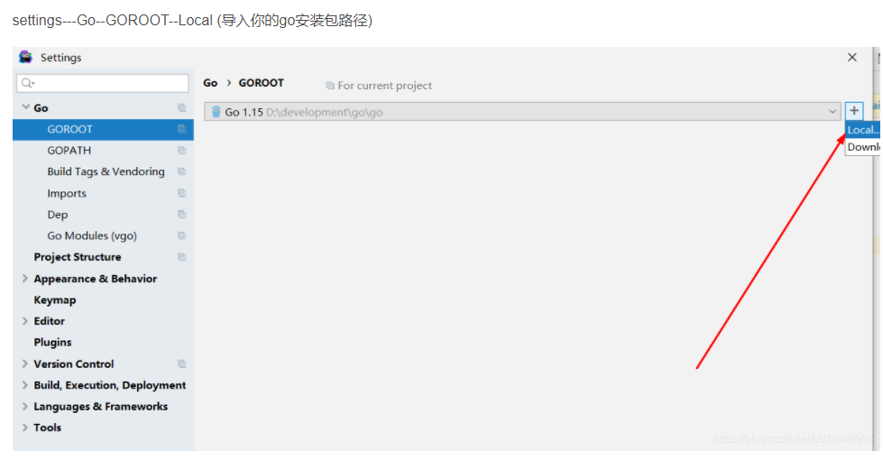

# 1 Go 语言初识

## 1.1 Go 语言介绍

### 1.1.1 Go语言是什么

“Go是一种开源的程序设计语言，它意在使得人们能够方便地构建简单、可靠、高效率的软件”（来自go官网golang.org）

我们程序员在开发程序，开发软件时都会选择一门编程语言，那么我们应该怎样进行选择呢？可能有同学会说，我们要选择一门简单的，容易学习的，而且开发效率高的，能够在很短的时间内开发完成一个软件，这样老板会非常的满意，能够升职加薪，Python语言或者Ruby语言就非常适合这种快速开发。但是问题是，用这种语言开发的软件，当用户量多了，运行的速度会非常慢，给人的感觉就是非常卡，大家想一下这种软件还有人愿意使用吗？那可能又有同学说了，我们要学习运行速度快的编程语言，例如C或者是C++,但是这类编程语言学习难度是非常大的。那么有没有一种编程语言，学习非常简单，开发速度非常快，开发出的软件电脑运行速度非常快呢？有，就是我们今天开始学习的GO语言。GO 语言借鉴了Python等其它编程语言简单，易学，生产效率高，同时GO语言专门针对多处理器（多核CPU，在这里可以给学生看一下windows下的多核CPU，）系统的程序进行了优化（让每核CPU都能够执行GO语言开发的程序），这样使用GO语言开发的程序运行的速度可以媲美C或C++开发程序的速度。

### 1.1.2 Go语言优势

运行速度快，简单易学

适合区块链开发

跨平台

丰富的标准库（指令），Go目前已经内置了大量的库，特别是网络库非常强大(开发飞秋软件)

Go里面也可以直接包含C代码，利用现有的丰富的C库

语言层面支持并发，这个就是Go最大的特色，天生的支持并发。所谓并发，所有正在运行的程序轮流使用CPU，每个程序允许占用CPU的时间非常短（比如10毫秒），这样用户根本感觉不出来CPU是在轮流为多个程序服务，就好象所有的程序都在不间断地运行一样。并发好处就是可以运行多个程序，并不卡顿。

### 1.1.3 Go语言能干什么

1：网络编程，这一块目前应用最广，例如网站开发。

2：服务器编程，例如：处理日志，处理文件。（在网站开发的过程中都会涉及到）

3：区块链开发

## 1.2 环境安装

### 1.2.1 windows环境安装

Windows下GO语言的环境安装步骤如下:

Go安装包下载网址：https://www.golangtc.com/download

有zip压缩版和msi安装版两个按本下载。（这里使用msi安装版，比较方便）。

运行msi安装文件，千万不要在安装路径中出现中文，一路Next。(关于安装路径在这里可以给学生重点强调，安装的位置以及不能出现中文名称)


### win install go new

下载go安装包

https://studygolang.com/dl

配置环境变量

```
此电脑->属性->高级系统设置->环境变量
```

 

golang配置




```
go version

go env

go env -w GO111MODULE=on
go env -w GOPROXY=https://goproxy.io,direct

go env

```

```
goland设置 go Modules
https://goproxy.io,direct

```

 


### 1.2.2 linux环境安装-升级内核安装方式

#### 1.2.2.1 yum升级内核

1）查看系统版本

```shell
[root@centos65 ~]# uname -a

Linux centos65 2.6.32-431.el6.x86_64 #1 SMP Fri Nov 22 03:15:09 UTC 2013 x86_64 x86_64 x86_64 GNU/Linux

[root@centos65 ~]# cat /etc/redhat-release 

CentOS release 6.5 (Final)

[root@centos65 ~]# uname -r

2.6.32-431.el6.x86_64

```

2）安装elrepo yum 源（提供内核更新、硬件驱动等软件源支持）

导入elrepo key

```shell
rpm --import https://www.elrepo.org/RPM-GPG-KEY-elrepo.org

rpm -Uvh http://www.elrepo.org/elrepo-release-6-6.el6.elrepo.noarch.rpm
```

安装elrepo的时候发现 上面链接 出现404，

故可以用一下链接

```c
rpm -Uvh http://www.elrepo.org/elrepo-release-6-8.el6.elrepo.noarch.rpm
```

操作如下：

```c
[root@centos65 ~]# rpm -Uvh http://www.elrepo.org/elrepo-release-6-8.el6.elrepo.noarch.rpm

Retrieving http://www.elrepo.org/elrepo-release-6-8.el6.elrepo.noarch.rpm

warning: /var/tmp/rpm-tmp.Nd7BtA: Header V4 DSA/SHA1 Signature, key ID baadae52: NOKEY

Preparing...                ########################################### [100%]

   1:elrepo-release         ########################################### [100%]
```

安装 elrepo yum 源

**内核升级**

yum elrepo源有 ml（mainline 为最新版本的内核）和 lt（长期支持的内核）两种内核，这里我们选择 lt 内核

升级内核

```shell
yum --enablerepo=elrepo-kernel -y install kernel-lt （kernel-ml）
```

内核升级

**引导文件修改（grub.conf）**

将 default 设置为 0 ，default=0


修改引导文件

**重启centos**

```shell
reboot
```

查看升级后的内核版本

```shell
[root@centos65 ~]# uname -r

4.4.138-1.el6.elrepo.x86_64
```

#### 1.2.2.2 Go安装

<https://studygolang.com/dl> 国内地址；golang.or/dl 官网地址

```bash
mkdir -p /home/tools
cd /home/tools
wget https://studygolang.com/dl/golang/go1.10.1.linux-amd64.tar.gz
tar -C /usr/local/ -xzf go1.10.1.linux-amd64.tar.gz
[root@centos65 tools]# ls /usr/local/go
api  AUTHORS  bin  blog  CONTRIBUTING.md  CONTRIBUTORS  doc  favicon.ico  lib  LICENSE  misc  PATENTS  pkg  README.md  robots.txt  src  test  VERSION
```

提示：

​	把解压的Go文件夹放到 /usr/local下，官方推荐目录，也可以自己指定

#### 1.2.2.3 目录介绍

```shell
[root@go tools] tree -L 1 /usr/local/go/
/usr/local/go/
├── api 	#存放依照Go版本顺序的API增量列表文件。包含公开的变量、厂里、函数等
├── AUTHORS
├── bin	 	#主要的标准命令文件，包括go、godoc、gofmt等
├── blog 	#官方博客中的文章，这些都是markdown格式
├── CONTRIBUTING.md
├── CONTRIBUTORS
├── doc 	#标准库的HTML格式的程序文档。可以通过godoc命令启动一个web程序展现这些文档
├── favicon.ico
├── lib 		#一些特殊的库文件
├── LICENSE
├── misc	 #辅助类的说明和工具
├── PATENTS
├── pkg 	#安装go标准库后的所有归档文件
├── README.md
├── robots.txt
├── src 		#存放Go自身、Go标准工具以及标准库的所有源码文件，深入研究Go，就靠它了
├── test 	#存放用来测试和验证Go本身的所有相关文件
└── VERSION
```

#### 1.2.2.4 配置环境变量

环境变量：GOROOT，GOROOT的值应该是Go的根目录，这里是/usr/local/go，需要在环境变量PATH中配置，$GOROOT/bin。这样就可以在任意目录下使用Go的命令了。

1 说明

export GOROOT=/usr/local/go #Go解压的根目录；GOROOT

export PATH=$PATH:$GOROOT/bin

2 操作

路径用 vim .bashrc

```shell
vi /etc/profile   用vim .bashrc

# golang config
export GOROOT=/usr/local/go
export PATH=$PATH:$GOROOT/bin
```

使其生效

```shell
source /etc/profile
```

3.检测

```shell
[root@go tools] echo $PATH
/usr/local/sbin:/usr/local/bin:/sbin:/bin:/usr/sbin:/usr/bin:/root/bin:/usr/local/go/bin
[root@go tools] go version
go version go1.10.1 linux/amd64
```

### 1.2.3 linux环境安装-编译

```
wget https://studygolang.com/dl/golang/go1.13.6.linux-amd64.tar.gz

tar -C /usr/local -xzf go1.13.6.linux-amd64.tar.gz
 
 vim .bashrc
 # golang config
 export GOROOT=/usr/local/go
export PATH=$PATH:$GOROOT/bin
#export GOPATH=$HOME/workspace/go
export GOPATH=/mnt/hgfs/web/go_work
export PATH="$PATH:$GOPATH/bin"

source .bashrc

设置 GOPATH 编译目录, 可选。如果是go mod方式的话
vim .bashrc
export GOPATH=$HOME/workspace/go
```


### centos7 最新安装

```
wget https://studygolang.com/dl/golang/go1.16.7.linux-amd64.tar.gz

rm -rf /usr/local/go && tar -C /usr/local -xzf go1.16.7.linux-amd64.tar.gz

vim /etc/profile
export GO111MODULE=on
export GOPROXY=https://goproxy.cn
export GOROOT=/usr/local/go
export GOPATH=/mnt/hgfs/go_work/wingopath
export GOBIN=$GOPATH/bin
export PATH=$PATH:$GOROOT/bin:$GOPATH/bin

source /etc/profile

go version

```


```shell
wget https://studygolang.com/dl/golang/go1.14.14.linux-amd64.tar.gz
tar -C /usr/local/ -xzf go1.14.14.linux-amd64.tar.gz
```


```shell
vim /etc/profile
#golang env config
export GO111MODULE=on
export GOROOT=/usr/local/go 
export GOPATH=/home/gopath
export PATH=$PATH:$GOROOT/bin:$GOPATH/bin
mkdir -p /home/gopath

#golang env config
export GO111MODULE=on
export GOROOT=/usr/local/go 
export GOPATH=/mnt/hgfs/go_work/unixgopath
export PATH=$PATH:$GOROOT/bin:$GOPATH/bin

source /etc/profile

go version
```

```shell
#golang env config
export GO111MODULE=on
export GOROOT=/usr/local/go
export GOPATH=/mnt/hgfs/go_work/wingopath
export GOBIN=$GOPATH/bin
export PATH=$PATH:$GOROOT/bin:$GOPATH/bin

```


## 1.3第一个Go程序

```go
package main

import "fmt"

func main() {
/* 这是我的第一个简单的程序 */
fmt.Printf("hello word\n")
}
```

测试

```shell
[root@go test] go run hello.go 
hello word
```

说明：

Go 语言的基础组成有以下几个部分：

* 包声明

* 引入包

* 函数

* 变量

* 语句 & 表达式

* 注释

1.第一行代码 package main 定义了包名。你必须在源文件中非注释的第一行指明这个文件属于哪个包，如：package main。package main表示一个可独立执行的程序，每个 Go 应用程序都包含一个名为 main 的包。

2.下一行 import "fmt" 告诉 Go 编译器这个程序需要使用 fmt 包（的函数，或其他元素），fmt 包实现了格式化 IO（输入/输出）的函数。

3.下一行 func main() 是程序开始执行的函数。main 函数是每一个可执行程序所必须包含的，一般来说都是在启动后第一个执行的函数（如果有 init() 函数则会先执行该函数）。

4.下一行 /*...*/ 是注释，在程序执行时将被忽略。单行注释是最常见的注释形式，你可以在任何地方使用以 // 开头的单行注释。多行注释也叫块注释，均已以 /* 开头，并以 */ 结尾，且不可以嵌套使用，多行注释一般用于包的文档描述或注释成块的代码片段。

5.下一行 fmt.Println(...) 可以将字符串输出到控制台，并在最后自动增加换行字符 \n。 

使用 fmt.Print("hello, world\n") 可以得到相同的结果。 

Print 和 Println 这两个函数也支持使用变量，如：fmt.Println(arr)。如果没有特别指定，它们会以默认的打印格式将变量 arr 输出到控制台。

6.当标识符（包括常量、变量、类型、函数名、结构字段等等）以一个大写字母开头，如：Group1，那么使用这种形式的标识符的对象就可以被外部包的代码所使用（客户端程序需要先导入这个包），这被称为导出（像面向对象语言中的 public）；标识符如果以小写字母开头，则对包外是不可见的，但是他们在整个包的内部是可见并且可用的（像面向对象语言中的 protected ）。

## 1.4 学习资料

Go语言官网(需要翻墙)：<https://golang.org/>

go中文社区：<https://studygolang.com>

go中文在线文档：<https://studygolang.com/pkgdoc>


## 1.5 注释

### 1.5.1 注释作用

在前面我们已经写过第一个GO程序了，该程序的功能很简单，代码量不是很多，也就是几行代码。但是大家看下面这段代码，代码量比我们写的第一个程序代码量多了很多，代码多了以后，阅读起来非常不容易。

```go
package main

import "fmt"

func main() {
    var n [10]int
    var i, j int
    
    for i = 0; i < 10; i++ {
        n[i] = i + 100
    }

    for j = 0; j < 10; j++ {
        fmt.Printf("Element[%d] = %d\n", j, n[j])
    }
}
```

接下来，在看下面的代码，由于在一些代码行上有汉字，所以阅读起来就很方便。

```go
package main

import "fmt"

func main() {
        var n [10]int /* n 是一个长度为10的数组 */
        var i, j int

        /* 为数组n初始化元素 */
        for i = 0; i < 10; i++ {
                n[i] = i + 100 /* 设置元素为i + 100*/
        }

        /* 输出每个数组元素的值 */
        for j = 0; j < 10; j++ {
                fmt.Printf("Element[%d] = %d\n", j, n[j])
        }
}
```

我们通过用自己熟悉的语言（例如，汉语），在程序中对某些代码进行标注说明，这就是注释的作用，能够大大增强程序的可读性。以后，在公司中做开发，其他程序员会经常阅读我们写的代码，当然，我们也会经常阅读别的程序员写的代码，如果代码中加了注释，那么阅读起来就非常容易了。

### 1.5.2注释分类

（1） 单行注释

所谓单行注释，就是每次给一行代码加注释，你可以在任何地方使用以 // 开头的单行注释。

```go
fmt.Println("hello go") // 将信息输出到屏幕上
```

以//开头， // 右边的所有东西当做说明，而不是真正要执行的程序，起辅助说明作用。

 (2)多行注释

若果代码量比多，每行加注释，比较麻烦，可以使用多行注释。

```go
func main() {
	/*
	一下两行代码都是将信息打印在屏幕上
	*/
    fmt.Println("hello go")
    fmt.Println("I love you")
}
```

除了给代码加上说明，用注释以外，如果你写的代码不想让计算机执行，那么也可以加上注释。

加了注释后代码不会被编译执行，这就是对已有的代码进行注销。

（3）重点强调

以后写程序要多加注释，这是我们程序猿的专业和职业道德，不加注释就是流氓。

## 1.6 工程管理

### 1.6.1 工作区

一般情况下，Go源码文件必须放在工作区中。但是对于命令源码文件来说，这不是必需的。工作区其实就是一个对应于特定工程的目录，它应包含3个子目录：src目录、pkg目录、bin目录。

**src目录**：用于以代码包的形式组织并保存Go源码文件，这里的代码包与src下的子目录一一对应。例如，如一个源码文件被声明属于代码包log，那么它就应当保存在src/log目录中。当然，你也可以把Go源码文件直接放在src目录下，单这样的Go源码文件就只能被声明属于main代码包。除非用于临时测试或演示，一般还是建议把Go源码文件放入特定的代码包总。

**pkg目录**：用于存放通过go install命令安装后的代码包的归档文件。前提是代码包中必须包含Go库源码文件。归档文件使指那些名称以".a"结尾的文件。该目录与GOROOT目录下的pkg目录功能类似。区别在于，工作区中的pkg目录专门用来存放用于代码的归档文件。编译和安装用户代码的过程一般会以代码包为单位进行。比如log包被编译安装后，将生产一个名为log.a的归档文件，并存放在当前工作区的pkg目录下的平台项目中。

**bin目录**：与pkg目录类似，在通过go install命令完成安装后，保存由Go命令源码文件生成的可执行文件。在类Unix操作系统下，这个可执行文件一般来说，名称与源码文件的主文件名相同。而在windows操作系统下，这个可执行文件的名称则是源码文件主文件名加.exe后缀。

### **1.6.2 GOPATH**

需要将工作区的目录路径添加到环境变量GOPATH中。

Gotool（命令行工具，为避免和Go名字冲突而起）的大部分功能其实已经不再针对当前目录，而是针对包名，于是如何才能定位对应的源码文件就靠GOPATH。

假设本地硬盘上有3个Go代码工程，分别为~/work/go-proj1、~/work2/goproj2、~/work3work4/go-proj3，那么GOPATH可以设置如下内容：

```shell
export GOPATH=~/work/go-proj1:~/work2/goproj2:~/work3work4/go-proj3
```

这样设置后，你可以在任意位置对以上的3个工程进行构建。

编辑 ~/.bashrc文件

```shell
export GOPATH=~/work/go-proj1:~/work2/goproj2:~/work3work4/go-proj3
source ~/.bashrc
```

### **1.6.3 目录结构**

以calcproj工程为例，介绍工程管理规范：

```shell
<calcproj>
├── README
├── AUTHORS
├── <bin>
   		├── calc
├── <pkg>
		├── <linux_amd64>
				├── simplemath.a
├── <src>
		├── <calc>
				├── calc.go
		├── <simplemath>
				├── add.go
				├── add_test.go
				├── sqrt.go
				├── sqrt_test.go
```

Go语言工程不需要任何工程文件，一个比较完整的工程会在根目录处放置这样几个文本文件。

* README：简单介绍本项目目标和关键的注意事项，通常第一次使用时应该先阅读本文档

* LICENSE：本工程采用的分发协议，所有开源项目通常都有这个文件。

一个标准的Go语言工程包含以下几个目录：src、pkg和bin。目录src是用于包含所有的源代码，是Gotool一个强制的规则，而pkg和bin则无需手动创建，如果必要Gotool在构建过程中会自动创建这些目录。

构建过程中Gotool对包结构的理解完全依赖于src下面的目录结构，比如对于上面的例子，Gotool会认为src下包含了两个包：calc和simplemath，而且两个包的路径都是一级的，即simplemath下的*.go文件将会构建为一个名为simplemath.a的包。假如你希望这个包的路径带有一个命名工具，比如在使用时希望以下面的方式导入：

```go
import "myns/simplemath"
```

那么需要将目录结构调整为如下格式：

```go
<calcproj>
├── README
├── ...
├── <src>
		├── <myns>
			├── <simplemath>
					├── add.go
					├── add_test.go
					├── sqrt.go
					├── sqrt_test.go
```

就是在src下多了一级，simplemath的父目录myns。

### 1.6.4 工程构建

正确设置好GOPATH环境变量后，用go build命令来执行构建。

业务我们的工程路径已经被加入到了全局变量GOPATH中，所以你可以在任意位置执行go build命令，而不必关心是否能找到源代码，但需要注意的是，在你构建可执行程序时，会在你所在的目录中生成可执行文件。如果不希望calc到处都是，就选择一个期望的目录，比如calcproj目录下的bin目录.

go build calc

下一步是将构建成功的包安装到恰当的位置，具体指令如下：

go install calc

如果之前没有执行过 go build命令，则go install 会先执行构建，之后将构建出来的calc可执行文件放到bin目录下。如果目标工程是一个包，则会放置到pkg目录中对应的位置pkg/linux_amd64/simplemath.a:

go install simplemath

## **1.7 开发工具IDE**

1.编辑器按照 VSCodeSetup <https://code.visualstudio.com/>

2.安装扩展


 

3.调试工具delve安装

a.打开网址<https://github.com/derekparker/delve/tree/master/Documentation/installation>

b.mac: brew install go-delve/delve/delve

c. linux&windows: go get github.com/derekparker/delve/cmd/dlv

 

插件安装失败，参考如下

<http://www.cnblogs.com/mubing/p/5820038.html>

<https://cloud.tencent.com/developer/article/1013066>

## 1.8 自己开发环境准备

1） VMware Tools安装及共享文件夹设置

所以虚拟机里的目录是 /mnt/hgfs/web/go_work

win10目录是：E:/web/go_work

提示：好处是可以用编辑器在win10下进行开发，在虚拟机centos环境中运行

2）GoPATH

```shell
vim /root/.bashrc
# Go path
export GOPATH=/mnt/hgfs/web/go_work/study
source ~/.bashrc
```

# 2变量

## 2.1 什么叫变量

在前面的讲解案例中，我们是让计算机输出数据到屏幕上，那么有同学可能就要问了，怎样让计算机保存我们通过键盘输入的数据呢？这就要用到变量了。

所谓的变量简单的理解就是计算机用来存储数据的。我们可以理解变量就像我们去超市买商品时用到的购物车，我们先将商品从货架上拿下来，放到购物车中，结账时在从购物车中取出商品。计算机通过变量来保存数据实际上将数据存储到计算机的内存中，这里我们可以画一个图给大家理解一下。


计算机将内存划分成不同的区域，数据就是存储在这些区域中，那么怎样从这些区域中将数据取出来呢？计算机将每块区域都加上了一串数字，作为编号。通过该编号就可以将数据取出来了，但是问题是，这一串数字对我们程序员来说是非常难记忆的，

为了解决这个问题，我们可以通过变量的方式来表示存储的数据，如下图：


 我们给每个存储区域加上了Number1,Number2,Name等符号，这样通过这些符号来存储数据，然后通过这些符号取出数据就非常容易，方便了。这些符号就是变量。

## 2.2 变量类型

我们现在理解了变量可以用来存储数据，但是我们要存储的数据类型是各种各样的，例如：整数，小数，文本等等。所以我们必须在定义变量时就要告诉计算机，定义的变量存储是什么类型的数据。那么在内存中就可以根据不同的类型来开辟不同的存储空间。

生活中关于“类型“的例子：


关于GO语言中的有哪些类型，我们后面会具体讲解。下面我们先看一下怎样声明变量？

## 2.3 变量声明

所谓声明变量就是创建一个变量，并且指定该变量存储什么类型的数据。

Go语言引入了关键字var，而类型信息放在变量名之后

Go 语言变量名由字母、数字、下划线组成，其中首个字母不能为数字。

声明变量的一般形式是使用 var 关键字；

语法：var identifier type

示例如下：

```go
package main

import "fmt"

func main() {
	fmt.Println("测试变量定义")
	// 1、声明格式 var 变量名 类型，变量声明了，必须要使用
	// 2、声明整形变量，改变量默认值为0
	// 3、同一个{}里，声明的变量名是唯一的
	var a int
	fmt.Println("a = ", a)

	//4、可以同时声明多个变量，中间用逗号隔开
}
```

变量声明示例：

```go
 var v1 int //默认0
 var v2 string //默认""
 var v3 [5]int // 数组
 var v4 []int //数组切片
 var v5 struct {
 	f int
 }
 var v6 *int //指针
 var v7 map[string]int //map,key为string类型，value为int类型
 var v8 func(a int) int
```

多个变量声明还可以如下声明：

```go
var (
	v1 int
	v2 string
)
```

## 2.4 变量初始化

现在我们虽然已经完成变量的定义了，但是该变量中存储的值，并不是我们想要的，我们希望变量中存储的是我们想要的值，应该怎么办？

我们可以在定义变量时，就给变量赋值，这种方式就是变量的初始化。示例如下：


注意：在这里我们将”=”符号，读作“赋值号”，不能读作“等号”。

问题：以下的程序输出的结果是多少？

​		var c int =20

​		fmt.Println(“c”)

同时再次强调一下在这里输出变量c的值，所以不能给变量c加上双引号。

初始化变量，var关键字可以保留，但不再是必须的。

```go
package main

import "fmt"

func main() {
	var v1 int = 10
	var v2 = 20 // 编译器自动推导类型
	v3 := 30    //编译器自动推导类型

	fmt.Println("v1 = ", v1)
	fmt.Println("v2 = ", v2)
	fmt.Println("v3 = ", v3)
}
```

出现在:=左侧的变量不应该是已经被声明过的，否则会导致编译错误，如下

var i int

i := 2

\#编译错误如下

no new variables on left side of :=

## 2.5 变量赋值

除了在定义变量时，完成初始化以外，我们也可以在变量定义完后，再给变量赋值，也就是先声明后赋值，示例如下：


注意：上面的输出语句也可以只使用一个Println函数，具体如下：fmt.Println(a,b),中间用逗号进行分割

问题1：以下程序的输出结果是多少？


输出：10

问题2：以下程序的输出结果是多少？


输出：10

结论：变量可以重复赋值,一旦给一个变量赋了新值,那么变量中的老值就不复存在了。

Go实现了C/C++程序员期盼多年的多重复制功能：

```go
i ,j = j, i
```

在不支持多重赋值的语言，交互两个变量的内容，需要第三个变量

```go
t = i, i = j, j = t
```

## 2.6 自动推导类型

在给变量赋值时，我们感觉非常麻烦，有没有更简单的给变量赋值的方式，我们可以使用自动推导类型，具体示例如下：

```go
num := 30
fmt.Println(num)
```

所谓自动推导类型，就是不用通过var 声明变量，不用指定类型，直接在变量名后面跟”:”号，同时完成赋值。那么GO会根据所赋的值自动推导出变量的类型。如果给num变量赋值为小数，那么该变量的类型为小数类型（浮点）。

通过比较，我们发现这种方式比前面的赋值方式要简单方便。这种方式，也是我们以后开发过程中最常用的方式。

## 2.7 多重赋值匿名变量

（1）多重赋值

在上面的讲解中，我们给变量num赋值，采用了自动推导的方式，如果想一次使用自动推导的方式，给多个变量赋值，应该怎样实现呢？具体如下：

```go
func main() {
	a := 1
	b := 10
	c := 20
	fmt.Println(a, b, c)
}
```

但是这种方式写起来非常的复杂，可以用如下的方式进行简化：

```go
func main() {
	a, b, c := 1, 10, 20
	fmt.Println(a, b, c)
}
```

将1的值赋值给a,将10的值赋值给b,将20的值赋值给c。

（2）匿名变量

在传统的语言中，调用函数时为了获取一个值，却因为该函数返回多个值而不得不定义一堆没用的变量。在Go中，可以通过结合使用多重返回和匿名变量来米便这种写法。

假设GetName()函数的定义如下，它返回3个值。

```go
func GetName() (firstName, lastName, fullName string) {
    return "Jett", "Jia", "JettJia"
}
```

若只想获得fullname，则调用函数时候可以如下方式编写：

```go
_, _, fullName := GetName()
```

## 2.8 数据置换

到目前为止，我们已经学习了什么是变量，变量的定义，以及变量的赋值。那么下面大家思考如下问题：

有两个变量a和b, a的值为10，b的值为20，交换两个变量的值？

（有两个杯子，都盛满了水，怎样交换两个杯子中的水）

(1) 使用传统方式实现

```go
func main() {
	var a int = 10
	var b int = 20
	var temp int
	temp = a
	a = b
	b = temp
	fmt.Println(a, b)
}
```

(2) 使用多重赋值的方式实现

```go
func main() {
	a, b := 10, 20
	a, b = b, a
	fmt.Println(a, b)
}
```

多重赋值的方式交换两个变量的值，比通过第三个变量来进行变量交换更简单，代码也少。

## 2.9 输出格式

关于“输出“大家也都能够理解是什么意思了，就是将数据信息打印在电脑屏幕上。生活中也随处可见输出的场景。


在我们GO语言中进行输出，用到我们前面所讲解的两个函数：Print()和Println()

这个两个函数的区别就是Print()函数不换行，Println()换行输出。

关于输出这里有两个问题，需要给大家强调清楚。

（1） 我们前面的程序中，已经多次用到输出，不管是采用Print(),还是Println()，但是问题是，每次输出的数据结构不清晰，比较混乱。

例如如下程序：

```go
func main() {
	a := 1
	b := 10
	c := 20
	fmt.Println(a, b, c)
}
```

该程序输出的结果是 1,10,20 .如果我们现在让另外一个程序员查看该结果，该程序员很难分清楚，1是来自哪个变量，2是来自哪个变量，3来自哪个变量，除非该程序员阅读代码。但是，大家想一下，如果该程序的代码量非常大，那么该程序员阅读代码是否要花费很长的时间呢？所以，建议采用如下输出:

```go
func main() {
	a := 1
	fmt.Println("a=", a)
}
```

双引号内的内容会原样输出。这样结构比较清晰，注意与变量名之间用逗号分隔。

(2) 除了使用Println()函数换行输出以外，还有另外一个函数Printf()也可以实现换行输出。示例如下：

```go
func main() {
	a := 1
	b := 20
	fmt.Printf("a=%d\n, b=%d", a, b)
}
```

运行以后，发现确实换行了。这种输出方式，就是格式化输出，%d,表示输出的是一个整数，第一个%d会被变量a的值替换，第二个%d会被变量b替换，其它类型的输出用什么去表示后面会给大家讲解。 “\n” 表示换行。

有同学可能就问了，这种换行输出方式比较麻烦，但是如果一次性有结构的输出多个变量的值，Println()输出就会比较麻烦，并且结构也会感觉比较混乱，还是以上面的代码为例，如下：

```go
func main() {
	a := 1
	b := 20
	c := 30
	fmt.Println("a=", a, ",b=", b, ",c=", c)
}
```

下面我们在给大家演示函数Printf()的输出:

```go
func main() {
	a := 1
	b := 20
	c := 30
	fmt.Printf("a=%d, b=%d, c=%d\n", a, b, c)
}
```

通过对比发现Printf()函数一次性换行输出多个变量值，结构清晰。

## 2.10 接收输入

前面我们所写的所有的程序，都是直接给变量赋值，但是很多情况下，我们希望用户通过键盘输入一个数值，存储到某个变量中，然后将该变量的值取出来，进行操作。我们日常生活中也经常用到输入的场景:


咱们在银行ATM机器前取钱时，肯定需要输入密码，对不？

那么怎样才能让程序知道咱们刚刚输入的是什么呢？？

大家应该知道了，如果要完成ATM机取钱这件事情，需要先从键盘中输入一个数据，然后用一个变量来保存，是不是很好理解啊!

那么我们GO语言怎样接收用户的键盘输入呢？如下：

```go
func main() {
	var age int
	fmt.Println("请输入您的年龄")
	fmt.Scanf("%d", &age)
	fmt.Printf("a=%d", age)
}
```

在GO中我们用到了“fmt”这个包中的Scanf()函数来接收用户键盘输入的数据。当程序执行到Scanf()函数后，会停止往下执行，等待用户的输入，输入完成后程序继续往下执行。在这里重点要注意的是Scanf()函数的书写格式，首先也要用“%d”,来表示输入的是一个整数，输入完整数后存储到变量age中，注意这里age变量前面一定要加上“&”符号，表示获取内存单元的地址（前面我们说的内存存储区域的编号），然后才能够存储。

还有另外一种获取用户输入数据的方式，如下：

```go
func main() {
	var age int
	fmt.Println("请输入您的年龄")
	fmt.Scan(&age)
	fmt.Printf("a=%d", age)
}
```

通过Scan函数接收用户输入，这时可以省略掉%d,这种写法更简单。

## 2.11 变量命名规范

在我们前面的编程中，我们定义变量时都是随意进行命名，但是在GO语言中，对变量的命名有一些规范性的要求，下面我们看一下具体的要求。

（1） 变量命名规范要求

名字必须以一个字母（Unicode字母）或下划线开头，后面可以跟任意数量的字母、数字或下划线。大写字母和小写字母是不同的：heapSort和Heapsort是两个不同的名字。

除了上面提到的规范要求以外，GO语言自己特有的，具有一定含义的一些字符，也不能作为变量名称。例如，前面我们接触到的func, fmt,print等等，这些都是GO自带的，具有特殊含义的字符，我们称为关键字。

| break    | default     | func   | interface | select |
| -------- | ----------- | ------ | --------- | ------ |
| case     | defer       | go     | map       | struct |
| chan     | else        | goto   | package   | switch |
| const    | fallthrough | if     | range     | type   |
| continue | for         | import | return    | var    |

除了以上介绍的这些关键字，Go 语言还有 36 个预定义标识符：

| append | bool    | byte    | cap     | close  | complex | complex64 | complex128 | uint16  |
| ------ | ------- | ------- | ------- | ------ | ------- | --------- | ---------- | ------- |
| copy   | false   | float32 | float64 | imag   | int     | int8      | int16      | uint32  |
| int32  | int64   | iota    | len     | make   | new     | nil       | panic      | uint64  |
| print  | println | real    | recover | string | true    | uint      | uint8      | uintptr |

（2）下面的变量名称哪些正确?


（3）见名知意

起一个有意义的名字，尽量做到看一眼就知道是什么意思(提高代码可 读性) 比如: 名字 就定义为 name , 定义学生 用 student

 (4) 驼峰命名法


小驼峰式命名法（lower camel case）： 第一个单词以小写字母开始；第二个单词的首字母大写，例如：myName、aDog

大驼峰式命名法（upper camel case）： 每一个单字的首字母都采用大写字母，例如：FirstName、LastName

不过在程序员中还有一种命名法比较流行，就是用下划线“_”来连接所有的单词，比如send_buf

# 3 基础数据类型

前面我们写的程序中，用到的变量的类型都是整型，但是在我们GO语言中，还有很多其它的类型，

| **类型**  | **名称** | **长度** | **零值** | **说明**                                      |
| --------- | -------- | -------- | -------- | --------------------------------------------- |
| bool      | 布尔类型 | 1        | false    | 其值不为真即为假，不可以用数字代表true或false |
| byte      | 字节型   | 1        | 0        | uint8别名                                     |
| int, uint | 整型     | -        | 0        | 有符号32位或无符号64位                        |
| int8      | 整型     | 1        | 0        | -128 ~ 127,                                   |
| uint8     | 整型     | 1        | 0        | 0 ~ 255                                       |
| int16     | 整型     | 2        | 0        | -32768 ~ 32767,                               |
| uint16    | 整型     | 2        | 0        | 0 ~ 65535                                     |
| int32     | 整型     | 4        | 0        | -2147483648 到 2147483647                     |
| uint32    | 整型     | 4        | 0        | 0 到 4294967295(42亿)                         |
| int64     | 整型     | 8        | 0        | 0 到 18446744073709551615（1844京）           |
| uint64    | 整型     | 8        | 0        | -9223372036854775808到 9223372036854775807    |
| float32   | 浮点型   | 4        | 0.0      | 小数位精确到7位                               |
| float64   | 浮点型   | 8        | 0.0      | 小数位精确到15位                              |
| string    | 字符串   |          | ""       | utf-8字符串                                   |

下面我们看一下几个非常重要的类型，其它类型随着课程的深入，后面会给大家讲解到。

## 3.1 布尔类型

在计算机中,我们用什么数据类型来表示一句话的对错，例如：在计算机中描述张三(20岁)比李四(18)小,这句话的结果？

布尔类型的变量取值要么是真（true）,要么是假(false),用bool关键字来进行定义。示例如下：

```go
func main() {
	//1、声明变量，没有初始化，默认值为false
	var a bool
	fmt.Println("a0 = ", a)

	a = true
	fmt.Println("a = ", a)

	// 2、自动推导类型
	var b = false
	fmt.Println("b = ", b)

	c := false
	fmt.Println("c = ", c)
}
```

指定格式的输出：

```go
func main() {
	var d bool
	d = true
	fmt.Printf("d=%t", d)
}
```

布尔类型主要用于后面讲解的条件判断，关于条件判断，我们在这里先举一个生活中的案例，大家可以理解一下：


Go语言中的布尔类型与其他语言基本一致，关键字也为bool，可赋值为true和false，实例代码如下：

```go
var v1 bool
v1 = true
v2 :=  (1 ==2) // v2也会被推导为bool类型
```

布尔类型不能接受其他类型的赋值，不支持自动或强制的类型转换。

```go
var b bool

b = 1 //编译错误

b = bool(1) //编译错误

//正确用法如下：

var b bool

b = (1 != 0) //编译正确
```

## 3.2 整型

Go 也有基于架构的类型，例如：int、uint 和 uintptr。

| 1    | **uint8** **(即byte)** 无符号 8 位整型 (0 到 255)            |
| ---- | ------------------------------------------------------------ |
| 2    | **uint16** 无符号 16 位整型 (0 到 65535)                     |
| 3    | **uint32** 无符号 32 位整型 (0 到 4294967295)                |
| 4    | **uint64** 无符号 64 位整型 (0 到 18446744073709551615)      |
| 5    | **uint**长度（平台相关）                                     |
| 6    | uintptr同指针（在32位平台下为4字节，64位平台下为8字节）      |
| 7    | **int8** 有符号 8 位整型 (-128 到 127)                       |
| 8    | **int16** 有符号 16 位整型 (-32768 到 32767)                 |
| 9    | **int32** 有符号 32 位整型 (-2147483648 到 2147483647)       |
| 10   | **int64** 有符号 64 位整型 (-9223372036854775808 到 9223372036854775807) |
| 11   | **int**长度（平台相关）                                      |

1 类型表示

需要注意的是，int和int32在Go语言里被认为是两种不同的类型，编译器也不会帮你自动做类型转换，比如以下例子编译会错误：

```go
var value2 int32

value1 := 64 //value1将会被自动推导为int类型

value2 = value1 //编译错误
```

编译错误类似如下：

```
cannot use value1 (type int) as type int32 in assignment
```

使用强制类型转换可以解决这个编译错误：

```go
value2 = int32(value1)
```

当然，开发者在做强制类型转换时，需要注意数据长度被截短而发生的数据精度损失，比如将浮点数强制转为整数，和值溢出（值超过转换的目标类型的值范围）问题

2 数值运算

假定 A 值为 10，B 值为 20。

| **运算符** | **描述** | **实例**           |
| ---------- | -------- | ------------------ |
| +          | 相加     | A + B 输出结果 30  |
| -          | 相减     | A - B 输出结果 -10 |
| *          | 相乘     | A * B 输出结果 200 |
| /          | 相除     | B / A 输出结果 2   |
| %          | 求余     | B % A 输出结果 0   |
| ++         | 自增     | A++ 输出结果 11    |
| --         | 自减     | A-- 输出结果 9     |

 

3比较运算

假定 A 值为 10，B 值为 20

| **运算符** | **描述**                                                     | **实例**          |
| ---------- | ------------------------------------------------------------ | ----------------- |
| ==         | 检查两个值是否相等，如果相等返回 True 否则返回 False。       | (A == B) 为 False |
| !=         | 检查两个值是否不相等，如果不相等返回 True 否则返回 False。   | (A != B) 为 True  |
| >          | 检查左边值是否大于右边值，如果是返回 True 否则返回 False。   | (A > B) 为 False  |
| <          | 检查左边值是否小于右边值，如果是返回 True 否则返回 False。   | (A < B) 为 True   |
| >=         | 检查左边值是否大于等于右边值，如果是返回 True 否则返回 False。 | (A >= B) 为 False |
| <=         | 检查左边值是否小于等于右边值，如果是返回 True 否则返回 False。 | (A <= B) 为 True  |

不同类型的整形数不能直接比较，比如int8类型不能和int类型的数直接比较,但是各种类型的整型变量都可以和字面常量比较，比如:

```go
func main() {
	var i int32
	var j int64
	i, j = 1, 2

	if i == j { //编译错误
		fmt.Println("i and j are equal.")
	}
	if i == 1 || j == 2 { // 编译通过
		fmt.Println("i and j are equal.")
	}
}
```


## 3.3 浮点型

| **序号** | **类型和描述**                    |
| -------- | --------------------------------- |
| 1        | **float32** IEEE-754 32位浮点型数 |
| 2        | **float64** IEEE-754 64位浮点型数 |
| 3        | **complex64** 32 位实数和虚数     |
| 4        | **complex128** 64 位实数和虚数    |

1）浮点数表示

```go
func main() {
	// 声明变量
	var f1 float32
	f1 = 3.14
	fmt.Println("f1 = ", f1)

	// 自动推导类型
	f2 := 3.14
	fmt.Println("f2 = ", f2)
	// float64存储小数比flaot32更准确
}
```

对于上面例子中类型被自动推倒的fvalue2，需要注意的是其类型被自动设为float64，而不管赋值给它的数字是否是用32位长度表示的。因此，对上面的例子，下面的赋值编译将导致报错：

```
f1 = f2
```

而必须使用这样的强制类型转换：

```
f1 = float32(f2)
```

有格式的输入与输出

```go
func main() {
	// 声明变量
	var f1 float32
	fmt.Println("请输入浮点数")
	fmt.Scanf("%f", &f1)
	fmt.Printf("f1=%f", f1)
}
```

注意：

var f1 float32

f1 = 12

f2 := 12.0  // 如果不加小数点，f2会被推导为整型而不是浮点型


2） 浮点数比较

因为浮点数不是一种精确的表达方式，所以像整型那样直接用 == 来判断两个浮点数是否相等时不可行的，这可能会导致不稳定的结果。

下面是一种推荐的替代方案：

```go
// p 为用户自定义的比较精度，比如0.00001， Fdim方法过期了
func IsEqual(f1, f2, p float64) bool {
	return math.Fdim(f1, f2) < p
}
```

## 3.4 字符类型

（1）字符基本输入与输出

所谓字符类型是用单引号括起来的单个字符，关于字符的定义使用如下：

```go
func main() {
	// 声明变量
	var ch byte //声明字符类型
	ch = 'a'    // 单引号，字符
	fmt.Printf("%c", ch)
}
```

输入一个字符，如下所示：

```go
func main() {
	// 声明变量
	var ch byte //声明字符类型
	fmt.Scanf("%c", &ch)
	fmt.Printf("%c", ch)
}
```

（2） 字符第二种输入与输出方式

```go
func main() {
	// 声明变量
	var ch byte // 声明字符类型
	ch = 97
	fmt.Printf("ch=%c", ch)
}
```

这里定义了，ch是一个字符类型，赋值却是一个整数97，打印的结果是小写字符’a’.

原因是：计算机不能直接存储字符类型，只能转成数字存储，但是为什么小写字符‘a’,对应的整数是97呢？因为，计算机是根据’ASCII’码来存储。（这里只是简单介绍ASCII）


注意强调：


问题，以下代码输出的结果是多少？


（3） 转义字符

字符除了我们常见的字符‘a’,字符’b’等等以外，还有一些特殊的字符，例如我们讲解的’\n’, 它的作用是什么？换行，不会在屏幕上输出具体的内容。这种字符我们称为转义字符（具有特殊含义），那么除了’\n’字符以外，还有哪些是我们以后编程中经常用到的转义字符呢？

\ ":表示一个英文半角的双引号

```go
func main() {
	fmt.Printf("\"区块链\"课程")
}
```

\t:表示一个tab键的空格（可以用来对输出的内容进行排版）

\ \:表示一个\(主要用在表示磁盘目录上，后面我们讲解文件操作时，经验要根据磁盘目录获取文件然后进行读取，写入等操作)	

## 3.5 字符串类型

在Go语言中，字符串也是一种基本类型。相比之下，C/C++语言中并不存在原生的字符串类型，通常使用字符数组来表示，并以字符指针来传递。

用单引号括起来的单个字符是字符类型，用双引号括起来的字符是字符串类型。“a”是字符还是字符串呢？

```go
func main() {
	var str string      // 声明一个字符串变量
	str = "Hello World" // 字符串赋值
	ch := str[0]        //取出字符串的第一个字符
	fmt.Printf("The length of \"%s\" is %d \n", str, len(str))
	fmt.Printf("The first character of \"%s\" is %c.\n", str, ch)
}
```

字符串的内容可以用类似于数组下标的方式获取，但与数组不同，字符串的内容不能再初始化后被修改，比如以下的例子：

```
str := "Hello world" // 字符串也支持声明时进行初始化的做法
str[0] = ‘x’ //编译错误
```

编译器会报类似如下的错误：

```
cannot assign to str[0]
```

字符串输入

```go
func main() {
	var str string // 声明一个字符串变量
	fmt.Scanf("%s", &str)
	fmt.Printf("str=%s", str)
}
```

## 3.5 字符与字符串区别

关于字符与字符串的区别：

```go
func main() {
	var ch byte
	var str string

	// 字符
	//1、单引号
	//2、字符，往往都只有一个字符，转义字符除外'\n'
	ch = 'a'
	fmt.Println("ch = ", ch)

	// 字符串
	//1、双引号
	//2、字符串有一个或多个字符组成
	//3、字符串都是隐藏了一个结束符 '\0'
	str = "a" // 由 'a'和'\0'组成了一字符串
	fmt.Println("str = ", str)

	str = "hello"
	// 测试字符串有多少字符组成
	fmt.Println("str长度是", len(str))
	// 只想操作字符串的某个字符，从0开始操作
	fmt.Printf("str[0] = %c, str[1] = %c\n", str[0], str[1])
}
```

## 3.6 fmt输出输入

我们前面在输出与输入字符串类型，字符类型，整型等都指定了对应的格式化，那么go语言中还有哪些格式化呢？

| **格式** | **含义**                                                     |
| -------- | ------------------------------------------------------------ |
| %%       | 一个%字面量                                                  |
| %b       | 一个二进制整数值(基数为2)，或者是一个(高级的)用科学计数法表示的指数为2的浮点数 |
| %c       | 字符型。可以把输入的数字按照ASCII码相应转换为对应的字符      |
| %d       | 一个十进制数值(基数为10)                                     |
| %f       | 以标准记数法表示的浮点数或者复数值                           |
| %o       | 一个以八进制表示的数字(基数为8)                              |
| %p       | 以十六进制(基数为16)表示的一个值的地址，前缀为0x,字母使用小写的a-f表示 |
| %q       | 使用Go语法以及必须时使用转义，以双引号括起来的字符串或者字节切片[]byte，或者是以单引号括起来的数字 |
| %s       | 字符串。输出字符串中的字符直至字符串中的空字符（字符串以'\0‘结尾，这个'\0'即空字符） |
| %t       | 以true或者false输出的布尔值                                  |
| %T       | 使用Go语法输出的值的类型                                     |
| %x       | 以十六进制表示的整型值(基数为十六)，数字a-f使用小写表示      |
| %X       | 以十六进制表示的整型值(基数为十六)，数字A-F使用小写表示      |

 大家目前先掌握该表格中，标注红色的内容。在红色内容中，我们没有用到的是%T，作用是输出值的类型，示例如下：

```go
func main() {
	var b bool
	b = true
	fmt.Printf("b变量的类型是%T", b)
}
```

# 4 常量

## 4.1 常量定义使用

在讲解常量之前，我们要先简单说一下我们前面讲解的变量。我们都知道，变量是用来存储数据，并且变量里面存储的值是可以在程序运行时随时发生变化的，例如如下案例，结果输出是多少？

```go
func main() {
	var number int
	number = 10
	number = 20
	fmt.Println("number=", number)
}
```

这个程序我们前面已经做过，最终的输出结果是20，因为重新给number变量赋值。

但是，常量里面的值确定好后，后面是不允许修改的。下面看一下关于常量的定义使用：

通过const关键字，给字面常量定义

```go
func main() {
	// 变量：程序运行期间，可以改变的量，变量声明需要var
	// 常量：程序运行期间，不可以改变的量，常量声明需要const
	const a int = 10
	// a = 20 // err, 常量不允许修改
	fmt.Println("a = ", a)

	// 自动推导类型
	const b = 11.2 // 没有用 :=
	fmt.Println("b = ", b)
}
```

常量的命名规范与变量命名规范一致。

问题：什么场景下会用到常量呢？

在程序开发中，我们用常量存储一直不会发生变化的数据，例如：π，身份证号码等。像这类的数据，在整个程序中运行中都是不允许发生改变的。

常量定义的右值也可以是一个在编译期运算的常量表达式，如：

```
const mask = 1 << 3
```

由于常量的赋值是一个编译期行为，所有右值不能出现任何需要运行期才能得出结果的表达式，比如师徒以如下方式定义常量就会导致编译错误：

```
const Home = os.GetEnv("HOME")
```

## 4.2 字面常量

所谓字面常量（literal），是指程序中硬编码的常量，如：

```
123
3.11415  // 浮点类型的常量
3.2+12i //复数类型的常量
true // 布尔类型的常量
"foo" // 字符串常量
```

## 4.3 iota枚举

常量声明可以使用iota常量生成器初始化，它用于生成一组以相似规则初始化的常量，但是不用每行都写一遍初始化表达式。

注意：在一个const声明语句中，在第一个声明的常量所在的行，iota将会被置为0，然后在每一个有常量声明的行加一。

具体使用方式如下：

```go
func main() {
	// 1、iota常量自动生成器，每个一行，自动累加1
	// 2、iota给常量赋值使用
	const (
		a = iota // 0
		b = iota // 1
		c = iota // 2
	)
	fmt.Printf("a = %d, b = %d, c = %d\n", a, b, c)
	// 3、iota遇到const,重置为0
	const d = iota
	fmt.Printf("d = %d\n", d)
	// 4、可以只写一个iota
	const (
		a1 = iota // 0
		b1
		c1
	)
	fmt.Printf("a1 = %d, b1 = %d, c1 = %d\n", a1, b1, c1)
	// 5、如果同一行，值都一样
	const (
		i          = iota
		j1, j2, j3 = iota, iota, iota
		k          = iota
	)
	fmt.Printf("i = %d, j1 = %d, j2 = %d, j3 = %d, k = %d\n", i, j1, j2, j3, k)
}
```

编译运行如下：

go run 3.go
a = 0, b = 1, c = 2
d = 0
a1 = 0, b1 = 1, c1 = 2
i = 0, j1 = 1, j2 = 1, j3 = 1, k = 2

## 4.4 枚举

没有特别的关键字，用const去定义

```go
package main

import (
	"fmt"
)

type PolicyType int32

const (
	Policy_MIN PolicyType = 0
	Policy_MAX PolicyType = 1
	Policy_MID PolicyType = 2
	Policy_AVG PolicyType = 3
)

func (p PolicyType) String() string {
	switch (p) {
	case Policy_MIN:
		return "MIN"
	case Policy_MAX:
		return "MAX"
	case Policy_MID:
		return "MID"
	case Policy_AVG:
		return "AVG"
	default:
		return "UNKNOWN"
	}
}

func foo(p PolicyType) {
	fmt.Printf("enum value: %v\n", p)
}

func main() {
	foo(Policy_MAX)
}

```

案例：

```go
package main

import "fmt"

func consts() {
	const (
		b = 1 << (10 * iota)
		kb
		mb
		gb
		tb
		pb
	)
	fmt.Println(b, kb, mb, gb, tb, pb)
}

func main() {
	consts()
}

```

运行：

```go
1 1024 1048576 1073741824 1099511627776 1125899906842624
```


# 5 运算符

在前面的课程中，我们已经学习了变量，常量，那么接下来我们学习一下运算符。GO语言中常见的运算符有算术运算符，赋值运算符，关系运算符，逻辑运算符等。

## 5.1 算术运算符

1)

| **运算符** | **术语**           | **示例** | **结果** |
| ---------- | ------------------ | -------- | -------- |
| +          | 加                 | 10 + 5   | 15       |
| -          | 减                 | 10 - 5   | 5        |
| *          | 乘                 | 10 * 5   | 50       |
| /          | 除                 | 10 / 5   | 2        |
| %          | 取模(取余)         | 10 % 3   | 1        |
| ++         | 后自增，没有前自增 | a=0; a++ | a=1      |
| --         | 后自减，没有前自减 | a=2; a-- | a=1      |

算术表达式:由算术运算符连接起来的式子.如:1+1    a-b(变量ab前面已声明并赋初值)

下面以a=10 ,b=20为例进行计算

```go
func main() {
	var a int = 10
	var b int = 20
	// 求和
	fmt.Printf("a+b=%d\n", a+b)
	// 减法
	fmt.Printf("b-a=%d\n", b-a)
	// 乘法
	fmt.Printf("a*b=%d\n", a*b)
	// 除法
	fmt.Printf("b/a=%d\n", b/a)
	// 取余
	fmt.Printf("b%a=%d\n", b%a)
}
```

自增与自减操作

```go
func main() {
	var a int = 10
	var b int = 12
	a++
	b--
	fmt.Printf("a=%d, b=%d", a, b)
}
```

go run 2.go
a=11, b=11

 a++等价于a=a+1

注意：GO语言中没有前自增，这是与其它编程语言不同的地方。

(2)演示:某学生三门课成绩为,语文:90  数学:80  英语:67,编程求总分和平均分.

```go
func main() {
	var chinese int = 90
	var math int = 80
	var english int = 67

	var sum, avg int
	sum = chinese + math + english
	avg = sum / 3

	fmt.Printf("总分是：%d， 平均分是：%d", sum, avg)
}
```

虽然已经计算出总分与平均分了，但是我们可以对上面的程序进行优化，怎么优化呢？示例如下：

```go
func main() {
	var chinese int = 90
	var math int = 80
	var english int = 67

	fmt.Printf("总分是：%d， 平均分是：%d", chinese+math+english, (chinese+math+english)/3)
}
```

以上程序大家需要注意几点：

（2.1）该程序比第一种实现减少了变量的定义，可以减少对内存的占用，所以变量不是定义越多越好。

（2.2） 注意运算优先级：**先乘除,后加减,有括号先算括号里的,相同级别的从左至右运算   int a=((1+5)+3) * 2**

（2.3） 小括号可以无限制的套用,但一定要成对出现

(3）类型转换：

现在我们把上面提的需求修改一下：语文:90  数学:80  英语:69,编程求总分和平均分.

只是将英语的成绩进行了修改，还是计算总分和平均分

```go
func main() {
	var chinese int = 90
	var math int = 80
	var english int = 69

	fmt.Printf("总分是：%d， 平均分是：%d", chinese+math+english, (chinese+math+english)/3)
}
```

但是平均分的计算结果还是79分，为什么没有小数呢？

现在将程序进行如下修改：

```go
func main() {
	var chinese int = 90
	var math int = 80
	var english int = 69

	fmt.Printf("总分是：%d， 平均分是：%f", chinese+math+english, float64(chinese+math+english)/3)
}
```

<font color="#FF4040">Go语言中不允许隐式转换，所有类型转换必须显式声明（强制转换），而且转换只能发生在两种相互兼容的类型之间</font>

```go
func main() {
	var ch byte = 97
	// var a int = ch // cannot use ch (type byte) as type int in assignmen
	var a int = int(ch)
	fmt.Println(a)
}
```

（4） 思考题：

（4.1）请阅读以下程序，如果该程序正确，请说出程序运行的结果，如果有错误，请说出错误原因，并指明怎样进行修改？

```
func main() {
	var num1 int = 35
	var num2 int = 40
	var avg float64
	avg = (num1 + num2) / 2
	fmt.Printf("avg=%f", avg)
}
```

cannot use (num1 + num2) / 2 (type int) as type float64 in assignment

（4.2）以下程序，如果正确请说出程序运行的结果，如果错误，请说出错误原因，并指明怎样进行修改？

```
func main() {
	var num1 int = 10
	var num2 int = 3
	var mod float64
	mod = float64(num1 / num2)

	fmt.Printf("mod=%f", mod)
}
```

go run 8.go
mod=3.000000

（4.3）以下程序，如果正确请说出程序运行的结果，如果错误，请说出错误原因，并指明怎样进行修改？

```
func main() {
	var num1 int = 35
	var num2 int = 40
	var num3 int = 2
	var avg float64
	avg = float64(num1+num2) / num3

	fmt.Printf("avg=%f", avg)
}
```

nvalid operation: float64(num1 + num2) / num3 (mismatched types float64 and int)

（5）练习：

练习1：定义两个数分别为100和20，打印出两个数的和。

练习2：计算半径为5的圆的面积和周长并打印出来.（pi为3.14）面积:pi*r*r; Perimeter(周长)

练习3:某商店T恤(T-shirt)的价格为35元/件,裤子(trousers)的价格为120元/条.小明在该店买了3件T恤和2条裤子,请计算并显示小明应该付多少钱?

打8.8折后呢？

```go
func main() {
	var T_shit int = 35
	var trousers int = 120
	var totalMoney int
	var realMoney float64

	// 总钱数
	totalMoney = 3*T_shit + 2*trousers
	//打折后需要付的总钱数
	realMoney = float64(totalMoney) * 0.88
	fmt.Printf("总钱数为：%d,打折后为：%f", totalMoney, realMoney)
}
```

注意：以上代码定义多个变量，主要目的是让大家理解类型转换

练习4：如上题中打完8.8折后出现小数,商店为了结算方便,只收用户整数部分的钱,如本应收用户303.6,现在只收用户

303元,应该如何做?

```go
func main() {
	var T_shit int = 35
	var trousers int = 120
	var totalMoney int
	var realMoney float64

	// 总钱数
	totalMoney = 3*T_shit + 2*trousers
	//打折后需要付的总钱数
	realMoney = float64(totalMoney) * 0.88
	fmt.Printf("总钱数为：%d,打折后为：%d", totalMoney, int(realMoney))
}
```

2） 强制类型转换总结

强制类型转换的语法格式：

​	 数据类型名(待转换的值)

例如：

```go
func main() {
	var a float64 = 3.123
	var b int
	b = int(a)
	fmt.Printf("b=%d", b)
}
```

**强制类型转换,数据类型一定要相兼容下面的写法对吗？**

```go
func main() {
	var a string
	var b int
	a = "3.14"
	b = int(a)
	fmt.Printf("b=%d", b)
}
```

谨记:int 转float强制转换,多小数

float转int强制转换,丢精度.

3） 补充：关于“+”运算符，除了可以完成两个数字相加以外，也可以链接两个字符串，如下：

```go
func main() {
	var str1 string = "abc"
	var str2 string = "def"
	fmt.Printf("%s", str1+str2)
}
```

4） 作业：

（4.1）编程实现计算几天(如46天)是几周零几 天.

（4.2）编程实现107653秒是几天几小时几分钟几秒?

## 5.2 赋值运算符

关于赋值运算符前面我们已经使用过多次，赋值运算符	=   ，

varint num=9;num=num+1; 这里的=号是赋值运算符,不是数学义意上的相等.

常见的赋值运算符如下，前面我们使用的=是普通赋值，+=，-=等我们称为“复合赋值运算符”

| **运算符** | **说明**     | **示例**                              |
| ---------- | ------------ | ------------------------------------- |
| =          | 普通赋值     | c = a + b 将 a + b 表达式结果赋值给 c |
| +=         | 相加后再赋值 | c += a 等价于 c = c + a               |
| -=         | 相减后再赋值 | c -= a 等价于 c = c - a               |
| *=         | 相乘后再赋值 | c *= a 等价于 c = c * a               |
| /=         | 相除后再赋值 | c /= a 等价于 c = c / a               |
| %=         | 求余后再赋值 | c %= a 等价于 c = c % a               |

## 5.3 关系运算符

关系运算符我们又称为比较运算符，听到比较这个词，大家想到的就是比较大小，例如：

大象的重量(1500)>老鼠的重量(1)

兔子的寿命(3)>乌龟的寿命(1000)

我的年龄(20)==你的年龄(20)

提问：比大比小的结果是什么？

结果是对或者是错，在GO语言中，怎样表示对于错呢？

关系运算的结果是布尔类型的。

bool值只有两个

真:true

假:false

GO语言中常见的关系运算符如下：

| **运算符** | **术语** | **示例** | **结果** |
| ---------- | -------- | -------- | -------- |
| ==         | 相等于   | 4 == 3   | false    |
| !=         | 不等于   | 4 != 3   | true     |
| <          | 小于     | 4 < 3    | false    |
| >          | 大于     | 4 > 3    | true     |
| <=         | 小于等于 | 4 <= 3   | false    |
| >=         | 大于等于 | 4 >= 1   | true     |

由以上关系运算符链接的表达式我们称为关系表达式。

关系运算符具体使用方式如下：

```go
func main() {
	var b bool
	// 大象的重量（1500）>老鼠的重量（1）
	b = 1500 > 1
	fmt.Printf("%t\n", b)
	// 兔子的寿命（3）》乌龟的寿命（1000）
	b = 3 > 1000
	fmt.Printf("%t\n", b)
}
```

## 5.4 逻辑运算符

**（1）常见的逻辑运算符如下：**

| **运算符** | **术语** | **示例** | **结果**                                                 |
| ---------- | -------- | -------- | -------------------------------------------------------- |
| !          | 非       | !a       | 如果a为假，则!a为真；如果a为真，则!a为假。               |
| &&         | 与       | a && b   | 如果a和b都为真，则结果为真，否则为假。                   |
| \|\|       | 或       | a \|\| b | 如果a和b有一个为真，则结果为真，二者都为假时，结果为假。 |

有逻辑运算符连接的表达式叫做逻辑表达式

通过以上表格我们发现：逻辑表达式的结果同样也是bool类型

逻辑运算符两边放的一般都是关系表达式或者bool类型的值。

例如：

5>3 &&true 

3>5||false

**（2）** **案例演示：**

让用户输入老王的语文和数学成绩,输出以下判断是否正确,正确输出True,错误输出False

2.1)老王的语文和数学成绩都大于90分

2.2)语文和数学有一门是大于90分的

**（3）** **总结**

（3.1）逻辑与 &&

表达式1&&表达式2

| 表达式1 | 表达式2 | 表达式1&&表达式2 |
| ------- | ------- | ---------------- |
| True    | True    | True             |
| False   | True    | False            |
| True    | False   | False            |
| False   | False   | false            |

（3.2）逻辑或 ||

表达式1||表达式2

| 表达式1 | 表达式2 | 表达式1\|\|表达式2 |
| ------- | ------- | ------------------ |
| True    | True    | True               |
| True    | False   | True               |
| False   | True    | True               |
| False   | False   | false              |

（3.3）逻辑非 !

!表达式

| 表达式 | !表达式 |
| ------ | ------- |
| True   | False   |
| False  | true    |

## 5.5 其他运算符

| **运算符** | **术语**     | **示例** | **说明**                |
| ---------- | ------------ | -------- | ----------------------- |
| &          | 取地址运算符 | &a       | 变量a的地址             |
| *          | 取值运算符   | *a       | 指针变量a所指向内存的值 |

关于指针的应用，我们后面会重点给大家讲解，目前大家只需要掌握&

## 5.6 运算符优先级

**（1）上面我们已经将运算符介绍完了，下面说一下它们的运算符优先级。**

在Go语言中，一元运算符（一些只需要一个操作数的运算符称为一元运算符（或单目运算符）。）拥有最高的优先级，二元运算符的运算方向均是从左至右。

下表列出了所有运算符以及它们的优先级，由上至下代表优先级由高到低：

如下图所示：

| **优先级** | **运算符**                     |
| ---------- | ------------------------------ |
| **7**      | **^      !**                   |
| **6**      | ***       /    %    << >>&&^** |
| **5**      | **+      -     \|      ^**     |
| **4**      | **==   !=   < <=    >=    >**  |
| **3**      | **<-**                         |
| **2**      | **&&**                         |
| **1**      | **\|\|**                       |

上图中部分运算符现在没有讲解到，后期用到时再给大家具体讲解，目前大家需要掌握的是算术，赋值，关系，逻辑，取地址运算符。

**（2）** **案例练习**:

写下判断闰年的表达式,设待判断的年份变量为year.

闰年的判定(符合下面两个条件之一):

年份能够被400整除.(2000)

年份能够被4整除但不能被100整除.(2008)

让用户输入一个年份,如果是润年,则输出true,如果不是,则输出false.

2100/1600/1800/2009年是闰年吗？

```go
func main() {
	fmt.Println("请输入一个需要判断闰年的年份：")
	var year int
	var b bool
	fmt.Scanf("%d", &year)

	b = (year%400 == 0) || (year%4 == 0 && year%100 != 0)
	fmt.Printf("%t", b)
}
```

注意：逻辑与的优先级要高于逻辑或。

# 6 流程控制

前面我们写的程序都是从第一行开始执行，一直执行到末尾，一行一行的顺序执行下来，这种执行结构叫顺序执行结构。

GO语言除了有顺序结构，还有选择结构，循环结构。

* 顺序结构：程序按顺序执行，不发生跳转。

* 选择结构：依据是否满足条件，有选择的执行相应功能。

* 循环结构：依据条件是否满足，循环多次执行某段代码。

## 6.1 选择结构

### 6.1.1 if结构

在编程中实现选择判断结构就是用if

if结构基本语法

if 条件判断{

代码语句

}，

条件判断如果为真（true）,那么就执行大括号中的语句，如果为假（false），就不执行大括号中的语句，（大家可以想一下，什么样的表达式返回的结果要么为true,要么为false），继续执行if结构后面的代码

具体案例如下：

```go
func main() {
	var age int = 26
	var b bool
	b = age > 18
	if b {
		fmt.Println("我已经成年了")
	}
}
```

上面的程序可以进行简化：

```go
func main() {
	var age int = 30
	if age > 18 {
		fmt.Println("我已经成年了")
	}
}
```

GO语言相比其它语言要灵活很多，下面我们看一下if的另外一种语法格式

```go
func main() {
	// if支持1个初始化语句，初始化语句和判断条件以分号分隔
	if a := 10; a == 10 {
		fmt.Println("a==10")
	}
}
```

### 6.1.2 if else结构

基本语法

想一想：在使用if的时候，它只能做到满足条件时要做的事情。那万一需要在不满足条件的时候，做某些事，该怎么办呢？

例如：小赵的考试成绩大于90(含)分,那么爸爸奖励他100元钱,否则的话,爸爸就让小赵跪方便面。

有同学可能会想，这道题用if结构也可以实现。如下所示：

```go
func main() {
	var score float64
	fmt.Println("请输入考试成绩：")
	fmt.Scanf("%f", &score)
	if score >= 90 {
		fmt.Println("奖励100元")
	} else {
		fmt.Println("跪方便面")
	}
}
```

### 6.1.3 if嵌套

我们上面的案例中，使用的是if-else的基本结构，其实if-else结构还可以进行嵌套使用。

例如：输入公交卡当前的余额，只要超过2元，就可以上公交车；如果空座位的数量大于0，就可以坐下

```go
func main() {
	var money float64
	fmt.Println("请输入公交卡钱数：")
	fmt.Scanf("%f", &money)
	if money >= 2 {
		var seat_count int
		fmt.Println("请输入空座位的数量：")
		fmt.Scanf("%d", &seat_count)
		if seat_count > 1 {
			fmt.Println("入座")
		} else {
			fmt.Println("没有座位")
		}
	} else {
		fmt.Println("余额不足")
	}
}
```

### 6.1.4 if-else if机构

基本语法如下：

if 条件判断{

​	要执行的代码段

}else if 条件判断{

​	要执行的代码段

}else if 条件判断{

​	要执行的代码段

}else if条件判断{

要执行的代码段

}…………………………….else{

}

通过以上的语法格式我们发现，可以写很多的else if结构。


具体的执行过程：程序首先判断第一个if所带的小括号中的判断条件，如果条件成立，也就是返回一个true，

则执行该if所带的大括号中的代码，执行完成后，立即跳出if else-if结构。

如果第一个if所带的判断条件不成立，也就是返回一个false，则继续向下进行判断，依次的判断每一个if所带

的判断条件，如果成立，就执行该if所带的大括号中的代码，如果不成立，则继续向下判断，

如果每个if所带的判断条件都不成立，就看当前这个if else-if结构中是否存在else。

如果有else的话，则执行else中所带的代码，如果没有else，则整个 if-else if什么都不做。

else可以省略。

下面我们使用该结构完成上面的案例：

```go
func main() {
	fmt.Println("请输入考试成绩")
	var score int
	fmt.Scanf("%d", &score)

	if score >= 90 {
		fmt.Println("A")
	} else if score >= 80 {
		fmt.Println("B")
	} else if score >= 70 {
		fmt.Println("C")
	} else if score >= 60 {
		fmt.Println("D")
	} else {
		fmt.Println("E")
	}
}
```

### 6.1.5 switch机构

下面我们开始讲解选择中的另外一个结构就是switch结构。

在讲解switch结构之前，我们先来看如下问题：

 

李四的年终工作评定,如果定为A级,则工资涨500元,如果定为B级,则工资涨200元,如果定为C级,工资不变,如果定为D级工资降200元,如果定为E级工资降500元.

设李四的原工资为5000,请用户输入李四的评级,然后显示李四来年的工资.

```go
func main() {
	var salary int = 5000
	var level string
	var b bool = true
	fmt.Println("请输入用户的年终评级")
	fmt.Scanf("%s", &level)

	switch level {
	case "A":
		salary += 500
	case "B":
		salary += 200
	case "C":
	case "D":
		salary -= 200
	case "E":
		salary -= 500
	default:
		b = false
		fmt.Println("输入错误，程序退出")
	}

	if b {
		fmt.Println("用户的工资是：", salary)
	}
}
```


### 6.1.6 if-else if 与 switch的比较

其实通过上面的案例，我们发现switch能够实现的，我们用if-else if也可以实现，那么反过来呢，if-else if能实现的，我们使用switch能否实现呢？接下来将我们前面用if-else if实现的“考试成绩评定”这道题用switch来实现。

```go
func main() {
	fmt.Println("请输入考试成绩")
	var score int
	fmt.Scanf("%d", &score)

	if score >= 90 {
		fmt.Println("A")
	} else if score >= 80 {
		fmt.Println("B")
	} else if score >= 70 {
		fmt.Println("C")
	} else if score >= 60 {
		fmt.Println("D")
	} else {
		fmt.Println("E")
	}
}
```

总结：

相同点:都可以实现多分支结构

不同点（根据个人习惯进行选择）:

if-else if:可以处理范围

switch:一般用于等值比较


## 6.2 循环结构

### 6.2.1 循环概念

所谓的循环就是重复的做同一件事情，我们先从生活的角度来理解一下循环。

### 6.2.2 基本循环语法

在GO语言中，我们有专门实现这种循环的结构就是for结构（GO语言中只有for循环结构，没有while,do-while结构），基本语法结构如下：

for 表达式1;表达式2;表达式3{

​	循环体

}

表达式1:定义一个循环的变量，记录循环的次数

表达式2：一般为循环条件，循环多少次

表达式3：一般为改变循环条件的代码，使循环条件终有一天不再成立

循环体：重复要做的事情。

练习

1）求1—100之间所有的整数之和。

```go
func main() {
	var sum int
	for i := 1; i <= 100; i++ {
		sum += i
	}

	fmt.Println("1+2+3+...+100=", sum)
}
```

2) 求1—100之间的耦合之和

```go
func main() {
	var sum int
	for i := 1; i <= 100; i++ {
		if i%2 == 0 {
			sum += i
		}
	}

	fmt.Println("1+2+...+100的偶数之和是：", sum)
}
```

3) 2006年培养学员80000人，每年增长25%，请问按此增长速度，到哪一年培训学员人数将达到20万人

分析：循环条件：学员人数>20万人时，结束整个循环，否则继续循环。（先将循环条件分析清楚，并且写完代码，然后在分析循环体）

循环体:对年份进行累加

```go
func main() {
	var people float64
	var year int = 2006
	for people = 8000; people <= 200000; people = people * 1.25 {
		year += 1
	}

	fmt.Printf("到%d年，人数达到20W人", year)
}
```

4) 找出100-999间的水仙花数

分析：水仙花数指的就是 这个百位数字的，百位的立方+十位的立方+个位的立方==当前这个百位数字

​		例如：153这个数字 百位数为1, 十位数为5，个位数为3

​		那么1的立方是1,    5的立方是125,   3的立方是27。

​		那么1+125+27正好是153

​		所以这道题的关键是我们怎样获取某个三位数字中的百位，十位，个位。

方法如下：百位：153/100

​            十位：153%100/10

​            个位：153%10

```go
func main() {
	var h int // 百位
	var t int // 十位
	var u int // 个位

	for i := 100; i <= 999; i++ {
		h = i / 100
		t = i % 100 / 10
		u = i % 10

		if h*h*h+t*t*t+u*u*u == i {
			fmt.Println("水仙花数有：", i)
		}
	}
}
```


## 6.3 跳转语句

于GO语句中的跳转语句，有break,continue,goto(与函数结合使用，后期讲解到函数在讲)

下面我们先来讲解break.

 ### 6.3.1 break

​	根据前面的案例，我们发现，循环必须指定循环条件，在满足循环条件的时候执行循环，如果不满足循环的条件，可以跳出整个循环。但是如果，我们没有指定循环条件，那么循环就成了死循环，所谓的死循环指的就是一直循环，跳不出来了。

怎样构建死循环呢？语法如下：

```
for {
	fmt.Println("haha")
}
```

死循环（无限循环）的语法非常简单，就是什么循环条件也没有写。

下面我们来看一下，关于死循环的应用场景

案例：要求用户输入用户名和密码，只要不是admin、888888就一直提示用户名,密码错误,请重新输入。

分析：该题我们怎样构建循环条件呢？

​		按照我们以前的做法，很难构建循环条件，那么我们可以使用死循环来做，但是，我们要在用户输入正确的用户名和密码的时候跳出整个循环，那么我们应该怎样强制的跳出死循环呢？我们可以使用break关键字。

  	 break的作用就是跳出本次循环

```go
func main() {
	var userName string
	var password string

	for {
		fmt.Println("请输入用户名")
		fmt.Scanf("%s\n", &userName)
		fmt.Println("请输入密码")
		fmt.Scanf("%s\n", &password)

		if userName == "admin" && password == "888888" {
			fmt.Println("登录成")
			break
		} else {
			fmt.Println("用户名密码错误，请重新输入")
		}
	}
}
```

通过以上案例演示，我们发现当程序执行到break语句时，会跳出for循环。

思考：现在将上面的题目的需求在改动一下，加上以下条件”用户名密码输入错误，最多输错3次,超过3次，提示输入错误信息次数太多,并且结束整个程序”，那么该程序怎样修改呢？

```go
func main() {
	var userName string
	var password string
	var count int

	for {
		fmt.Println("请输入用户名")
		fmt.Scanf("%s\n", &userName)
		fmt.Println("请输入密码")
		fmt.Scanf("%s\n", &password)

		if userName == "admin" && password == "888888" {
			fmt.Println("登录成")
			break
		} else {
			count++
			if count >= 3 {
				fmt.Println("输入错误次数太多")
				break
			}
			fmt.Println("用户名密码错误，请重新输入")
		}
	}
}
```

### 6.3.2 continue

前面我们已经讲解完成了break,下面我们来说一下continue语句。

continue的作用是：立即结束本次循环,判断循环条件,如果成立,则进入下一次循环,否则退出循环.

```go
func main() {
	for i := 1; i <= 5; i++ {
		if i == 2 {
			continue
		}
		fmt.Println("i的值为：", i)
	}
}
```

执行过程：当i的值为1时，判断循环条件，满足循环条件(i<=5),进入循环体，执行if判断，发现条件不满足，不执行continue,直接打印，第一次循环结束，进入第二次循环，这时变量i的值为2, 满足循环条件，进入循环体，执行if判断，发现满足条件，执行continue，continue的作用:结束本次循环，也就是不在执行后面的代码(不管后面有多少行代码都不在执行)，直接跳转到for，执行for循环的第三个表达式，让i的值进行加1操作，这时i变量的值变成3，判断一下是否满足循环条件，满足（i<=5）,进入循环体，开始执行，以此类推。最终输出结果：1,3,4,5

练习：用continue实现计算1到100(含)之间的除了能被7整除之外所有整数的和。（该题也可以使用其它方式来实现）

```go
func main() {
	var sum int
	for i := 1; i <= 100; i++ {
		if i%7 == 0 {
			continue
		}
		sum += i
	}

	fmt.Println(sum)
}
```

输出以下结构的乘法口诀表：


```go
func main() {
	var i int
	var j int

	for i = 1; i <= 9; i++ {
		for j = 1; j <= i; j++ {
			fmt.Printf("%d*%d=%d\t", i, j, i*j)
		}
		fmt.Println("")
	}
}
```

# 7 函数

## 7.1函数定义

(1.1)什么是函数呢？

函数就是将一堆代码进行重用的一种机制。函数就是一段代码，一个函数就像一个专门做这件事的人，我们调用它来做一些事情，它可能需要我们提供一些数据给它，它执行完成后可能会有一些执行结果给我们。要求的数据就叫参数，返回的执行结果就是返回值。

 (1.2)函数基本语法

func 函数名(){

函数体

}

通过func关键字来定义函数，函数名后面必须加括号。

## 7.2 普通参数列表

所谓的普通参数列表指的是，我们给函数传递的参数的个数都是确定好。基本语法如下：

```go
package main

import "fmt"

func SumAdd(a int, b int) {
	var sum int
	sum = a + b
	fmt.Println("a+b=", sum)
}

func main() {
	var num1, num2 int
	fmt.Println("请输入第一个数：")
	fmt.Scanf("%d\n", &num1)
	fmt.Println("请输入第二个数：")
	fmt.Scanf("%d\n", &num2)
	SumAdd(num1, num2)
}
```

根据上面的案例我们总结出，参数的个数和类型可以根据需要去确定。

但是一定要注意：在定义函数时，形参与实参的个数与类型都要保持一致。否则编译的时候会报错

## 7.3 不定参数列表

根据前面的讲解，我们都知道了，在定义函数的时候根据需求指定参数的个数和类型，但是有时候如果无法确定参数的个数呢？

举例说明：上一小节我们写过一个求两个整数之和的函数，但是在实际的开发中，也会经常遇到这样的情况，就是项目经理（对整个项目的进度进行把控，对程序员进行管理的人员，称为项目经理），要求你写一个函数，实现整数的和。在这个要求中，项目经理并没有说清楚到底是有几个整数，那么我们应该怎样确定该函数的参数呢？就用接下来给大家讲解的“不定参数列表”来解决这个问题

那么我们可以通过如下的方式来定义函数:

```go
func Test(args ...int) {
	for i := 0; i < len(args); i++ {
		fmt.Print(args[i])
	}
	fmt.Println("")
}

func main() {
	Test(1)
	Test(1, 2)
	Test(1, 2, 3)
}
```

Test()函数的参数名字叫args（参数的名字可以随便起）,类型是整型的。但是，大家一定要注意，在args后面跟了三个点，就是表示该参数可以接收0或多个整数值。所以，args这个参数我们可以想象成是一个集合（类似数学中集合），可以存放多个值。

所以，在Test()函数内，我们通过以前学习的一个函数叫len(),来计算出args这个集合中存储了多少个数（如果args这个集合中存储了5个数，那么len()函数的值就是5），通过for循环将该集合中的数全部输出，在输出时我们通过下标的方式将args集合中的值输出的。所谓的下标，我们可以理解成就是一个编号，对存储在args这个集合中每个数字都加上了编号。在这里要注意的是：下标是从0开始计算的。如下图所示：


args集合中存储了5,6,7三个数，对应的下标（编号），分别是0,1,2. 如果该集合中存储了4个数，那么第4个数的编号就是3.

现在取出第一个数就是args[0]值为5，第二个数args[1]值为6，以此类推。

 

在main()函数中，我们分别调用了三次Test()函数，在第一次调用时，我们只传递了一个参数1，那么形参args中也就只有1，所以只循环了一次就将该值输出。第二次调用时，传递了两个参数，循环两次输出，第三次调用，传递了三个参数，循环了三次输出。

在Test()函数中，我们除了使用len()函数，计算出集合中存储的数据的个数，然后再输出以外，还有另外一种输出的方式就是使用range关键字。如下所示：

```go
func Test(args ...int) {
	for i, data := range args {
		fmt.Println("编号为：", i)
		fmt.Println("值为：", data)
	}
}

func main() {
	Test(1, 2, 3)
}
```

range会从集合中返回两个数，第一个是对应的坐标，赋值给了变量i，第二个就是对应的值，赋值了变量data

所以以上两种输出集合的方式，大家在以后的开发过程中都可以使用。

当然在使用不定参数时，要注意几个问题：

第一：一定（只能）放在形参中的最后一个参数。例如：


上面我们定义了一个Test()函数，该函数第一个参数是一个普通的整型类型，第二个参数是不定参数。那么不定参数args，必须放在后面，整型类型的参数a必须放在前面.如果两者的位置进行互换，如下所示：


在编译的时候就会出错，出现的错误信息如下：

can only use ... with final parameter in list

第二：在对函数进行调用时，固定参数必须传值，不定参数可以根据需要来决定是否要传值。

示例如下：


我们定义了一个Test()函数，该函数需要两个固定参数，和不定参数，在main()函数中，我们对Test函数进行了调用，实参1,2这两个值分别传递给形参中的a和b,实参中的3,5,6传递给了不定参数。

但是如果我们在调用Test()函数时，一个参数都不传递，那么会出错。例如：


出现的错误信息如下：


最后我们来实现一下，一开始提出的“写一个函数，实现整数的和”这个问题，这个函数现在实现起来就非常简单了。

```go
func Test(args ...int) {
	var sum int
	for _, data := range args {
		sum += data
	}

	fmt.Println(sum)
}

func main() {
	Test(3, 4, 5)
}
```

在以上的案例中，我们用到了一个下划线( _ ),该下划线表示匿名变量，丢弃数据不进行处理，也就是任何赋予它的值都会被丢弃。

在前面讲解的时候，我们只是说过匿名变量的语法，没有讲解其应用的场景，那么大家可以通过该案例体会出匿名变量的应用场景。

## 7.4 函数嵌套调用

### 7.4.1 基本函数嵌套调用

函数也可以像我们在前面学习if选择结构,for循环结构一样进行嵌套使用。所谓函数的嵌套使用，其实就是在一个函数中调用另外的函数。

```go
func Test1(num1 int, num2 int) {
	fmt.Println(num1 + num2)
}

func Test(a int, b int) {
	Test1(a, b)
}

func main() {
	Test(3, 5)
}
```

函数嵌套执行的过程：

（1） 先执行main()函数，在main()函数中调用Test()函数，同时将参数分别传递给Test()函数的a,b

（2） Test( )函数中调用Test1( )函数，进行参数的传递。

（3） 执行Test1( )函数中的代码，打印两个数的和。

（4） Test1( )函数中所有的代码执行完成后，会回到Test( )函数，执行Tes( )函数剩余的代码。

当Test( )函数中所有的代码执行完成后，会回到main( )函数，执行main( )函数后面剩余的代码。

思考：根据以上函数嵌套执行的流程分析，下面函数的执行结果是：

```go
func Test1(num1 int, num2 int) {
	fmt.Println(num1 + num2)
	fmt.Println("Test1")
}

func Test(a int, b int) {
	Test1(a, b)
	fmt.Println("Test")
}

func main() {
	Test(3, 5)
	fmt.Println("main")
}
```

```
go run 6.go
8
Test1
Test
main
```

函数的嵌套调用在以后的开发中应用场景有很多，例如：大家都有在网站注册信息的经历，下面我们模拟一下这个注册过程，让大家体会一下函数嵌套调用在实际开发中的应用场景。

一般的注册过程如下：在网页上填写信息，信息填写完成后，点击注册按钮，如果信息填写全部正确，会提示注册成功，并给您的邮箱发送信息，如果您填写的信息有错误（例如：邮件格式不正确），会提示相应的错误信息，不会注册成功，也不会发邮件。

根据以上信息，大家思考一下，我们可以定义几个函数？

前面我们在讲解函数定义的时候说过，定义函数的基本原则是：基本上每一个函数都是实现单独的功能。所以我们可以定义如下几个函数：Register( )注册函数，作用是接收用户在网页上填写的信息，完成用户信息的保存（只有将信息存储起来，等你下次登录时，将你填写的用户名和密码与注册时保存的用户名和密码进行比较）。CheckInfo( )函数,该函数的作用是对用户填写的信息进行校验，SendMsg( )函数完成邮件的发送。

那么这三个函数之间的调用关系是怎样的？

示例如下所示：

```go
// 发送邮件信息
func SendMsg() {

}

// 完成用户校验
func CheckInfo(userName string, userPwd string, userEmail string) {

}
func Register() {
	// 接收用户在网页中填写的信息

	// 对用户进行校验
	CheckInfo("test", "123", "123@qq.com")

	// 发送电子邮件
	SendMsg()
	fmt.Println("注册成功")
}

func main() {
	Register()
}
```

通过以上案例，希望大家仔细体会嵌套函数的应用场景。而且，我也相信大家对函数的好处有了很深入的理解(例如：用户登录成功，如果也要发送邮件，可以直接调用SendMsg()函数)。

### 7.4.2 不定参数函数调用

不定参数的函数在调用的时候，要注意一些细节问题。

我们通过案例给大家演示一下:

```go
func Test1(args ...int) {
	for _, data := range args {
		fmt.Println(data)
	}
}
func Test(args ...int) {
	Test1(args...)
}

func main() {
	Test(3, 5, 9)
}
```

Test1(args...)表示将参数全部传递，所以Test1( )函数最终的输出结果是：3,5,9

如果我们只想传递一部分数据，而不是传递所有的数据，应该怎样进行传递呢？

```go
func Test1(args ...int) {
	for _, data := range args {
		fmt.Println(data)
	}
}
func Test(args ...int) {
	Test1(args[2:]...)
}

func main() {
	Test(3, 5, 9, 13)
}
```

以上案例的输出结果 ：9, 13

Test方法中，args[2:]  是将编号为2（包含2）以后的数据全部传递，编号是从0开始的。

## 7.5 函数返回值

### 7.5.1  返回值函数基本定义

前面我们学习过一个GO自带的函数，len( )函数。该函数的作用是获取集合中数据的个数，也就是说该函数有返回值。

我们拿到该返回值后，就可以做进一步的处理，例如：可以用来作为循环条件。

我们自己定义的函数怎样返回值呢？

基本语法如下：


（1） 在定义函数Test( )时，后面加了int，表示该函数最终返回的是一个整型的数据

（2） 在Test( )函数中要返回数据，必须要返回的数据放在return关键字之后（通过return关键字返回数据）。

（3） 在main( )中调用Test( )函数，这时会执行Test( )函数中的代码，当执行完 return sum时，会将sum变量中保存的值返回。

（4） Test( )函数返回的值会赋值给main( )函数中的result变量。

 以上是定义一个具有返回值函数的基本语法，当然，GO语言也提供了另外一种语法定义具有返回值的函数，如下所示：


第三种写法：


以上几种写法，都可以大家可以根据自己的习惯进行选择。

以上案例中，没有给Test( )函数传递参数，如果需要对Test( )函数进行参数传递，可以按照前面讲解的参数传递的内容，对函数进行参数进行传递。

案例演示如下：


### 7.5.2 多个返回值

上面案例中，我们定义的函数都是返回一个指，那么一个函数是否可以返回多个值呢？可以，具体语法如下：

```go
func Test() (a, b, c int) {
	a, b, c = 1, 2, 3
	return a, b, c
}

func main() {
	var result1 int
	var result2 int
	var result3 int
	result1, result2, result3 = Test()

	fmt.Printf("result1=%d, result2=%d, result3=%d", result1, result2, result3)
}
```

第二种写法：

```go
func Test() (a, b, c int) {
	a, b, c = 1, 2, 3
	return
}

func main() {
	var result1 int
	var result2 int
	var result3 int
	result1, result2, result3 = Test()

	fmt.Printf("result1=%d, result2=%d, result3=%d", result1, result2, result3)
}
```

函数的返回值，在实际的开发中应用也是非常广泛的，下面我们还是以前面讲的“用户注册”，这个案例说一下：

在用户注册这个案例中，我们定义了一个函数Register( )函数完成用户信息的接收和保存，但是在保存之前调用了CheckInfo（）函数来校验接收到的用户信息。但是我们前面写的案例中，有一个问题就是如果没有通过检验，是不允许保存的，但是前面的案例中并没有对这种情况进行判断，所以案例修改成如下所示：

```go
// 发送邮件信息
func SendMsg() {

}

// 完成用户校验
func CheckInfo(userName string, userPwd string, userEmail string) (b bool) {
	// 对传递过来的信息进行校验，如果全部正确返回true,否则返回false
	if userName != "" && userPwd != "" && userEmail != "" {
		b = true
	} else {
		b = false
	}
	return
}
func Register() {
	// 接收用户在网页中填写的信息

	// 对用户进行校验
	var flag bool = false
	flag = CheckInfo("test", "123", "123@qq.com")
	if flag {
		// 发送电子邮件
		SendMsg()
		fmt.Println("注册成功")
	} else {
		fmt.Println("注册失败")
	}
}

func main() {
	Register()
}
```

## 7.6 函数类型

在讲解函数类型之前，我们先简单的回顾一下，前面我们是怎样定义一个函数，以及怎样调用一个函数的。

我们通过如下的案例简单复习一下：

```go
func Test(a int, b int) (sum int) {
	sum = a + b
	return
}

func main() {
	var s int
	s = Test(3, 6)
	fmt.Println(s)
}
```

通过上面的案例，我们将函数的定义，参数传递，返回值都复习了一下。

在GO语言中还有另外一种定义使用函数的方式,就是函数类型，所谓的函数类型就是将函数作为一种类型可以用来定义变量，这种用法类似于前面我们讲过的int ,float64,string等类型，这些类型都是可以用来定义变量。基本语法如下：

```go
func Test(a int, b int) (sum int) {
	sum = a + b
	return sum
}

type FuncType func(a int, b int) int // 定义函数类型

func main() {
	var s int
	// s = Test(3, 6)
	// fmt.Println(s)
	var result FuncType // 定义函数类型的变量
	result = Test
	s = result(3, 6)
	fmt.Println(s)
}
```

说明如下：type关键字后面跟着类型的名字(FunType)，FunType就是一个类型.那么FunType是一个什么类型呢？

是一个函数类型，因为FunType后面跟着func(用来定义函数的)，但是这里注意的是没有函数名字。那么FunType是怎样的一个函数类型呢？是一个需要传递两个整型参数，有一个整型返回值的函数类型。

既然函数类型类似于我们前面学习过的 int ,string 等类型，那么函数类型可以用来定义变量。

var  result FuncType //表示定义了一个变量叫result,该变量的 类型是FuncType类型，而该类型是一个函数类型。

下面我们可以使用result这个函数类型的变量来调用函数了。

result=Test //将要调用的函数的名字赋值给result变量（也可以理解成将result变量指向了要调用的函数），这里要注意的是：第一:Test后面不能加括号。第二：函数类型变量result要和将要调用的函数Test保持一致，所谓一致就是我们定义的函数类型FuncType的变量result，只能调用参数是两个整型的，并且有一个返回值，而且也是整型的函数。那么Test函数完全满足要求。

现在已经完成了函数类型变量result指向了函数Test,那么我们可以使用函数类型的变量result调用函数:

result(3,6)//完成函数的调用。

这是我们在GO语言中使用函数类型的方式完成函数的调用，可能有同学感觉这种方式比较麻烦，不如我们前面讲解的方式使用起来简单。那么在这里，要求大家先理解这种方式，能记住语法就可以了。关于该方式的优势，等我们讲解完面向对象编程这个知识点后，大家就有深刻的理解了。

## 7.7函数作用域

### 7.7.1 局部变量

前面我们定义的函数中，都经常使用变量。那么我们看一下如下程序的输出结果：

```go
func Test() {
	a := 5
	a += 1
}

func main() {
	a := 9
	Test()
	fmt.Println(a)
}
```

最终的输出结果是9，为什么呢？在执行fmt.Println(a)语句之前，我们已经调用了函数Test(),并在该函数中我们已经重新给变量a赋值了。但是为什么结果没有发生变化呢？这就是变量的作用范围（作用域）的问题。在Test( )函数中定义的变量a,它的作用范围只在改函数中有效，当Test( )函数执行完成后，在该函数中定义的变量也就无效了。也就是说，当Test( )函数执行完以后，定义在改函数中所有的变量，所占有的内存空间都会被回收。

所以，我们把定义在函数内部的变量称为局部变量。

局部变量的作用，为了临时保存数据需要在函数中定义变量来进行存储，这就是它的作用。

并且，通过上面的案例我们发现：不同的函数，可以定义相同的名字的局部变量，但是各用个的不会产生影响。例如：我们在main( )函数中定义变量a,在Test( )函数中也定义了变量a，但是两者之间互不影响，就是因为它们属于不同的函数，作用范围不一样，在内存中是两个存储区域。

### 7.7.2 全局变量

有局部变量，那么就有全局变量。所谓的全局变量:既能在一个函数中使用，也能在其他的函数中使用，这样的变量就是全局变量.也就是定义在函数外部的变量就是全局变量。全局变量在任何的地方都可以使用。案例如下：

```go
var a int // 变量丁义珍函数外面

func Test() {
	a = 5
	a += 1
}

func main() {
	a = 9
	Test()
	fmt.Println(a)
}
```

注意：在上面的案例中，我们在函数外面定义了变量a,那么该变量就是全局变量，并且Test( )函数和main( )函数都可以使用该变量。该程序的执行流程是：先执行main( )函数，给变量a赋值为9,紧接着调用Test( )函数，在改函数中完成对变量a的修改。

由于main( )函数与Test( )函数所使用的变量a是同一个，所以当Test( )函数执行完成后，变量的a已经变成了6. 回到main( )函数执行后面的代码，也就是 fmt.Println(a),输出的值就是6.

可能有同学已经发现该程序和我们前面写的程序还有一点不同的地方是：第一个程序我们是a:=9,但是第二个程序执行修改成了 a=9,  现在修改一下第二个程序如下：

```go
var a int

func Test() {
	a = 5
	a += 1
}

func main() {
	a := 9 // 注意此处
	Test()
	fmt.Println(a)
}
```

该程序与上面的程序不同之处在于，该程序是a:=9,上面的程序是a=9.

现在大家思考一下该程序的结果是多少？

最终结果是9.

原因是：a:=9等价于 

var a int 

a=9

也就是定义一个整型变量a,并且赋值为9.

那么现在的问题是，我们定义了一个全局变量a,同时在main( )中又定义了一个变量也叫a,但是该变量是一个局部变量。

**当全局变量与局部变量名称一致时，局部变量的优先级要高于全局变量。**所以在main( )函数中执行fmt.Println(a)时输出的是局部变量a的值。但是Test( )函数中的变量a还是全局变量。

**注意:大家以后在开发中，尽量不要让全局变量的名字与局部变量的名字一样。**

所以大家，思考以下程序执行的结果：

```go
var a int

func Test() {
	a = 5
	a += 1
	fmt.Println("Test", a)
}

func main() {
	a := 9
	Test()
	fmt.Println("main", a)
}
```

go run 19.go
Test 6
main 9

总结：

​    (1)在函数外边定义的变量叫做全局变量。

​	(2)全局变量能够在所有的函数中进行访问

​	(3)如果全局变量的名字和局部变量的名字相同，那么使用的是局部变量的，小技巧强**龙不压地头蛇**

## 7.8 **匿名函数与闭包**

### 7.8.1 匿名函数

前面我们定义函数的时候，发现是不能在一个函数中，再次定义一个函数。如果我们想在一个函数中再定义一个函数，那么可以使用匿名函数，所谓匿名函数就是没有名字的函数。

如下所示：

```go
func main() {
	var num int
	num = 9

	f := func() { //匿名函数，注意没有函数名字
		num++
		fmt.Println("匿名函数：", num)
	}
	f()
	fmt.Println("main函数", num)
}
```

go run 20.go
匿名函数： 10
main函数 10

在main( )函数中定义了一个匿名函数，定义的方式非常简单func(){  函数体 }, 一定要注意的是在func的后面没有函数的名字，同时在这里定义的该匿名函数也没有参数。我们将定义好的匿名函数赋值给了变量f,那么变量f就是一个函数类型。要想执行该匿名函数，就可以通过f( )的方式去调用执行。

在这里，有一件非常有意思的事情，就是在匿名函数中可以直接访问main( )函数中定义的局部变量，并且在匿名函数中对变量的值进行了修改，最终会影响到整个main( )函数中定义的变量的值。所以上面两行输入都是10.

关于这一点，一定与上一节讲解的函数作用域进行区别。

匿名函数还有其它调用方式如下：

```go
func main() {
	var num int
	num = 9

	f := func() {
		num++
		fmt.Println("匿名函数：", num)
	}

	type FuncType func() // 函数没有参数，没有返回值

	// 声明变量
	var f1 FuncType //声明函数类型的变量
	f1 = f          // 将匿名函数赋值给函数类型变量
	f1()
	fmt.Println("main函数", num)
}
```

上面案例中，定义的匿名函数赋值给了变量f,那么f 的类型就是函数类型，所以我们自己也可以定义一个函数类型的变量来调用匿名函数。但是上面的应用比较繁琐，实际用的比较少。

定义匿名函数时，直接调用

```go
func main() {
	var num int
	num = 9

	func() {
		num++
		fmt.Println("匿名函数：", num)
	}() //该括号的作用是直接调用匿名函数

	fmt.Println("main函数：", num)
}
```

该方式，需要在匿名函数的末尾加上小括号，表示调用。同时也不需要将定义好的匿名函数赋值给某个变量。

下面看一下怎样给匿名函数传递参数：

```go
func main() {
	func(a, b int) {
		var sum int
		sum = a + b
		fmt.Println("a+b=", sum)
	}(3, 6)
}
```

或者如下方式：

```go
func main() {
	f := func(a, b int) {
		var sum int
		sum = a + b
		fmt.Println("a+b=", sum)
	}
	f(3, 6)
}
```

匿名函数如果有返回值，怎样进行处理呢？

```go
func main() {
	x, y := func(i, j int) (max, min int) {
		if i > j {
			max = i
			min = j
		} else {
			max = j
			min = i
		}

		return
	}(10, 20)

	fmt.Printf("x = %d, y = %d", x, y)
}
```

以上案例中定义了一个匿名函数，该匿名函数需要两个整型参数，同时指定了该函数返回值的名字是变量max与min

当执行到return时，让变量manx与min返回，赋值了变量x,y。x中存储的是max变量的值，y中存储的是min变量的值。

 

以上就是关于什么是匿名函数，以及匿名函数的使用。匿名函数最主要的功能就是实现了闭包。

### 7.8.2闭包

所谓的闭包是指有权访问另一个函数作用域中的变量的函数，就是在一个函数内部创建另一个函数。

在Go语言里，所有的匿名函数(Go语言规范中称之为函数字面量)都是闭包。

根据以上定义，那么上一节定义的匿名函数其实就是闭包。（仔细体会上一节定义的匿名函数）

（也可以这样理解闭包：虽然不能在一个函数里直接声明另一个函数，但是可以在一个函数中声明一个函数类型的变量，此时的函数称为闭包（closure））


下面我们通过一个案例，看一下关于闭包的应用。

思考:以下程序执行的结果是：

```go
func Test() int {
	var x int
	x++

	return x
}

func main() {
	fmt.Println(Test())
	fmt.Println(Test())
	fmt.Println(Test())
}
```

虽然Test( )函数调用了三次，但是输出都是1.原因是：

每次调用Test( )函数，都是重新声明变量x，当函数执行完成后，x会自动被释放所占资源。

如果想实现累加运算，这里就需要用到闭包（匿名函数）。

```go
func Test() func() int { //匿名函数类型
	var x int
	return func() int {
		x++
		return x
	}
}

func main() {
	f := Test()
	fmt.Println(f())
	fmt.Println(f())
	fmt.Println(f())
}
```

由于在定义Test( )函数时指定了返回的类型是一个匿名函数，并且该匿名函数返回的类型是整型。

所以在Test( )函数中定义了一个匿名函数，并且将整个匿名函数返回，匿名函数返回的是整型。

在main( )函数中定义了一个变量f,该变量的类型是匿名函数，f( )表示调用执行匿名函数。

最终执行完成后发现，实现了数字的累加。

因为匿名函数(闭包)，有一个很重要的特点:

**它不关心这些捕获了的变量和常量是否已经超出了作用域，所以只有闭包还在使用它，这些变量就还会存在。**

## 7.9 **递归函数**

通过前面的学习知道一个函数可以调用其他函数。

如果一个函数在内部不调用其它的函数，而是自己本身的话，这个函数就是递归函数。

例如：

```go
func Test(a int) {
	if a == 1 {
		fmt.Println("a=", a)
		return
	}

	Test(a - 1) // 自己调用自己
	fmt.Println("abc=", a)
}

func main() {
	Test(3)
}
```

注意：递归函数的执行流程

递归函数的作用：

举个例子，我们来计算阶乘 n! = 1 * 2 * 3 * ... * n

```go
func Factorial(n uint64) (result uint64) {
	if n > 0 {
		result = n * Factorial(n-1)
		return result
	}

	return 1
}

func main() {
	var i int = 15
	fmt.Printf("%d的阶乘是%d\n", i, Factorial(uint64(i)))
}
```

其它应用场景：

电商网站中的商品类别菜单的应用。

查找某个磁盘下的文件。


## 7.10 函数式编程

```go
package main

import "fmt"

func adder() func(int) int {
	sum := 0
	return func(v int) int{
		sum += v
		return sum
	}
}
func main() {
	a := adder()
	for i := 0; i < 10; i++ {
		fmt.Printf(" 0 + 1 + ... + %d = %d\n", i, a(i))
	}
}

```

正统式函数编程

```go
package main

import "fmt"

type iAdder func(int) (int, iAdder)

func adder2(base int) iAdder {
	return func(v int) (int, iAdder) {
		return base + v, adder2(base + v)
	}
}

func main() {
	a := adder2(0)
	for i := 0; i < 10; i++ {
		var s int
		s, a = a(i)
		fmt.Printf(" 0 + 1 + ... + %d = %d\n", i, s)
	}
}
```


# 8 工程管理补充

## 8.1 工作区介绍

通过前面函数的学习，我们能够体会到函数的优势，就是可以将不同的功能放在不同的函数中实现，主函数（main( )）可以直接调用。这样结构非常的清晰，也非常方面代码的管理。如果我们把所有的代码都写在main( )函数中，会出现什么样的情况呢？

代码混乱，非常不容易管理。但是现在我们面临了另外一个问题就是：我们所有自己定义的函数都写在了一个文件中，

如果我们做的项目代码量越来越多，那么该文件会变的非常臃肿，代码也会变得非常难管理。所以，我们在开发中，除了要定义函数，同时还要将代码放在不同的文件中。例如：我们定义了一个UserInfo.go文件，里面包含了用户的添加函数，修改函数，删除函数等操作。

这就涉及到项目的工程管理也就是怎样对项目中的文件进行管理。

为了更好的管理项目中的文件，要求将文件都要放在相应的文件夹中。GO语言规定如下的文件夹如下：

* （1）src目录：用于以代码包的形式组织并保存Go源码文件。（比如：.go .c .h .s等）

* （2）pkg目录：用于存放经由go install命令构建安装后的代码包（包含Go库源码文件）的“.a”归档文件。

* （3）bin目录：与pkg目录类似，在通过go install命令完成安装后，保存由Go命令源码文件生成的可执行文件。

 

以上目录称为工作区，工作区其实就是一个对应于特定工程的目录。

目录src用于包含所有的源代码，是Go命令行工具一个强制的规则，而pkg和bin则无需手动创建，如果必要Go命令行工具在构建过程中会自动创建这些目录

## 8.2 创建统计目录

（2.1）创建src目录，在改目录下创建go源码文件

（2.1.1）在项目文件夹下新建src目录，如下图所示：


在D盘GoProject目录下创建了src目录。

（2.1.2）在改目录下创建不同的go源码文件，如下图所示：


在src目录下创建main.go文件和test.go文件（注意：这个两个文件是在同一个目录下面，都是在src目录下面）

main.go 文件下的代码如下所示：

```go
package main

import "fmt"

func main() {
	fmt.Println("main")
}
```

test.go 文件下的代码如下所示：

```go
package main //必须于main.go放在同一个包

import "fmt"

func Test() {
	fmt.Println("Test")
}
```

现在已经完成两个文件代码的编写，接下来的问题是，我们怎样在main.go文件中的入口函数main( )中调用test.go文件中的Test( )函数呢？这就需要设置环境变量GOPATH属性。如果要完成不同文件中函数的调用，必须设置GOPATH，否则，即使文件处于同一工作目录（工作区）下，也是无法完成调用的。

（2.2）GOPATH设置

GOPATH设置的具体步骤如下：


配置完成后，可以测试一下是否配置成功


（2.3） 在main.go文件中完成对test.go文件中函数的调用


最后编译执行。

**注意：同一个目录下不能定义不同的package。**

## 8.3 创建不统计目录

在上一小节中，将不同的go源代码文件都放在了同一个目录下面，如果将go源代码文件放在不同的目录下面应该怎样进行处理呢？

具体的步骤如下：

（3.1）新建项目目录，如下图所示


在“CmsProject”目录下面，创建src目录，在src目录下面创建如下文件目录与文件.


main.go 定义的是入口函数main( ).

userinfo 文件夹下定义的是user.go文件。


user.go 文件中的代码如下：


main.go 文件中的代码如下：


通过以上两个文件中的代码，可以总结出如下几点:

第一：不同目录，包名不一致（自定义包）。

第二：main.go中调用user.go中的方法时，一定要导包，并且调用的方式是：包名.函数名 的方式


（3.2）要想运行以上代码，还需要设置GOPATH环境变量的值，这样设置比较麻烦，可以通过以下方法进行快速设置：


（3.3）注意：user.go文件中的函数名首字母必须大写，如果改成小写在main.go中无法进行调用

这种不同级目录应用，在以后的项目开发中使用频率非常高。例如：上面我们的案例中，可以将用户管理的操作放在userinfo目录下，商品管理模块可以再定义一个目录,例如:product.如下图所示：


product.go中的代码如下：


main.go中的代码如下：


（3.4）关于包的问题

在第一天的课程中，我们已经讲解了关于包的概念，包就是一个标识，标志着代码是来自哪儿，对代码进行管理。

所以，在main( )函数中要使用相应的函数，必须进行导包，然后根据包名去调用相应的函数。

通过上面的代码，我们也能够体会出“包”的优势，就是可以在userinfo包中定义名叫Add( )方法，在product包中也可以定义Add( )方法，但是在main( )函数中进行调用时，通过包名进行调用，就可以很清楚Add( )方法来自哪个包，不会造成混乱，和名称的冲突。并且相关的功能代码，放在一个包中，可以很好的被复用。例如：可以在userinfo包中使用product,如下图所示：


但是我们创建的的自定义包最好放在GOPATH的src目录下，在Go语言中，代码包中的源码文件名可以是任意的。但是，这些任意名称的源码文件都必须以包声明语句作为文件中的第一行，每个包都对应一个独立的名字空间。

包中成员以名称⾸字母⼤⼩写决定访问权限：

* public: ⾸字母⼤写，可被包外访问

* private: ⾸字母⼩写，仅包内成员可以访问

 

注意：同一个目录下不能定义不同的package。


（3.5）导包的问题

在上面的案例中，要使用包，必须要进行导入，可以通过关键字进行import进行导入，它会告诉编译器你想引用该包内的代码。

如果导入的是标准库中的包（GO语言自带，例如:”fmt”包）会在安装 Go 的位置找到。 Go 开发者创建的包会在 GOPATH 环境变量指定的目录里查找。所以，import关键字的作用就是查找包所在的位置。

如果编译器查遍 GOPATH 也没有找到要导入的包，那么在试图对程序执行 run 或者 build

的时候就会出错。

**注意：**如果导入包之后，未调用其中的函数或者类型将会报出编译错误。


我们常规的导包方式是用import关键子一个个导入。

例如：


表示导入三个包，有GO语言自带的包，也有我们自定义的包。但是，这种写法可能比较麻烦，所以为了简化也可以采用如下的方式进行导包：


这种方式，使用的频率是非常高的。

# 9 数据格式

## 9.1 数组

如果要存储班级里所有学生的数学成绩，应该怎样存储呢？可能有同学说，通过定义变量来存储。但是，问题是班级有80个学生，那么要定义80个变量吗？

像以上情况，最好是通过数组的方式来存储。

所谓的数组：是指一系列同一类型数据的集合。

### 9.1.1 数组定义

定义的集中方式

```go
var arr1 [5]int
arr2 := [3]int{1, 2, 3}
arr3 := [...]int{2, 4, 6, 8, 10}
```

举例说明：

```go
var a [10]int
```

数组定义也是通过var 关键字，后面是数组的名字a，长度是10,类型是整型。表示：数组a能够存储10个整型数字。也就是说，数组a的长度是10。

我们可以通过len( )函数测试数组的长度，如下所示：

```
var a [10]int
fmt.Println(len(a))
```

当定义完成数组a后，就在内存中开辟了10个连续的存储空间，每个数据都存储在相应的空间内，数组中包含的每个数据被称为数组元素（element），一个数组包含的元素个数被称为数组的长度。

注意：数组的长度只能是常量。以下定义是错误的：

```
var n int = 10
var a[n]int
```

### 9.1.2 数组赋值

数组定义完成后，可以对数组进行赋值操作。

数组是通过下标来进行操作的，下标的范围是从0开始到数组长度减1的位置。


var a[10] int   表示的范围是a[0],a[1],a[2].......,a[9]

完成对数组赋值的第一种方法：

```go
func main() {
	var a [10]int

	a[0] = 1
	a[1] = 2
	a[2] = 3
	a[3] = 4
	a[4] = 5
	a[5] = 6
	a[6] = 7
	a[7] = 8
	a[8] = 9
	a[9] = 10

	fmt.Println(a[0])
	fmt.Println(a[1])
}
```

如果现在给a[10]=29, 会出现什么情况呢？

 invalid array index 10 (out of bounds for 10-element array)


但是这种赋值方式比较麻烦，所以可以使用第二种赋值方式，如下所示：

```go
func main() {
	var a [10]int
	for i := 0; i < 10; i++ {
		a[i] = i + 1
	}

	for i := 0; i < 10; i++ {
		fmt.Println(a[i])
	}
}
```

通过for循环完成数组的赋值与输出。注意：循环的条件，如果将循环条件修改成i<=10是否正确

在上一节中，我们说过可以通过len( )函数来获取 数组的长度，所以也可以对上面的程序，进行如下的修改：

```go
func main() {
	var a [10]int
	for i := 0; i < len(a); i++ {
		a[i] = i + 1
	}

	for i := 0; i < len(a); i++ {
		fmt.Println(a[i])
	}
}
```

 对数组中的数据输出，也可以使用range.如下所示：

```go
func main() {
	var a [10]int
	for i := 0; i < len(a); i++ {
		a[i] = i + 1
	}

	for i, data := range a {
		fmt.Printf("a[%d]=%d\t", i, data)
	}
}

```

i变量存储的是数组的下标，data变量存储的是数组中的值。

如果只想输出数组中的元素值，不希望输出下标，可以使用匿名变量

```go
for _, data := range a {
	fmt.Printf("%d\t", data)
}
```

上面的案例中，首先完成了数组的赋值，然后再输出数组中的值。但是，如果定义完成数组后，没有赋值，直接输出会出现什么样的问题呢？

```go
func main() {
	var a [10]int
	for i := 0; i < len(a); i++ {
		fmt.Println(a[i])
	}
}
```

a数组中的元素类型是整型，定义完成后，直接输出，结果全部是0.

当然数组中存储的元素类型也可以是其它类型，如下所示：

var a [10]float64//如果不赋值，直接输出，结果默认全部是0

vara[10]string//如果不赋值，直接输出，结果默认全部是空字符

var a [10]bool//如果不赋值，直接输出，结果默认全部是false.

### 9.1.3 数组初始化

上一小节中，首先先定义数组，然后再完成数组的赋值。其实，在定义数组时，也可以完成赋值，这种情况叫做数组的初始化。

具体案例如下：

```go
func main() {
	// 1、全部初始化
	var a [5]int = [5]int{1, 2, 3, 4, 5}
	fmt.Println("a=", a)

	b := [5]int{1, 2, 3, 4, 5}
	fmt.Println("b=", b)

	// 2、部分初始化，没有初始化的元素，自动赋值为0
	c := [5]int{1, 2, 3}
	fmt.Println("c=", c)

	// 3、指定某个元素初始化
	d := [5]int{2: 10, 4: 20} // 给下标为2，和下标为4的进行赋值
	fmt.Println("d=", d)
}
```

```go
func main() {
	b := [...]int{1, 2, 3} //通过初始阿虎确定数组长度
	fmt.Println(b[0])
}
```

### 9.1.4 数组练习

练习1：从一个整数数组中取出最大的整数,最小整数,总和,平均值。

```go
func main() {
	// 1、全部初始化
	var a [6]int = [6]int{1, 2, 3, 4, 5, 0}
	// 2、声明两个边路来存储最大值和最小值
	var max int
	var min int
	var sum int //存储和
	// 循环数组，将数组中的每个元素与最大值和最小值进行比较
	for i := 0; i < len(a); i++ {
		if a[i] > max {
			max = a[i]
		}
		if a[i] < min {
			min = a[i]
		}
		sum += a[i]
	}
	fmt.Printf("最大值：%d,最小值：%d，和为: %d,平均值: %d", max, min, sum, sum/len(a))
}
```

以上程序输出的结果是：

最大值：5,最小值：0，和为: 15,平均值: 2


通过观察发现该程序输出的结果没有问题。

但是，现在将程序进行如下修改：将数组中的0元素删除，同时将数组的长度修改为5.

```go
func main() {
	// 1、全部初始化
	var a [5]int = [5]int{1, 2, 3, 4, 5}
	// 2、声明两个边路来存储最大值和最小值
	var max int
	var min int
	var sum int //存储和
	// 循环数组，将数组中的每个元素与最大值和最小值进行比较
	for i := 0; i < len(a); i++ {
		if a[i] > max {
			max = a[i]
		}
		if a[i] < min {
			min = a[i]
		}
		sum += a[i]
	}
	fmt.Printf("最大值：%d,最小值：%d，和为: %d,平均值: %d", max, min, sum, sum/len(a))
}
```

运行以上程序，结果如下：

最大值：5,最小值：0，和为: 15,平均值: 3

思考：数组中没有0，为什么输出的结果中最小值为0呢？

 

现在，在将程序进行如下修改：将数组中的数据全部修改成负数。

```go
func main() {
	// 1、全部初始化
	var a [5]int = [5]int{-1, -2, -3, -4, -5}
	// 2、声明两个边路来存储最大值和最小值
	var max int
	var min int
	var sum int //存储和
	// 循环数组，将数组中的每个元素与最大值和最小值进行比较
	for i := 0; i < len(a); i++ {
		if a[i] > max {
			max = a[i]
		}
		if a[i] < min {
			min = a[i]
		}
		sum += a[i]
	}
	fmt.Printf("最大值：%d,最小值：%d，和为: %d,平均值: %d", max, min, sum, sum/len(a))
}
```

最大值：0,最小值：-5，和为: -15,平均值: -3


思考:数组中没有0，为什么输出的结果中最大值为0呢？

 

应该怎样解决如上的问题呢？将程序修改如下：

```go
func main() {
	// 1、全部初始化
	var a [5]int = [5]int{-1, -2, -3, -4, -5}
	// 2、声明两个边路来存储最大值和最小值
	var max int = a[0] // 假设数组中的第一个值是最大值
	var min int = a[0] // 假设数组中的第一个值是最小值
	var sum int        //存储和
	// 循环数组，将数组中的每个元素与最大值和最小值进行比较
	for i := 0; i < len(a); i++ {
		if a[i] > max {
			max = a[i]
		}
		if a[i] < min {
			min = a[i]
		}
		sum += a[i]
	}
	fmt.Printf("最大值：%d,最小值：%d，和为: %d,平均值: %d", max, min, sum, sum/len(a))
}
```

练习2：数组里面都是人的名字,分割成:例如:老王|王叔|王哥…”

```go
func main() {
	names := [...]string{"老王", "王叔", "王哥"}
	// 思路：循环数组，取出数组中每个元素，然后连接上"|" ，保存到一个字符串变量中
	var str string
	for i := 0; i < len(names); i++ {
		str += names[i] + "|"
	}

	fmt.Println(str)
}
```

现在将最后一个“|”去掉，程序应该怎样进行修改？

具体思路:首先通过循环的方式取出数组中前两个元素，分别链接”|” ,存储到变量str中。然后获取最后一个元素，不需要链接“|”，直接与str链接就可以了。获取names数组中最后一个元素的方式：

通过len(names)计算出数组的长度，然后减去1, 就是数组中最后一个元素的下标（数组的下标是从0开始计算）。所以取出最后一个元素的方式为：names[len(names)-1]

```go
func main() {
	names := [...]string{"老王", "王叔", "王哥"}
	// 思路：循环数组，取出数组中每个元素，然后连接上"|" ，保存到一个字符串变量中
	var str string
	for i := 0; i < len(names)-1; i++ {
		str += names[i] + "|"
	}

	fmt.Println(str + names[len(names)-1])
}
```

练习3：将一个字符串数组的元素的顺序进行反转。{“我”,“是”,”好人”} {“好人”,”是”,”我”}。第i个和第length-i-1个进行交换。

分析如下：


```go
func main() {
	names := [...]string{"我", "是", "好人"}
	var temp string // 定义中间变量，负责交换
	for i := 0; i < len(names)/2; i++ {
		temp = names[i]
		names[i] = names[len(names)-1-i]
		names[len(names)-1-i] = temp
	}

	// 输出交数组后的值
	for i := 0; i < len(names); i++ {
		fmt.Println(names[i])
	}
}
```


### 9.1.5 数组冒泡排序

如何对数组中存储的数据，按照从大到小，或者从小到大进行排序？可以使用冒泡排序。

分析过程：


```go
func main() {
	var num = [10]int{9, 8, 7, 6, 5, 4, 3, 2, 1, 0}
	var temp int
	for i := 0; i < len(num)-1; i++ {
		for j := 0; j < len(num)-1-i; j++ {
			if num[j] > num[j+1] {
				temp = num[j]
				num[j] = num[j+1]
				num[j+1] = temp
			}
		}
	}

	for i := 0; i < len(num); i++ {
		fmt.Println(num[i])
	}
}
```

### 9.1.6 数组作为函数参数

数组是值类型，是会拷贝数组。一般go中，不用数组做参数传递。

数组也可以像变量一样，作为参数传递给函数，用法如下：

```go
func modify(a [5]int) {
	a[0] = 666 //对传递过来的数组，修改第一个元素的值
	fmt.Println("modify a= ", a)
}

func main() {
	a := [5]int{1, 2, 3, 4, 5} //初始化
	modify(a)                  // 传递数组
	fmt.Println("main a = ", a)
}
```

注意：在main( )函数中，定义数组a, 然后调用modify( )方法传递数组，同时在modify( )方法中修改数组中第一个元素。最终输出结果发现，并不会影响main( )函数中数组a的值，这一点与其它编程语言是有区别的。

练习1：用方法来实现：有一个字符串数组： { "马龙", "迈克尔乔丹", "雷吉米勒", "蒂姆邓肯", "科比布莱恩特" },请输出最长的字符串。

思路：

​    1：在main( )函数中定义该数组，并且传递到GetLongest( )方法中

​    2：定义一个max变量用来存储最长的字符串，并且假设数组中的第一个元素是最长的。

​    3：通过循环，将数组中的元素取出来与max变量进行比较，如果长度比max变量中存储的长度要长，赋值给max

​    4：将结果返回

```go
func GetLongest(names [5]string) string {
	var max string
	max = names[0]
	for i := 1; i < len(names); i++ {
		if len(names[i]) > len(max) {
			max = names[i]
		}
	}
	return max
}

func main() {
	str := [...]string{"马龙", "迈克尔乔丹", "雷吉米勒", "蒂姆邓肯", "科比布莱恩特"}

	name := GetLongest(str)
	fmt.Println(name)
}
```

练习2：用方法来实现：请计算出一个整型数组的平均值。保留两位小数

思路：该题主要是通过循环的方式，将数组中的每个元素取出来进行累加，最后求平均数。注意输出格式

```go
func GetAvg(numbers [3]int) float64 {
	var sum int
	for i := 0; i < len(numbers); i++ {
		sum += numbers[i]
	}

	return float64(sum) / float64(len(numbers))
}

func main() {
	var num [3]int = [3]int{1, 2, 7}
	avg := GetAvg(num)
	fmt.Printf("%.2f", avg)
}
```

练习4：在上一题中，计算整型数组中的平均值，这个数组中的元素都是固定死的，如果将需求修改成数组中的3个元素是随机生成的，应该怎样进行处理？这就涉及到随机数的知识：随机数，可以理解成让计算机随机生成的一组数字。

在GO语言中，产生随机数的语法如下：

```go
func RandomFunc() {
	// 设置种子，只需一次
	rand.Seed(123)
	for i := 0; i < 5; i++ {
		// 产生随机数
		fmt.Println("rand = ", rand.Int()) // 随机很大的数
	}
}

func main() {
	RandomFunc()
}
```

要产生随机数，还需要导入“math/rand”包，

rand.Seed(123),设置随机种子，由于随机种子是固定的，所以运行该程序，发现每次生成的随机数是一样的。

所谓的随机种子：随机数是由随机种子根据一定的计算方法计算出来的数值。所以，只要计算方法一定，随机种子一定，那么产生的随机数就不会变。

为了解决这个问题，可以让随机种子随时发生变化，所以可以利用时间来作为随机种子。 如果用时间来做随机种子，需要导入“time”包。

rand.Int( );每次产生的整型随机数都非常的大，所以可以限制范围，使用的是rand中的Intn( )方法。例如：rand.Intn(100)，限制100内的随机数。

最终程序可以进行如下的修改：

```go
func RandomFunc() {
	// 设置种子，只需一次
	//rand.Seed(123)
	rand.Seed(time.Now().UnixNano()) //以当前系统时间作为种子参数
	for i := 0; i < 5; i++ {
		// 产生随机数
		// fmt.Println("rand = ", rand.Int()) // 随机很大的数
		fmt.Println("rand = ", rand.Intn(100)) // 限制在100内的数
	}
}

func main() {
	RandomFunc()
}
```

最终，完整代码如下，该程序中涉及到了数组，函数嵌套调用，随机数等知识。通过该程序，体会出函数的一个很重要的优势，职责明确，RandomFunc( )函数是负责产生随机数，GetAvg( )负责对产生的数据进行计算。

```go
package main

import(
	"fmt"
	"math/rand"
	"time"
)

func RandomFunc() [3]int {
	var data [3]int
	rand.Seed(time.Now().UnixNano())
	for i := 0; i < 3; i++ {
		data[i] = rand.Intn(100)
	}
	return data
}
func GetAvg() float64 {
	var sum int
	var numbers [3]int
	numbers = RandomFunc()
	for i := 0; i < len(numbers); i++ {
		fmt.Println("随机数：", numbers[i])
		sum += numbers[i]
	}

	return float64(sum) / float64(len(numbers))
}

func main() {
	avg := GetAvg()
	fmt.Printf("%.2f", avg)
}
```

练习4：用函数实现字符串数组{ "中国", "美国", "巴西", "澳大利亚", "加拿大" }中的内容反转，并在主函数(main( ))中,输出反转的结果。

```go
func Test(str [5]string) [5]string {
	var temp string
	for i := 0; i < len(str)/2; i++ {
		temp = str[i]
		str[i] = str[len(str)-1-i]
		str[len(str)-1-i] = temp
	}
	return str
}

func main() {
	counties := [...]string{"中国", "美国", "巴西", "澳大利亚", "加拿大"}
	array := Test(counties)
	for i := 0; i < len(array); i++ {
		fmt.Println(array[i])
	}
}
```

注意：该程序中定义的函数，返回的是数组。

练习5：完成两个数组中元素的比较，判断其相同下标对应的元素是否完全一致。例如：a := [5]int{1, 2, 3, 4, 5}与b:= [3]int{1, 2, 3}进行比较，判断其数组元素是否完全一致。

思路：

​	 1：可以先计算出数组a和数组b的长度，如果长度不一致，数组肯定不一致。

​     2：如果长度一致，可以通过循环将每个数组中元素取出来，进行比较。如果有一个元素不一致就退出循环。

那么上面举例的 a数组与b数组中的元素肯定不一致，因为长度不一致。

如果将数组b修改成b:=[5]int{1,2,3}, 是否一致呢？不一致，虽然长度相等，但是b[3]和b[4]都是0,元素不一致。

如果将数组b修改成b:=[5]int{5,1,2,3,4}是否一致呢？不一致，因为a[0]是1，而b[0]是5.

根据以上分析的思路，代码案例如下：在main( )函数中定义如下代码：

```go
func main() {
	a := [5]int{1, 2, 3, 4, 5}
	b := [5]int{5, 2, 3, 4, 5}

	if len(a) == len(b) {
		for i := 0; i < len(a); i++ {
			if a[i] == b[i] {
				continue //如果元素相同，直接进入下次循环
			} else {
				fmt.Println("两个数组元素不一致")
				break //如果元素不同，直接跳出循环
			}
		}
	} else {
		fmt.Println("两个数组元素不一致")
	}
}
```

在上面的代码中，重点体会continue和break的用法。

虽然以上代码能够满足需求，但是问题是比较麻烦，GO语言中提供了另外一种方式进行比较，

直接使用“==”或”!=”进行比较。但是具体的要求是：

1：只支持 == 或 !=, 比较是不是每一个元素都一样

2：两个数组比较，数组类型要一样

```go
func main() {
	a := [5]int{1, 2, 3, 4, 5}
	b := [5]int{1, 2, 3, 4, 5}
	c := [5]int{1, 2, 3}
	d := [5]int{5, 1, 2, 3, 4}
	//f := [3]int{1, 2, 3}
	fmt.Println("a==b", a == b)
	fmt.Println("a==c", a == c)
	fmt.Println("a==d", a == d)
	//fmt.Println("a==f", a == f) // 长度不一致，直接抛出异常错误
}
```

除了可以进行比较以外，同类型的数组可以赋值

```go
var d [5]int
d = a
fmt.Println("d=", d)
```


### 9.1.7 二维数组

前面定义的数组只有一个下标，称之为一维数组，如果有两个下标，称之为二维数组。

关于二维数组，只要了解其基本使用就可以。

二维数组的定义如下：

```
b := [3][4]int{{1, 2, 3, 4}, {5, 6, 7, 8}, {9, 10, 11, 12}}
```

可以理解数组b有3行4列构成，共能够存储12组数据。

//部分初始化，没有初始化的值为0

```go
c := [3][4]int{{1, 2, 3}, {5, 6, 7, 8}, {9, 10}}
d := [3][4]int{{1, 2, 3, 4}, {5, 6, 7, 8}}
e := [3][4]int{1: {5, 6, 7, 8}}//对第二列进行初始化，其它采用默认值。
```

由于二维数组是有行与列构成的，所以通过for循环进行初始化，需要循环嵌套，如下所示：

```go
func main() {
	var a [3][4]int
	k := 0
	for i := 0; i < 3; i++ {
		for j := 0; j < 4; j++ {
			k++
			a[i][j] = k
			fmt.Printf("a[%d][%d] = %d,", i, j, a[i][j])
		}
		fmt.Printf("\n")
	}

	fmt.Println("a=", a)
}
```

总结：有多少个[]就是多少维

有多少个[]就用多少个循环

## 9.2 切片

### 9.2.1 切片概念

在讲解切片（slice）之前，大家思考一下数组有什么问题？

第一：数组定义完，长度是固定的。

例如：

```
var num [5]int = [5]int{1,2,3,4,5}
fmt.Println(num)
```

定义的num数组长度是5，表示只能存储5个整型数字，现在向数组num中追加一个数字，这时会出错。

第二：使用数组作为函数参数进行传递时，如果实参为5个元素的整型数组，那么形参也必须5个元素的整型数组，否则出错。

针对以上两个问题，可以使用切片来进行解决。

切片：切片与数组相比切片的长度是不固定的，可以追加元素，在追加时可能使切片的容量增大，所以可以将切片理解成“动态数组”，但是，它不是数组。

### 9.2.2 切片和数组区别

通过定义，来比较一下切片与数组的区别

（1） 先回顾数组的基本定义初始化：

​	a:=[5]int{ }

​	数组中[ ]是一个固定的数字，表示长度。定义完后，长度是固定，最多存储5个数字。

（2）切片的基本定义初始化如下：

​	s:=[ ]int{ }//定义空切片

​	看定义的方式，发现与数组很相似，但是注意：切片中的[ ]是空的，或者是“...”.切片的长度和容量可以不固定。

现在通过程序演示，动态向切片中追加数据

```go
func main() {
	// 初始化切片
	s := []int{1, 2, 3}
	// 通过append函数向切片追加数据
	s = append(s, 5, 6, 7)
	fmt.Println(s)
}
```

 go run 1.go
[1 2 3 5 6 7]

### 9.2.3 切片其他定义方式

(3) 切片第二种定义方式：

```
var s1 []int //声明切片和声明数组一样，只是少了长度，此为空(nil)切片
```

(4) 切片第三中定义方式，通过make( )函数实现

借助make函数, 格式 make(切片类型, 长度, 容量)

```
s := make([]int, 5, 10)
```

什么是切片的长度与容量？

长度是已经初始化的空间(以上切片s初始空间默认值都是0)。容量是已经开辟的空间，包括已经初始化的空间和空闲的空间。

我们可以通过如下图来理解切片的长度与容量：


该切片的长度是5（存有数据，注意如果没有赋值，默认值都是0），容量是10，只不过有5个空闲区域。

即使没有给切片s赋值，初始化的空间（长度）默认存储的数据都是0。

演示如下：

```go
func main() {
	s := make([]int, 5, 8)
	fmt.Println(s)
}
```

go run 2.go
[0 0 0 0 0]


在使用make( )函数定义切片时，一定要注意，切片长度要小于容量，例如：

```go
s := make([]int, 10, 5) //是错误的。
```

make( )函数中的容量参数是可以省略掉的，如：

```go
s := make([]int, 10) //省略容量
```

这时长度与容量是相等的，都是10.


GO语言提供了相应的函数来计算切片的长度与容量。

```go
func main() {
	s := make([]int, 5, 10)
	fmt.Println("长度是：", len(s))
	fmt.Println("容量是：", cap(s))
}
```

go run 3.go
长度是： 5
容量是： 10


接下来给切片s赋值，可以通过下标的方式直接来进行赋值。如下所示：

```go
func main() {
	s := make([]int, 5, 10)
	s[0] = 1
	s[1] = 2

	fmt.Println(s)
}
```

go run 4.go
[1 2 0 0 0]


也可以通过循环的方式来进行赋值。

```go
func main() {
	s := make([]int, 5, 10)
	for i := 0; i < len(s); i++ {
		s[i] = i
	}
	fmt.Println(s)
}
```

在这里一定要注意，循环结束条件是小于切片的长度，而不是容量。因为，切片的长度是指的是初始化的空间。以下方式会出现异常错误。

```go
for i := 0; i < cap(s); i++ {
	s[i] = i
}
```


给切片赋完值后，怎样将切片中的数据打印出来呢？

第一种方式：直接通过下标的方式输出，例如：s[0],s[1].....。

第二种方式:通过循环的方式，注意循环结束的条件，也是小于切片的长度，如下所示：

```go
func main() {
	s := make([]int, 5, 10)
	// 赋值
	for i := 0; i < len(s); i++ {
		s[i] = i
	}

	// 循环的方式打印
	for i := 0; i < len(s); i++ {
		fmt.Println(s[i])
	}
}
```

或者使用range方式输出

```go
// range输出
for k, v := range s {
	fmt.Printf("s[%d]=%d ", k, v)
}
```


### 9.2.4 切片截取

上一小节中，已经完成了切片的定义，赋值等操作，接下来看一下关于切片的其它操作。首先说一下切片的截取操作，所谓截取就是从切片中获取指定的数据。

我们通过如下程序给大家解释一下：

```go
func main() {
	// 定义了切片，并且完成初始化
	s := []int{10, 20, 30, 0, 0}
	// 从切片中截取
	slice := s[0:3:5]
	fmt.Println(slice)
}
```

go run 7.go
[10 20 30]

**s[0:3:5]是什么意思呢？
我们可以使用s[low:high:max]来表示
第一个数（low）表示下标的起点（从该位置开始截取），如果low取值为0表示从第一个元素开始截取，也就是对应的切片s中的10
第二个数(high)表示取到哪结束，也就是下标的终点（不包含该位置），3表示取出下标是0,1,2的数据（10,20,30），不包括下标为3的数据，那么也就是说取出的数据长度是3. 可以根据公式：3-0 计算(len=high-low)，也就是第二个数减去第一个数，差就是数据长度。在这里可以将长度理解成取出的数据的个数。
第三个数用来计算容量，所谓容量:是指切片目前可容纳的最多元素个数。通过公式5-0计算(cap=max-low)，也就是第三个数据减去第一个数。该案例中容量为5**

现在将以上程序进行修改：

```go
func main() {
	// 定义了切片，并且完成初始化
	s := []int{10, 20, 30, 40, 50}
	// 从切片中截取
	slice := s[0:3:5]
	fmt.Println(slice)
}
```

go run 7.go
[10 20 30]

因为起点还是0，终点还是3.长度是3，容量是5。


 继续修改该程序：

```go
// 定义了切片，并且完成初始化
s := []int{10, 20, 30, 40, 50}
// 从切片中截取
slice := s[0:4:5]
fmt.Println(slice)
```

go run 7.go
[10 20 30 40]


继续修改该程序

```go
// 定义了切片，并且完成初始化
s := []int{10, 20, 30, 40, 50}
// 从切片中截取
slice := s[1:4:5]
fmt.Println(slice)
```

go run 7.go
[20 30 40]


那么容量是多少呢？容量为4，通过第三个数减去第一个数（5-1）计算。

通过画图的方式来表示slice切片中的容量。


通过上面的图，可以发现切片s经过截取操作以后，将结果赋值给切片slice后，长度是3，容量是4，只不过有一块区域是空闲的。

关于切片的截取还有其它的操作，如下图所示：

| **操作**            | **含义**                                                     |
| ------------------- | ------------------------------------------------------------ |
| **s[n]**            | 切片s中索引位置为n的项                                       |
| **s[:]**            | 从切片s的索引位置0到len(s)-1处所获得的切片                   |
| **s[low:]**         | 从切片s的索引位置low到len(s)-1处所获得的切片                 |
| **s[:high]**        | 从切片s的索引位置0到high处所获得的切片，len=high             |
| **s[low:high]**     | 从切片s的索引位置low到high处所获得的切片，len=high-low       |
| **s[low:high:max]** | 从切片s的索引位置low到high处所获得的切片，len=high-low，cap=max-low |
| **len(s)**          | 切片s的长度，总是<=cap(s)                                    |
| **cap(s)**          | 切片s的容量，总是>=len(s)                                    |

下面通过一个案例，演示一下：

（1）**s[:]**

```go
array := []int{0, 1, 2, 3, 4, 5, 6, 7, 8, 9}
s1 := array[:] // 不指定容量和长度
fmt.Println("s1=", s1)
fmt.Printf("len = %d, cap = %d", len(s1), cap(s1))
```

（2）**s[low:]**

```go
array := []int{0, 1, 2, 3, 4, 5, 6, 7, 8, 9}
s2 := array[3:] //从下标为3开始，到结尾
fmt.Println("s2 =", s2)
fmt.Printf("len = %d, cap =%d\n", len(s2), cap(s2))
```

（3）**s[:high]**

```go
array := []int{0, 1, 2, 3, 4, 5, 6, 7, 8, 9}
s3 := array[:6] // 从0开始，取6个元素，长度是6，容量是10.常用
fmt.Println("s3 =", s3)
fmt.Printf("len = %d, cap =%d\n", len(s3), cap(s3))
```

(4)**s[low:high]**

```go
array := []int{0, 1, 2, 3, 4, 5, 6, 7, 8, 9}
s4 := array[2:5]
fmt.Println("s4", s4)
fmt.Printf("len = %d, cap =%d\n", len(s4), cap(s4))
```

array[2:5] 表示从下标为2的元素（包含该元素）开始取，到下标为5的元素(不包含该元素)结束。所以切片s4的长度是3。切片s4的容量是多少呢？是8，根据array切片的容量是10, 减去array[2:5]中的2。

### 9.2.5 思考题

接下来说，思考如下题，定义一个切片array,然后对该切片array进行截取操作（范围自定义），得到新的切片s6, 并修改切片s6某个元素的值。代码如下：

```go
array := []int{0, 1, 2, 3, 4, 5, 6, 7, 8, 9}
s6 := array[2:5]
fmt.Println("s6", s6)
fmt.Printf("len = %d, cap =%d\n", len(s6), cap(s6))
```

s6切片的结果是：[2,3,4] 因为是从下标为2的元素（包含）开始取，到下标为5的元素（不包含）结束,取出3个元素，也就是长度为3。

现在将程序进行如下修改：

```go
array := []int{0, 1, 2, 3, 4, 5, 6, 7, 8, 9}
s6 := array[2:5]
s6[2] = 888 // 对下标为2的元素进行修改
fmt.Println("s6", s6)
```

现在程序的输出结果是：

s6 [2 3 888]

接下来输出切片array的值：

```go
array := []int{0, 1, 2, 3, 4, 5, 6, 7, 8, 9}
s6 := array[2:5]
s6[2] = 888 // 对下标为2的元素进行修改
fmt.Println("s6", s6)
fmt.Println("array", array)
```

输出的结果如下：

s6 [2 3 888]
array [0 1 2 3 888 5 6 7 8 9]

发现切片array中的值也发生了变化，也就是修改切片s6的值会影响到原切片array的值，下面通过画图的形式来说明其原因。


在这里重点要理解的是：s6 := array[2:5]，将array切片中的array[2],array[3],array[4]截取作为新切片s6,实际上是切片s6指向了原切片array（在这里并不是为切片s6新建一块区域）。所以修改s6,也会影响到array.

```go
array := []int{0, 1, 2, 3, 4, 5, 6, 7, 8, 9}
s6 := array[2:5]
s6[2] = 888 // 对下标为2的元素进行修改
//创建另外一个新的切片
s7 := s6[2:7] //根据s6创建新切片s7
fmt.Println("s6=", s6)
fmt.Println("s7=", s7)
fmt.Println("array=", array)
```

程序输出：

s6= [2 3 888]
s7= [888 5 6 7 8]
array= [0 1 2 3 888 5 6 7 8 9]


下面也是通过画图的形式，来解释该程序的结果：


继续思考, 现在在原有的程序中又加了一行，如下所示：

```go
s6 := array[2:5]
s6[2] = 888 // 对下标为2的元素进行修改
s7 := s6[2:7]
s7[2] = 999
fmt.Println("s6=", s6)
fmt.Println("s7=", s7)
fmt.Println("array=", array)
```

输出结果如下：

s6= [2 3 888]
s7= [888 5 999 7 8]
array= [0 1 2 3 888 5 999 7 8 9]

继续思考：以上案例中，s6切片和s7切片的容量分别是多少？

8， 6

### 9.2.6  append函数的使用

在第一节中，已经给大家讲解过切片与数组很大的一个区别就是：切片的长度是不固定的，可以向已经定义的切片中追加数据。并且也给大家简单的演示过通过append的函数，在原切片的末尾添加元素。

```go
func main() {
	array := []int{1, 2, 3}
	array = append(array, 4)       // 追加一个元素
	array = append(array, 5, 6, 7) //追加多个元素
	fmt.Println(array)
}
```

(问题,以上案例容量的变化，将整型换成“字符串”容量的变量)

问题：可能有同学会问，如果容量不够用了，该怎么办呢？

例如有以下切片：

```go
s:= make([]int, 5, 8)
```

定义了切片s，长度是5，容量是8

```go
func main() {
	s := make([]int, 5, 8)
	fmt.Printf("len=%d, cap=%d\n", len(s), cap(s))
}
```

结果是：

len=5, cap=8

并且前面我们讲解过，长度是指已经初始化的空间，现在切片s没有赋值，但是默认值为0

验证如下所示：

```go
func main() {
	s := make([]int, 5, 8)
	fmt.Printf("len=%d, cap=%d\n", len(s), cap(s))
	fmt.Println(s)
}
```

结果是：

len=5, cap=8
[0 0 0 0 0]

现在开始通过append函数追加数据，如下所示:

```go
s := make([]int, 5, 8)
s = append(s, 1) //追加元素
fmt.Printf("len=%d, cap=%d\n", len(s), cap(s))
fmt.Println(s)
```

go run 10.go
len=6, cap=8
[0 0 0 0 0 1]

从输出的结果上，我们完全能够体会到，append函数的作用是在末尾追加（直接在默认值后面追加数据），由于追加了一个元素，所以长度为6.

但是如果我们把程序修改成如下所示：

```go
func main() {
	s := make([]int, 5, 8)
	// s = append(s, 1) //追加元素
	s[0] = 1 //直接赋值
	fmt.Printf("len=%d, cap=%d\n", len(s), cap(s))
	fmt.Println(s)
}
```

go run 10.go
len=5, cap=8
[1 0 0 0 0]

由于s[0]=1是直接给下标为0的元素赋值，并不是追加，所以结果的长度不变。

 

下面我们继续通过append( )继续追加数据：

```go
func main() {
	s := make([]int, 5, 8)
	s = append(s, 1)
	s = append(s, 2)
	s = append(s, 3)
	fmt.Println(s)
	fmt.Printf("len=%d, cap=%d\n", len(s), cap(s))
}
```

go run 11.go
[0 0 0 0 0 1 2 3]
len=8, cap=8

追加完成3个数据后，长度变为了8，与容量相同。

那么如果现在通过append( )函数，继续向切片s中继续追加一个数据，那么容量会变为多少呢？

代码如下：

```go
func main() {
	s := make([]int, 5, 8)
	s = append(s, 1)
	s = append(s, 2)
	s = append(s, 3)
	s = append(s, 4)
	fmt.Println(s)
	fmt.Printf("len=%d, cap=%d\n", len(s), cap(s))
}
```

go run 11.go
[0 0 0 0 0 1 2 3 4]
len=9, cap=16

追加完成一个数据后，长度变为9，大于创建切片s时的容量，所以切片s扩容，变为16.

那么切片的容量是否是以2倍容量来进行扩容的呢？

我们可以来验证一下：

```go
func main() {
	// 如果超过原来的容量，通常以2倍容量扩容
	s := make([]int, 0, 1) // 容量为1
	oldCap := cap(s)
	for i := 0; i < 20; i++ {
		s = append(s, i)
		newCap := cap(s)
		if oldCap < newCap {
			fmt.Printf("cap:%d===>%d\n", oldCap, newCap)
			oldCap = newCap
		}
	}
}
```

cap:1===>2
cap:2===>4
cap:4===>8
cap:8===>16
cap:16===>32

通过以上结果分析，发现是2倍的容量进行扩容。

但是我们修改一下循环条件看一下结果，将循环结束的条件修改的大一些，如下所示：

```go
func main() {
	// 如果超过原来的容量，通常以2倍容量扩容
	s := make([]int, 0, 1) // 容量为1
	oldCap := cap(s)
	for i := 0; i < 200000; i++ {
		s = append(s, i)
		newCap := cap(s)
		if oldCap < newCap {
			fmt.Printf("cap:%d===>%d\n", oldCap, newCap)
			oldCap = newCap
		}
	}
}
```

cap:1===>2
cap:2===>4
cap:4===>8
cap:8===>16
cap:16===>32
cap:32===>64
cap:64===>128
cap:128===>256
cap:256===>512
cap:512===>1024
cap:1024===>1280 //这里不是2倍
cap:1280===>1696
cap:1696===>2304
cap:2304===>3072
cap:3072===>4096
cap:4096===>5120
cap:5120===>7168
cap:7168===>9216
cap:9216===>12288
cap:12288===>15360
cap:15360===>19456
cap:19456===>24576
cap:24576===>30720
cap:30720===>38912
cap:38912===>49152
cap:49152===>61440
cap:61440===>76800
cap:76800===>96256
cap:96256===>120832
cap:120832===>151552
cap:151552===>189440
cap:189440===>237568

通过以上的运行结果分析：当容量小于1024时是按照2倍容量扩容，当大于等于1024是不是按照2倍容量扩容。

### 9.2.7 copy函数使用

针对切片操作常用的方法除了append( )方法以外，还有copy方法.

基本语法：copy(切片1，切片2)

将第二个切片里面的元素，拷贝到第一个切片中。

下面通过一个案例，看一下该方法的使用：

```go
func main() {
	srcSlice := []int{1, 2}
	dstSlice := []int{6, 6, 6, 6, 6}

	copy(dstSlice, srcSlice)
	fmt.Println("dst=", dstSlice)
}
```

上面案例中，将srcSlice中的元素拷贝到destSlice切片中。结果如下：

dst= [1 2 6 6 6]

通过以上结果可以分析出，直接将srcSlice切片中两个元素拷贝到dstSlice元素中相同的位置。而dstSlice原有的元素备替换掉。

下面将以上程序修改一下，如下所示：

```go
func main() {
	srcSlice := []int{1, 2}
	dstSlice := []int{6, 6, 6, 6, 6}

	//copy(dstSlice, srcSlice)
	copy(srcSlice, dstSlice)
	fmt.Println("src=", srcSlice)
}
```

运行结果：

src= [6 6]

通过以上两个程序得出如下结论：在进行拷贝时,拷贝的长度为两个slice中长度较小的长度值。

思考以下程序输出的结果：

```go
func main() {
	slice1 := []int{1, 2, 3, 4, 5}
	slice2 := []int{5, 4, 3}
	copy(slice2, slice1)
	fmt.Println("slice2=", slice2)
}
```

结果是：

slice2= [1 2 3]

### 9.2.8 切片作为函数参数

切片也可以作为函数参数，那么与数组作为函数参数有什么区别呢？

接下来通过一个案例，演示一下切片作为函数参数。

```go
func InitData(num []int) {
	for i := 0; i < len(num); i++ {
		num[i] = i
	}
}

func main() {
	// 创建一个切片
	s := make([]int, 10)
	//初始化切片
	InitData(s)
	//打印切片的内容
	for _, v := range s {
		fmt.Println(v)
	}
}
```

通过以上案例，发现在主函数main( )中，定义了一个切片s,然后调用InitData( )函数，将切片s作为实参传递到该函数中，并在InitData( )函数中完成初始化，该函数并没有返回值，但是在主函数中直接打印切片s，发现能够输出对应的值。也就是在InitData( )函数中对形参切片num赋值，影响到了main( )函数中的切片s.

但是，大家仔细想一下，如果我们这里传递参数不是切片，而是数组，那么能否完成该操作呢？

那么我们将上面的程序，修改成以数组作为参数进行传递的形式：

```go
func InitData(num [10]int) {
	for i := 0; i < len(num); i++ {
		num[i] = i
	}
}

func main() {
	var s [10]int
	InitData(s)

	for _, v := range s {
		fmt.Println(v)
	}
}
```

发现以数组的形式作为参数，并不能完成我们的要求，所以切片作为函数实参与数组作为函数实参，进行传递时，传递的方式是不一样的。

在GO语言中，数组作为参数进行传递是值传递，而切片作为参数进行传递是引用传递。

什么是值传递？什么是引用传递？

值传递：方法调用时，实参数把它的值传递给对应的形式参数，方法执行中形式参数值的改变不影响实际参数的值

 

引用传递：也称为传地址。函数调用时，实际参数的引用(地址，而不是参数的值)被传递给函数中相对应的形式参数（实参与形参指向了同一块存储区域），在函数执行中，对形式参数的操作实际上就是对实际参数的操作，方法执行中形式参数值的改变将会影响实际参数的值。

案例1：计算出一组整型数据之和。

```go
func InitData(num []int) {
	for i := 0; i < len(num); i++ {
		fmt.Printf("请输入第%d个数：\n", i+1)
		fmt.Scanf("%d", &num[i])
	}
}

func SumAdd(num []int) int {
	var sum int
	for i := 0; i < len(num); i++ {
		sum += num[i]
	}
	return sum
}

func main() {
	var count int
	var sum int
	fmt.Println("请输入要计算的整型数据的个数")
	fmt.Scanf("%d", &count)
	s := make([]int, count)
	InitData(s)
	sum = SumAdd(s)
	fmt.Println("sum=", sum)
}

```

案例2：实现冒泡排序

```go
func BubbleSort(s []int) {
	n := len(s)
	for i := 0; i < n-1; i++ {
		for j := 0; j < n-1-i; j++ {
			if s[j] > s[j+1] {
				s[j], s[j+1] = s[j+1], s[j]
			}
		}
	}
}

func InitData(s []int) {
	// 设置种子
	rand.Seed(time.Now().UnixNano())
	for i := 0; i < len(s); i++ {
		s[i] = rand.Intn(100)
	}
}

func main() {
	n := 10
	s := make([]int, n)
	InitData(s)
	fmt.Println("排序前:", s)
	BubbleSort(s)
	fmt.Println("排序后", s)
}
```


## 9.3 字符串

我们从文件中将数据读取出来以后，很多情况下并不是直接将数据打印出来，而是要做相应的处理。例如：去掉空格等一些特殊的符号，对一些内容进行替换等。

这里就涉及到对一些字符串的处理。在对字符串进行处理时，需要借助于包“strings”

下面讲解一下常用的字符串处理函数:

### 9.3.1 Contains

```
func Contains(s,substrstring)bool

功能：字符串s中是否包含substr，返回bool值
```

演示如下：

```go
func main() {
	var str string = "hellogo"
	fmt.Println(strings.Contains(str, "go"))  //返回值为true
	fmt.Println(strings.Contains(str, "abc")) //返回值为false
}
```

### 9.3.2 Join

```
func Join(a[]string,sepstring)string
功能：字符串链接，把slicea通过sep链接起来
```

演示如下：

```go
func main() {
	s := []string{"abc", "hello", "mike", "go"}
	buf := strings.Join(s, "|")
	fmt.Println("buf = ", buf)
}
```

### 9.3.3 Index

```
func Index(s,sepstring)int
功能：在字符串s中查找sep所在的位置，返回位置值，找不到返回-1
```

```go
func main() {
	fmt.Println(strings.Index("abcdhello", "hello"))
	fmt.Println(strings.Index("abcdhello", "go")) //不包含子串返回-1
}
```

go run 3.go
4
-1

### 9.3.4 Repeat

```
func Repeat(string,countint)string
功能：重复s字符串count次，最后返回重复的字符串
```

演示如下：

```go
func main() {
	buf := strings.Repeat("go", 3)
	fmt.Println("buf = ", buf) // gogogo
}
```

### 9.3.5 Replace

```
func Replace(s,old,newstring,nint)string
功能：在s字符串中，把old字符串替换为new字符串，n表示替换的次数，小于0表示全部替换
```

```go
func main() {
	fmt.Println(strings.Replace("oink oink oink", "k", "ky", 2))
	fmt.Println(strings.Replace("oink oink oink", "oink", "moo", -1))
}
```

go run 5.go
oinky oinky oink
moo moo moo

### 9.3.6 Split

```
func Split(s,sepstring)[]string
功能：把s字符串按照sep分割，返回slice
```

```go
func main() {
	buf := "hello@abc@go@mike"
	s2 := strings.Split(buf, "@")
	fmt.Println("s2 = ", s2)
}
```

s2 =  [hello abc go mike]

### 9.3.7 Trim

```
func Trim(sstring,cutsetstring)string
功能：在s字符串的头部和尾部去除cutset指定的字符串
```

```go
func main() {
	buf := strings.Trim("    are u ok? 		", " ") //去掉2头空格
	fmt.Printf("buf = #%s#\n", buf)
}
```

### 9.3.8 Fields

```
func Fields(sstring)[]string
功能：去除s字符串的空格符，并且按照空格分割返回slice
```

```go
func main() {
	// 去掉空格，把元素放入切片中
	s3 := strings.Fields("    are u ok?    ")
	for i, data := range s3 {
		fmt.Println(i, " ", data)
	}
}
```

go run 8.go
0   are
1   u
2   ok?

练习1：从日期字符串（"2008-08-08"）中分析出年、月、日；2008年08月08日。

让用户输入一个日期格式如:2008-01-02,你输出你输入的日期为2008年1月2日

```go
func main() {
	var str string
	fmt.Println("请输入出生日期，格式为：年-月-日")
	fmt.Scan(&str)
	s := strings.Split(str, "-")
	fmt.Println(s[0] + "年" + s[1] + "月" + s[2] + "日")
}
```

## 9.4 字符串转换

通过以上的讲解，发现字符串的处理是非常重要的，GO语言也提供了字符串与其它类型之间相互转换的函数。相应的字符串转换函数都在”strconv”包。

### 9.4.1 Format

Format 系列函数把其他类型的转换为字符串。

```go
func main() {
	// 将bool类型转换为字符串
	var str string
	str = strconv.FormatBool(false)
	fmt.Println(str)
}
```

将整型转换成字符串：

```go
// 将整型转字符串，常用
var str2 string
str2 = strconv.Itoa(666)
fmt.Println(str2)
```

将浮点数，转为字符串

```go
var str3 string
// 'f' 指打印格式，以小数方式，3指小数点位数，64以float64处理
str3 = strconv.FormatFloat(3.14, 'f', 3, 64)
fmt.Println(str3)
```

### 9.4.2 Parse

Parse 系列函数把字符串转换为其他类型

```go
func main() {
	// 最烦从转其他类型
	var flag bool
	var err error
	flag, err = strconv.ParseBool("true")
	if err == nil {
		fmt.Println("flag = ", flag)
	} else {
		fmt.Println("err = ", err)
	}

	// 把字符串转为整型
	a, _ := strconv.Atoi("567")
	fmt.Println("a = ", a)

	// 把字符串转为浮点型
	b, err := strconv.ParseFloat("123.23", 64)
	if err == nil {
		fmt.Println("flag = ", b)
	} else {
		fmt.Println("err = ", err)
	}
}
```

### 9.4.3 Append

Append 系列函数将整数等转换为字符串后，添加到现有的字节数组中。

```go
func main() {
	// 转换为字符串后追加到字节数组
	slice := make([]byte, 0, 1024)
	slice = strconv.AppendBool(slice, true)
	// 第二个数为要追加的数，第三个为指定10进制方式追加
	slice = strconv.AppendInt(slice, 1234, 10)
	slice = strconv.AppendQuote(slice, "hellgo")

	fmt.Println("slice = ", string(slice)) //转换string后打印
}
```

lice =  true1234"hellgo"

## 9.5 Map

前面我们学习了GO语言中数组，切片类型，但是我们发现使用数组或者是切片存储的数据量如果比较大，那么通过下标来取出某个具体的数据的时候相对来说，比较麻烦。例如：

```
names := []string{"张三", "李四", "王五", "马六", "钱七"}
fmt.Pritnln(names[2])
```

现在要取出切片中存储的“王五”，那么需要数一下对应的下标值是多少，这样相对来说就比较麻烦。有没有一种结构能够帮我们快速的取出数据呢？就是字典结构。

说道字典大家想到的就是：


在使用新华字典查询某个字，我们一般都是根据前面的部首或者是拼音来确定出要查询的该字在什么位置，然后打开对应的页码，查看该字的解释。

GO语言中的字典结构是有键和值构成的。

所谓的键，就类似于新华字典的部首或拼音，可以快速查询出对应的数据。

如下图所示：


通过该图，发现某个键（key）都对应的一个值(value)，如果现在要查询某个值，直接根据键就可以查询出某个值。

在这里需要注意的就是 字典中的键是不允许重复的，就像身份证号一样。

### 9.5.1 字典结构定义

```go
map[keyType]valueType
```

1) 定义字典结构使用map关键字，[ ]中指定的是键(key)的类型,后面紧跟着的是值的类型。

键的类型，必须是支持==和!=操作符的类型，切片、函数以及包含切片的结构类型不能作为字典的键，使用这些类型会造成编译错误：


下面定义一个字典m,键的类型是整型，值的类型是字符串。

```go
func main() {
	var m map[int]string
	fmt.Println(m)
}
```

定义完后，直接打印，结果为空(nil)。

注意：字典中不能使用cap函数，只能使用len( )函数。len( )函数返回map拥有的键值对的数量

```go
func main() {
	var m map[int]string
	fmt.Println(len(m))
}
```

以上代码值为0，也就是没有值。

2) 当然也可以使用make( )函数来定义，如下所示：

```go
m2 := make(map[int]string)
fmt.Println("m2 =", m2)
fmt.Println("len = ", len(m2))
```

以上代码值为0，也就是没有值。

当然也可以指定容量。

```go
m3 := make(map[int]string, 3)
fmt.Println("m3 =", m3)
fmt.Println("len = ", len(m3))
```

输出的len值还是0，因为这里并没有赋值。

接下来可以给字典m3进行赋值，并且指定容量，如果容量不够自动扩容。

```go
m3 := make(map[int]string, 3)
m3[1] = "张三"
m3[2] = "李四"
m3[3] = "王五"
m3[4] = "马六"
fmt.Println("m3 =", m3)
fmt.Println("len = ", len(m3))
```

可以直接使用键完成赋值，再次强调键是唯一的，同时发现字典m2的输出结果，不一定是按照赋值的顺序输出的，每次运行输出的顺序可能都不一样，所以这里一定要注意：**map是无序的**，我们无法决定它的返回顺序，所以，每次打印结果的顺利有可能不同。

3) map 也可以定义完成后直接进行初始化

```go
m4 := map[int]string{1: "mike", 2: "go", 3: "c++"}
fmt.Println("m4=", m4)
```


### 9.5.2 打印字典中的值

（1）可以直接通过键输出，如下所示：

```go
func main() {
	m4 := map[int]string{1: "mike", 2: "go", 3: "c++"}
	fmt.Println("m4[1] = ", m4[1])
	fmt.Println("m4[2] = ", m4[2])
	fmt.Println("m4[3] = ", m4[3])
}
```

（2） 通过循环遍历的方式输出

```go
m4 := map[int]string{1: "mike", 2: "go", 3: "c++"}
for key, value := range m4 {
	fmt.Println("key=", key)
	fmt.Println("value=", value)
}
```

输出的顺序是无序的。

(3)在输出的时候，还可以进行判断。

```go
m4 := map[int]string{1: "mike", 2: "go", 3: "c++"}
value, ok := m4[1]
if ok == true {
	fmt.Println("m[1]=", value)
} else {
	fmt.Println("key不存在")
}
```

第一个返回值为key所对应的value, 第二个返回值为key是否存在的条件，存在ok为true。

（4） 删除map中的某个元素。

根据map中的键，删除对应的元素，也是非常的方便。

如下所示：

```go
m4 := map[int]string{1: "mike", 2: "go", 3: "c++"}
delete(m4, 1) //删除key为1的内容
fmt.Println("m4=", m4)
```

输出：

m4= map[2:go 3:c++]

（5） map 作为函数参数是引用传递。

```go
func test(m map[int]string) {
	delete(m, 1)
}

func main() {
	m4 := map[int]string{1: "mike", 2: "go", 3: "c++"}
	test(m4)
	fmt.Println("m4 = ", m4)
}
```

### 9.5.3 复合map

```go
package main

import (
	"fmt"
)

func main() {
	//多维map的声明与实现方法
	//方法1 初始化一个空的多维映射
	mainMapA := map[string]map[string]string{}
	subMapA := map[string]string{"A_Key_1": "A_SubValue_1", "A_Key_2": "A_SubValue_2"}
	mainMapA["MapA"] = subMapA
	fmt.Println("MultityMapA")
	for keyA, valA := range mainMapA {
		for subKeyA, subValA := range valA {
			fmt.Printf("mapName=%s	Key=%s	Value=%s\n", keyA, subKeyA, subValA)
		}
	}

	//方法2 使用make声明一个多维映射(等同一般声明)
	//var mainMap map[string]map[string]string
	mainMapB := make(map[string]map[string]string)
	//内部容器必须再次初始化才能使用
	subMapB := make(map[string]string)
	subMapB["B_Key_1"] = "B_SubValue_1"
	subMapB["B_Key_2"] = "B_SubValue_2"
	mainMapB["MapB"] = subMapB
	fmt.Println("\nMultityMapB")

	for keyB, valB := range mainMapB {
		for subKeyB, subValB := range valB {
			fmt.Printf("mapName=%s	Key=%s	Value=%s\n", keyB, subKeyB, subValB)
		}
	}

	/* 方法3 使用interface{}初始化一个一维映射
	 * 关键点：interface{} 可以代表任意类型
	 * 原理知识点:interface{} 就是一个空接口，所有类型都实现了这个接口，所以它可以代表所有类型
	 */
	//mainMapC := make(map[string]interface{})
	mainMapC := map[string]interface{}{}
	subMapC := make(map[string]string)
	subMapC["C_Key_1"] = "C_SubValue_1"
	subMapC["C_Key_2"] = "C_SubValue_2"
	mainMapC["MapC"] = subMapC
	fmt.Println("\nMultityMapC")
	for keyC, valC := range mainMapC {
		//此处必须实例化接口类型，即*.(map[string]string)
		//subMap := valC.(map[string]string)
		for subKeyC, subValC := range valC.(map[string]string) {
			fmt.Printf("mapName=%s	Key=%s	Value=%s\n", keyC, subKeyC, subValC)
		}
	}
}
```

编译运行：

```go
MultityMapA
mapName=MapA	Key=A_Key_1	Value=A_SubValue_1
mapName=MapA	Key=A_Key_2	Value=A_SubValue_2

MultityMapB
mapName=MapB	Key=B_Key_1	Value=B_SubValue_1
mapName=MapB	Key=B_Key_2	Value=B_SubValue_2

MultityMapC
mapName=MapC	Key=C_Key_1	Value=C_SubValue_1
mapName=MapC	Key=C_Key_2	Value=C_SubValue_2
```


## 9.6 结构体

现在有一个需求，要求存储学生的详细信息，例如，学生的学号，学生的姓名，年龄，家庭住址等。按照以前学习的存储方式，

可以以如下的方式进行存储：


通过定义变量的信息，进行存储。但是这种方式，比较麻烦，并且不利于数据的管理。

在GO语言中，我们可以通过结构体来存储以上类型的数据，结构体的定义如下：

```go
type Student struct {
	id   int
	name string
	sex  byte //字符类型
	age  int
	addr string
}
```

type 后面跟着的是结构体的名字Student, struct表示定义的是一个结构体。

大括号中是结构体的成员，注意在定义结构体成员时，不要加var.

通过以上的定义，大家能够感觉出，通过结构体来定义复杂的数据结构，非常清晰。

结构体定义完成后，可以进行初始化。

### 9.6.1 结构体初始

```go
type Student struct {
	id   int
	name string
	sex  byte //字符类型
	age  int
	addr string
}

func main() {
	// 顺序初始化，每个成员必须初始化
	var s1 Student = Student{1, "mike", 'm', 18, "bj"}
	fmt.Println("s1 = ", s1)
}
```

注意：顺序初始化，每个成员必须初始化，在初始化时，值的顺序与结构体成员的顺序保持一致。

```go
// 指定成员初始化，没有初始化的成员，自动赋值为0
s2 := Student{name: "mike", addr: "bj"}
fmt.Println("s2 = ", s2)
```

结构体定义完成后，结构体成员的使用。

```go
var s Student //定义结构体变量
s.id = 1001
s.name = "zhangsan"
s.age = 18
s.addr = "北京"
s.sex = 'm'
fmt.Println(s)
```

### 9.6.2 结构体比较与赋值

两个结构体可以使用 == 或 != 运算符进行比较，但不支持 > 或 <。

```go
type Student struct {
	id   int
	name string
	sex  byte //字符类型
	age  int
	addr string
}

func main() {
	s1 := Student{1, "mike", 'm', 18, "bj"}
	s2 := Student{1, "mike", 'm', 18, "bj"}
	s3 := Student{2, "mike", 'm', 18, "bj"}
	fmt.Println("s1==s2", s1 == s2)
	fmt.Println("s1==s3", s1 == s3)
}
```

go run 2.go
s1==s2 true
s1==s3 false

同类型的两个结构体变量可以相互赋值。

```go
s3 := Student{2, "mike", 'm', 18, "bj"}
var tmp Student
tmp = s3
fmt.Println("tmp = ", tmp)
```

### 9.6.3 结构体与数组

上一小节，我们已经对结构体的定义，与基本使用有一定的了解了，下面有一个需求：用结构体存储多个学生的信息。

可以使用上一小节讲解的，通过结构体定义多个结构体变量，也可以定义结构体数组来存储。

结构体数组定义如下所示：

```go
type Student struct {
	id    int
	name  string
	score float64
}

func main() {
	students := []Student{
		Student{101, "张三", 100},
		Student{102, "李四", 89},
		Student{103, "王五", 98},
	}

	for i := 0; i < len(students); i++ {
		fmt.Println(students[i].name)
	}
}
```

可以通过循环的方式，将结构体数组中的每一项进行输出。

练习1：计算以上学生成绩的总分

```go
type Student struct {
	id    int
	name  string
	score float64
}

func main() {
	students := []Student{
		Student{101, "张三", 100},
		Student{102, "李四", 89},
		Student{103, "王五", 98},
	}

	var sum float64
	for i := 0; i < len(students); i++ {
		sum += students[i].score
	}
	fmt.Println("总分是：", sum)
}
```

练习2：输出以上学生成绩中最高分

```go
type Student struct {
	id    int
	name  string
	score float64
}

func main() {
	students := []Student{
		Student{101, "张三", 100},
		Student{102, "李四", 89},
		Student{103, "王五", 98},
	}

	var max float64
	max = students[0].score
	for i := 0; i < len(students); i++ {
		if max < students[i].score {
			max = students[i].score
		}
	}
	fmt.Println("最高分是", max)
}
```

### 9.6.4 结构体座位函数参数

结构体也可以作为函数参数，进行传递，如下所示：

```go
type Student struct {
	id   int
	name string
	sex  byte
	age  int
	addr string
}

func Test(stu Student) {
	stu.id = 666
	fmt.Println("stu:", stu)
}

func main() {
	s := Student{1, "mike", 'm', 18, "bj"}
	Test(s)
	fmt.Println("s=", s)
}
```

结构体作为函数参数进行传递，是值传递。

练习：3个学生，计算其平均分

思路：(1)：定义一个结构体如下：

```
type Student struct {
	id    int
	name  string
	score float64
}
```

(2)：定义一个结构体数组，并且添加学生信息

```go
func main() {
	var avg float64
	students := [3]Student{}

	for i := 0; i < 3; i++ {
		fmt.Printf("请输入第%d个学生的编号，姓名，成绩", i+1)
		fmt.Scan(&students[i].id, &students[i].name, &students[i].score)
	}
	avg = Avg(students)
	fmt.Println("平均成绩", avg)
}
```

(3)：计算平均值

```go
func Avg(stu [3]Student) float64 {
	var sum float64
	for i := 0; i < len(stu); i++ {
		sum += stu[i].score
	}
	return sum / float64(len(stu))
}
```

练习：3个学生，每个学生3门课程，求其平均值

思路和上题是一样的，不同之处在于结构体中，定义了一个数组类型的成员，存储三门成绩

```go
type Student struct {
	id    int
	name  string
	score [3]float64 // 结构体成员是数组类型
	avge  float64
}

func Avg(stu [3]Student) [3]Student {
	var sum float64
	for i := 0; i < len(stu); i++ {
		sum = stu[i].score[0] + stu[i].score[1] + stu[i].score[2]
		stu[i].avge = sum / 3
	}
	return stu
}

func main() {
	students := [3]Student{}
	var stus [3]Student

	for i := 0; i < 3; i++ {
		fmt.Printf("请输入第%d个学生的编号，姓名，成绩1,成绩2,成绩3", i+1)
		fmt.Scan(&students[i].id, &students[i].name, &students[i].score[0], &students[i].score[1], &students[i].score[2])
	}
	stus = Avg(students)
	fmt.Println("平均成绩", stus)
}
```

体会结构体的优势，掌握基本的用法。

## 9.7 指针

### 9.7.1 变量内存与地址

前面我们讲过存储数据的方式，可以通过变量，或者复合类型中的数组，切片，Map,结构体。

我们不管使用变量存储数据，还是使用符合类型存储数据，都有两层的含义：

存储的数据（内存），对应的地址。

接下来，通过变量来说明以上两个含义。例如，定义如下变量：

```go
func main() {
	var i int
	i = 100
	fmt.Printf("i=%d\n", i)
	fmt.Printf("&i=%v\n", &i)
}
```

go run 1.go
i=100
&i=0xc042056058

第一个Printf( )函数的输出，大家都很熟悉，输出变量i的值，这个实际上就是输出内存中存储的数据。在前面的课程中，已经讲解过，定义一个变量，就是在内存中开辟一个空间，用来存储数据，当给变量i赋值为100，其实就是将100存储在改空间内。

第二个Printf( )函数的输出，输出的是变量i在内存中的地址。通过如下图来给大家解释：


这张图，大家也应该非常熟悉，是在讲解变量时，画的一张图，0x100010假设是变量i的内存地址（通过第二个输出可以获取实际的地址），内存地址的作用：在输出变量中存储的数据时，是通过地址来找到该变量内存空间的。

这个内存地址和实际生活中的地址也很相似，例如：大家可以将内存空间想象成，我们上课的教室，教室中存放有学生，那么现在要找一个学生，必须要知道具体的地址以及教室门牌号。

### 9.7.2 指针变量

现在已经知道怎样获取变量在内存中的地址，但是如果想将获取的地址进行保存，应该怎样做呢？

可以通过指针变量来存储，所谓的指针变量：就是用来存储任何一个值的内存地址。

指针变量的定义如下：

```go
func main() {
	var i int = 100
	var p *int //第一一个指针变量
	p = &i     //把变量的地址赋值给指针变量p
	fmt.Printf("i=%d, p=%v", i, p)
}
```

i=100, p=0xc042056058

指针变量p的定义是通过 * 这个符号来定义，指针变量p的类型为*int, 表示存储的是一个整型变量的地址。

如果指针变量p存储的是一个字符串类型变量的地址，那么指针变量p的类型为*string

p=&i :该行代码的意思是，将变量i的地址取出来，并且赋值给指针变量p.也就是指针变量p指向了变量i的存储单元。

可以通过如下图来表示：


在以上图中，一定要注意：指针变量p存储的是变量i的地址。

大家可以思考一个问题：

既然指针变量p指向了变量i的存储单元，那么是否可以通过指针变量p，来操作变量i中存储的数据？

答案是可以的，具体操作方式如下：

```go
func main() {
	var i int = 100
	var p *int //第一一个指针变量
	p = &i     //把变量的地址赋值给指针变量p
	*p = 80    //使用指针修改值
	fmt.Printf("i=%d, p=%v", i, p)
}
```

i=80, p=0xc042056058

注意：在使用指针变量p来修改变量i的值的时候，前面一定要加上*.（通过指针访问目标对象）

现在打印变量i的值已经有100变为80.

当然，也可以通过指针变量p来输出，变量i中的值，输出的方式如下所示：

```go
fmt.Printf("i=%d, p=%v", i, *p)
```

所以，*p的作用就是根据存储的变量的地址，来操作变量的存储单元（包括输出变量存储单元中的值，和对值进行修改）

### 9.7.3 注意事项

在使用指针变量时，要注意以下两点。

1：默认值为nil

```go
func main() {
	var p *int
	fmt.Println(p)
}
```

直接执行上面的程序，结果是：nil

2:不要操作没有合法指向的内存。

例如，在上面的案例中，我们定义了指针变量p，但是没有让指针变量指向任何一个变量，那么直接运行如下程序，会出现异常。

```go
func main() {
	var p *int
	*p = 56 //没有指向，直接操作
	fmt.Println(p)
}
```

出现的错误信息如下：

panic: runtime error: invalid memory address or nil pointer dereference
[signal 0xc0000005 code=0x1 addr=0x0 pc=0x48c8e6]

所以，在使用指针变量时，一定要让指针变量有正确的指向。以下的操作是合法的：

```go
func main() {
	var p *int
	var a int
	p = &a //指向变量a
	*p = 56 
	fmt.Println(a)
}
```

在该案例中，定义了一个变量a, 同时定义了一个指针变量p, 将变量a的地址赋值给指针变量p,也就是指针变量p指向了变量a的存储单元。给指针变量p赋值，影响到了变量a.最终输出变量a中的值也是56.

### 9.7.4 new()函数

指针变量，除了以上介绍的指向以外(p=&a)，还可以通过new( )函数来指向。

具体的应用方式如下:

```go
func main() {
	var p *int
	p = new(int)
	*p = 57
	fmt.Println(*p)
}
```

new(int)作用就是创建一个整型大小(4字节)的空间

然后让指针变量p指向了该空间，所以通过指针变量p进行赋值后，该空间中的值就是57.

new( )函数的作用就是C语言中的动态分配空间。但是在这里与C语言不同的地方，就是最后不需要关心该空间的释放。GO语言会自动释放。这也是比C语言使用方便的地方。

也可以使用自动推导类型的方式：

```go
q := new(int)
*q = 787
fmt.Println(*q)
```

### 9.7.5 指针做函数参数

指针也可以作为函数参数，那么指针作为函数参数在进行传递的时候，是值传递还是引用传递呢？

大家都知道，普通变量作为函数参数进行传递是值传递，如下案例所示：

定义一个函数，实现两个变量值的交换。

```go
func Swap(num1, num2 int) {
	num1, num2 = num2, num1
	fmt.Printf("num1=%d, num2=%d\n", num1, num2)
}

func main() {
	var a int = 10
	var b int = 20
	Swap(a, b)
	fmt.Printf("a=%d, b=%d", a, b)
}
```

go run 5.go
num1=20, num2=10
a=10, b=20

通过以上案例，证实普通类型变量在传递时，为值传递。

那么使用指针作为函数参数呢？现在将以上案例修改成，用指针作为参数，如下所示：

```go
func Swap(num1, num2 *int) {
	*num1, *num2 = *num2, *num1
	fmt.Printf("num1=%d, num2=%d\n", *num1, *num2)
}

func main() {
	var a int = 10
	var b int = 20
	Swap(&a, &b)
	fmt.Printf("a=%d, b=%d", a, b)
}
```

go run 6.go
num1=20, num2=10
a=20, b=10

通过以上案例证实，指针作为参数进行传递时，为引用传递，也就是传递的地址。

在调用Swap( )函数时，将变量a与变量b的地址传分别传递给指针变量num1,num2,这时num1和num2,分别指向了变量a,与变量b的内存存储单元，那么操作num1,num2实际上操作的就是变量a与变量b，所以变量a与变量b的值被交换。

### 9.7.6 数组指针

前面在讲解数组的时候，我们用数组作为函数参数，但是数组作为参数进行传递是值传递，如果想引用传递，可以使用数组指针。具体使用方式如下：

```go
func Swap(p *[5]int) { //指针数组
	(*p)[0] = 89
}

func main() {
	a := [5]int{1, 2, 3, 4, 5}
	Swap(&a) ///传递地址
	fmt.Println(a)
}
```

定义一个数组，作为函数Swap的实参进行传递，但是这里传递的是数组的地址，所以Swap的形参是数组指针。，

这时指针p，指向了数组a, 对指针p的操作实际上是对数组a的操作，所以如果直接执行如下语句：fmt.Println(* p),会输出数组a中的值。也可以通过*p结合下标将对应的值取出来进行修改。最终在main函数中输出数组a，发现其元素也已经修改。

当然，我们也可以通过循环的方式来将数组指针中的数据打印出来：

```go
for index, value := range *p {
	fmt.Printf("index=%d, value=%d", index, value)
}
```

### 9.7.7 指针数组

上一小节，讲解到的是数组指针，也就是让一个指针指向数组 ，然后可以通过该指针来操作数组。还有一个概念叫指针数组，这两个概念很容混淆，指针数组指的是一个数组中存储的都是指针（也就是地址）。也就是一个存储了地址的数组。

下面通过一个案例，看一下指针数组的应用

```go
func main() {
	// 指针数组定义
	var p [2]*int //指针数组定义
	var i int = 10
	var j int = 20
	p[0] = &i //将地址赋值给指针数组
	p[1] = &j
	fmt.Println(p[0])
	fmt.Println(p[1])
}
```

指针数组的定义方式，与数组指针定义方式是不一样的，注意指针数组是将“*”放在了下标的后面。

由于指针数组存储的都是地址，所以将变量i,与变量j的地址赋值给了指针数组p。

最后输出指针数组p中存储的地址。


思考:既然指针数组p存储了变量i 和变量j的的地址，那么怎样通过指针数组p操作变量i与变量j的值呢？

具体实现如下：

```go
func main() {
	// 指针数组定义
	var p [2]*int
	var i int = 10
	var j int = 20
	p[0] = &i
	p[1] = &j
	fmt.Println(*p[0])
	fmt.Println(*p[1])
}
```

注意这里输出要注意的问题是，没有加小括号。（注意运算顺序）

当然，我们也可以通过for循环的方式来输出指针数组中对应的值。

```go
for index, value := range p {
	fmt.Printf("index=%d, value=%d ", index, *value)
}
```

### 9.7.8 结构体指针变量

我们前面定义了指针指向了数组，解决了数组引用传递的问题。那么指针是否可以指向结构体，也能够解决结构体引用传递的问题呢？完全可以。

下面我们先来看一下，结构体指针变量的定义：


也可以使用自动推导类型

```go
type Student struct {
	id    int
	name  string
	score float64
}

func main() {
	p1 := &Student{1, "zhangsan", 90}
	fmt.Println(*p1)
}
```

现在定义了一个结构体指针变量，那么可以通过该指针变量来操作结构体中的成员项。

```go
type Student struct {
	id    int
	name  string
	score float64
}

func main() {
	p1 := &Student{1, "zhangsan", 90}
	p1.score = 89 // 直接通过"."运算符来操作结构体成员
	fmt.Println(*p1)
}
```

前面在讲解结构时，用结构体作为函数的参数，默认的是值传递，那么通过结构体指针，可以实现结构体的引用传递。具体实现的方式如下：

```go
type Student struct {
	id    int
	name  string
	score float64
}

func Test(p *Student) { // 结构体指针变量作为形参
	p.id = 19
}

func main() {
	p1 := &Student{1, "zhangsan", 90}
	p1.score = 89
	Test(p1) // 传递结构体地址
	fmt.Println(*p1)
}
```

# 10 面向对象

前面我们已经将GO语言中各种类型，给大家讲解完毕了，那么接下来要给大家讲解的是面向对象编程思想。

在讲解具体面向对象编程之前，先说一下面向过程编程。我们前面学习都是面向过程的一种编程思想，接下来可以从生活中理解面向过程:

如果我们自己来修汽车，应该有哪些步骤呢？

第一步：找工具

第二步：判断问题的原因

第三步：暴力拆卸

这个修理的步骤就是面向过程，所谓的面向过程就是：强调的是步骤、过程、每一步都是自己亲自去实现的。

如果采用面向对象的思想，那么应该怎样修车呢？

找4s店的工作人员来帮我们修车，但是到底怎么修，我们是不用考虑的，也就是说我们不关心步骤与过程。

所谓的面向对象其实就是找一个专门做这个事的人来做，不用关心具体怎么实现的。

所以说，面向过程强调的是过程，步骤。而面向对象强调的是对象，也就是干事的人。

大家可以想一下，在生活中还有哪些事情是面向过程，面向对象的。

比如说，玩游戏，如果是面向过程，就是自己玩，自己打怪升级。如果是面向对象，可以找代练，一切打怪升级都有代练完成，不需要我们自己关心了。

比如说，做饭，面向过程就是自己做，自己买菜，自己洗，自己炒，整个过程都有自己来完成，但是如果是面向对象，可以叫外卖，不用关心饭是怎么做的。

所以通过以上案例，大家能够体会出，面向过程就是强调的步骤，过程，而面向对象强调的是对象，找个人来做。


在面向对象中，还有两个概念是比较重要的，一是对象，二是类。

什么是对象呢？

万物皆对象，例如张三同学是一个对象，李四同学也是一个对象

那么我们在生活中怎样描述一个对象呢？

比如，描述一下张三同学：

姓名：张三

性别：男

身高：180cm

体重：70kg

年龄：22岁


通过以上的描述，可以总结出在生活中描述对象，可以通过特征（身高，体重，年龄等）和行为（爱好等）来进行描述。

那么在程序中，可以通过属性和方法（函数）来描述对象。属性就是特征，方法（函数）就是行为。所以说，对象必须具有属性和方法。虽然说，万物皆对象，但是在描述一个对象的时候，一定要具体不能泛指，例如，不能说“电灯”是一个对象，而是说具体的哪一台“电灯”。

大家可以思考一下，如果我们现在描述一下教室中某一台电灯，应该有哪些属性（特征）和方法（行为）呢？


下面我们在思考一下，下面这道题：

张三(一个学生)\杨老师\邻居售货员张阿姨\李四的爸爸\李四的妈妈

找出这道题中所有对象的共性（所谓共性，指的是相同的属性和方法）。

所以说，我们可以将这些具有相同属性和相同方法的对象进行进一步的封装，抽象出来类这个概念。

类就是个模子，确定了对象应该具有的属性和方法。

对象是根据类创建出来的

例如:上面的案例中，我们可以抽出一个“人”类（都有年龄，性别，姓名等属性，都有吃饭，走路等行为），“张三”这个对象就是根据“人”类创建出来的，也就是说先有类后有对象。

1：GO语言中的面向对象

前面我们了解了一下，什么是面向对象，以及类和对象的概念。但是，GO语言中的面向对象在某些概念上和其它的编程语言还是有差别的。

严格意义上说，GO语言中没有类(class)的概念,但是我们可以将结构体比作为类，因为在结构体中可以添加属性（成员），方法（函数）。

面向对象编程的好处比较多，我们先来说一下“继承”，

 

所谓继承指的是，我们可能会在一些类（结构体）中，写一些重复的成员，我们可以将这些重复的成员，

单独的封装到一个类(结构体)中，作为这些类的父类(结构体)，我们可以通过如下图来理解：


当然严格意义上，GO语言中是没有继承的，但是我们可以通过”匿名组合”来实现继承的效果。

## 10. 1 匿名字段

根据上面的图，我们发现学生类(结构体)，讲师类(结构体)等都有共同的成员（属性和方法），这样就存在重复，所以我们把这些重复的成员封装到一个父类（结构体）中。然后让学生类(结构体)和讲师类(结构体)继承父类(结构体)

接下来，我们可以先将公共的属性，封装到父类（结构体）中实现继承,关于方法(函数)的继承后面再讲。

### 10.1.1 **匿名字段创建与初始化** 

那么怎样实现属性的继承呢？

可以通过匿名字段(也叫匿名组合)来实现，什么是匿名字段呢？通过如下使用，大家就明白了。

```go
type Person struct {
	id   int
	name string
	age  int
}

type Student struct {
	Person //匿名字段
	score  float64
}
```

以上代码通过匿名字段实现了继承，将公共的属性封装在Person中，在Student中直接包含Person,那么Student中就有了Person中所有的成员，Person就是匿名字段。注意：Person匿名字段，只有类型，没有名字。

那么接下来说我们就可以给Student赋值了，具体初始化的方式如下：

```go
func main() {
	// 顺序初始化
	var s1 Student = Student{Person{101, "mike", 18}, 98.5}
	fmt.Println("s1=", s1)
}
```

以上代码中创建了一个结构体变量s1, 这个s1我们可以理解为就是Student对象，但是要注意语法格式，以下的写法是错误的：

var s2 Student=Student{101,”mike”,18,98.5}

其它初始化方式如下：

(1)自动推导类型

```go
// 自动推导类型
s2 := Student{Person{102, "zhangsan", 18}, 90}
fmt.Printf("s2 = %+v\n", s2)
```

（2）指定初始化成员

```go
// 指定成员初始化，没有初始化的整型自动赋值为0，字符串为空
s3 := Student{score: 97}
fmt.Printf("s3 = %+v\n", s3)
```

接下来还可以对Person中指定的成员进行初始化。

```go
s4 := Student{Person: Person{name: "mike"}, score: 100}
fmt.Printf("s4 = %+v\n", s4)
```

### 10.1.2 成员操作

创建完成对象后，可以根据对象来操作对应成员属性，是通过“.”运算符来完成操作的。具体案例如下：

```go
type Person struct {
	id   int
	name string
	age  int
}

type Student struct {
	Person //匿名字段
	score  float64
}
func main() {
	var s1 Student = Student{Person{101, "mike", 18}, 98.5}
	s1.age = 20
	s1.Person.id = 120
	s1.score = 99
	fmt.Println(s1)
}
```

由于Student继承了Person，所以Person具有的成员，Student也有，所以根据Student创建出的对象可以直接对age成员项进行修改。

由于在Student中添加了匿名字段Person，所以对象s1,也可以通过匿名字段Person来获取age，进行修改。

当然也可以进行如下修改：

```go
var s1 Student = Student{Person{101, "mike", 18}, 98.5}
s1.Person = Person{112, "zhangsan", 20}
fmt.Println(s1)
```

直接给对象s1中的Person成员（匿名字段）赋值

通过以上案例我们可以总结出，根据类（结构体）可以创建出很多的对象，这些对象的成员（属性）是一样的，但是成员（属性）的值是可以完全不一样的。

### 10.1.3 同名字段

现在将Student结构体与Person结构体，进行如下的修改：

```go
type Person struct {
	id   int
	name string
	age  int
}

type Strudent struct {
	Person
	name  string //和Person同名了
	score float64
}
```

在Student中也加入了一个成员name,这样与Person重名了，那么如下代码是给Student中name赋值还是给Person中的name 进行赋值？

```go
func main() {
	var s1 Student
	s1.name = "zhangsan"
	fmt.Printf("s1 = %+v\n", s1)
}
```

输出结果如下：

s1 = {Person:{id:0 name: age:0} name:zhangsan score:0}

通过结果发现是对Student中的name进行赋值，所以在操作同名字段时，有一个基本的原则：如果能够在自己对象所属的类（结构体）中找到对应的成员，那么直接进行操作，如果找不到就去对应的父类（结构体）中查找。这就是所谓的就近原则。

### 10.1.4 **指针类型匿名字段**

结构体（类）中的匿名字段的类型，也可以是指针。

例如：

```go
type Person struct {
	id   int
	name string
	age  int
}

type Student struct {
	*Person //指针类型匿名字段
	score   float64
}

func main() {
	var s Student
	s = Student{&Person{101, "lisi", 19}, 90} // &Person
	fmt.Println(s)
}
```

输出结果：

{0xc0420503e0 90}

输出了结构体的地址。如果要取值，可以进行如下操作：

```go
func main() {
	var s Student
	s = Student{&Person{101, "lisi", 19}, 90} // &Person
	fmt.Println(s.id, s.name, s.age, s.score)
}
```

在定义对象s时，完成初始化，然后通过”.”的操作完成成员的操作。

但是，注意以下的写法是错误的：

```go
type Person struct {
	id   int
	name string
	age  int
}

type Student struct {
	*Person //指针类型匿名字段
	score   float64
}

func main() {
	var s Student
	s.id = 103
	s.name = "wangwu"
	s.age = 19
	s.score = 89
	fmt.Println(s.id, s.name, s.age, s.score)
}
```

大家可以思考一下，以上代码为什么会出错？

会出错，错误信息如下：

invalid memory address or nil pointer dereference

翻译成中文：无效的内存地址或nil指针引用

意思是*Person没有指向任何的内存地址，那么其默认值为nil.

也就是指针类型匿名字段*Person没有指向任何一个结构体，所以对象s也就无法操作Person中的成员。

具体的解决办法如下：

```go
func main() {
	var s Student
	s.Person = new(Person) // 使用new分配空间
	s.id = 103
	s.name = "wangwu"
	s.age = 19
	s.score = 89
	fmt.Println(s.id, s.name, s.age, s.score)
}
```

new( )的作用是分配空间，new( )函数的参数是一个类型，这里为Person结构体类型，返回值为指针类型，所以赋值给*Person,

这样*Person也就指向了结构体Person的内存

### 10.1.5 多重继承

在上面的案例，Student类（结构体）继承了Person类（结构体），那么Person是否可以在继承别的类(结构体)呢？

可以，这就是多重继承。

多重继承指的是一个类可以继承另外一个类，而另外一个类又可以继承别的类，比如A类继承B类，而B类又可以继承C类，这就是多重继承。

具体案例如下：

```go
type Object struct {
	id   int
	flag bool
}

type Person struct {
	//id int
	Object
	name string
	age  int
}

type Student struct {
	Person
	name  string //和Person同名了
	score float64
}
```

接下来，看一下怎样对多重继承中的成员进行操作：

```go
type Object struct {
	id   int
	flag bool
}

type Person struct {
	//id int
	Object
	name string
	age  int
}

type Student struct {
	Person
	name  string //和Person同名了
	score float64
}

func main() {
	var s1 Student
	s1.name = "zhangsan"
	s1.Person.name = "laozhang"
	s1.Person.Object.id = 101
	fmt.Printf("s1 = %+v\n", s1)
}
```

操作的方式，与前面讲解的是一样的。

注意：尽量在程序中，减少多重继承，否则会增加程序的复杂度。

通过以上内容的讲解，大家能够体会出面向对象编程中继承的优势了，接下来会给大家介绍

面向对象编程中另外的特性：封装性，其实关于封装性，在前面的编程中，大家也已经能够体会到了，就是通过函数来实现封装性。

大家仔细回忆一下，当初在讲解函数时，重点强调了函数的作用，就是将重复的代码封装来，用的时候，直接调用就可以了，不需要每次都写一遍，这就是封装的优势。（超级玛丽案例）

在面向对象编程中，也有封装的特性。面向对象中是通过方法来实现。下面，将详细的给大家讲解一下方法的内容。

## 10.2 方法

### 10.2.1 基本方法创建

在介绍面向对象时，讲过可以通过属性和方法（函数）来描述对象。

什么是方法呢？

方法，大家可以理解成就是函数，但是在定义使用方面与前面讲解的函数还是有区别的。

我们先定义一个传统的函数：

```go
func Test(a, b int) int {
	return a + b
}

func main() {
	result := Test(1, 2)
	fmt.Println(result)
}
```

这个函数非常简单，下面定义一个方法，看一下在语法与传统的函数有什么区别：

方法的定义：

```go
type Integer int // 为int定义别名Integer

func (a Integer) Test(b Integer) Integer {
	return a + b
}

func main() {
	var result Integer = 3
	r := result.Test(3)
	fmt.Println(r)
}
```

type Integer int :表示的意思是给int类型指定了一个别名叫Integer,别名可以随便起，只要符合GO语言的命名规则就可以。

指定别名后，后面可以用Integer来代替int 来使用。

func (a Integer) Test(b Integer) Integer {
	
}

表示定义了一个方法，方法的定义与函数的区别

第一：在关键字后面加上( a Integer), 这个在方法中称之为接收者，所谓的接受者就是接收传递过来的第一个参数，然后复制a， a的类型是Integer ,由于Integer是int的别名，所以a的类型为int

第二：在表示参数的类型时，都使用了对应的别名。

通过方法的定义，可以看出方法其实就是给某个类型绑定的函数。在该案例中，是为整型绑定的函数，只不过在给整型绑定函数(方法)时，一定要通过type来指定一个别名，因为int类型是系统已经规定好了，无法直接绑定函数，所以只能通过别名的方式。

第三:调用方式不同

var result Interger=3

表示定义一个整型变量result，并赋值为3.

result.Test( 3)

通过result变量，完成方法的调用。因为，Test( )方法，是为int类型绑定的函数，而result变量为int类型。所以可以调用Test( )方法。result变量的值会传递给Test( )方法的接受者，也就是参数a,而实参Test( 3),会传递形参b.

当然，我们也可以将Test( )方法，理解成是为int类型扩展了，追加了的方法。因为系统在int类型时，是没有改方法的。

 

通过以上的定义，发现方法其实方法就是函数的语法糖。

在以上案例中，Test( )方法是为int类型绑定的函数，所以任何一个整型变量，都可以调用该方法。

例如：

```go
var sum Integer = 6
t := sum.Test(8)
fmt.Println(t)
```

### 10.2.2 给结构体添加方法

上面给整型创建了一个方法，那么直接通过整型变量加上“点”，就可以调用该方法了。

大家想一下，如果给结构体(类)加上了方法，那么根据结构体（类）创建完成对象后，是不是就可以通过对象加上“点”，就可以完成方法的调用，这与调用类中定义的属性的方式是完全一样的。这样就完成了通过方法与属性来描述一个对象的操作。（大家自己回想一下，前面在讲解对象的概念时，一直在说其具有的属性与行为（方法））

给结构体添加方法，语法如下：

```go
type Student struct {
	id    int
	name  string
	age   int
	score float64
}

func (stu Student) PrintShow() { //方法接受者
	fmt.Println(stu)
}

func main() {
	s := Student{101, "zhangsan", 19, 90}
	s.PrintShow() //创建完对象，调用方法
}
```

给结构体添加方法的方式与前面给int类型添加方法的方式，基本一致。唯一不同的是，不需要给结构体指定别名，因为结构体Student就是相当于其所有成员属性的别名（id,name,score）,所以这里不要在给结构体Student创建别名。

调用方式：根据结构体(类)创建的对象，完成了方法的调用。

PrintShow( )方法的作用，只是将结构体的成员（属性）值打印出来，如果要修改其对应的值，应该怎么做呢？

这时，大家肯定相当了解指针，将方法的接收者，修改成对应的指针类型。

具体修改如下：

```go
type Student struct {
	id    int
	name  string
	age   int
	score float64
}

func (stu Student) PrintShow() { //方法接受者
	fmt.Println(stu)
}

func (p *Student) EditInfo(id int, name string, age int, score float64) {
	p.id = id
	p.name = name
	p.age = age
	p.score = score
}

func main() {
	var stu Student                      //定义一个结构体类型的变量
	(&stu).EditInfo(102, "lisi", 19, 88) // 将结构体的指针传递给接受者，同时将要修改的数据传递到方法中
	stu.PrintShow()
}
```

在创建方法时，接收者类型为指针类型，所以在调用方法时，创建一个结构体变量，同时将结构体变量的地址，传递给方法的接收者，然后调用EditInfo( )方法，完成要修改的数据传递。

在使用方法是，要注意如下几个问题：

第一：只要接收者类型不一样，这个方法就算同名，也是不同方法，不会出现重复定义函数的错误

```go
package main

type long int

func (tmp long) test() {

}

type char byte

func (tmp char) test() {

}
```

但是，如果接收者类型一样，但是方法的参数不一样，是会出现错误的。

```go
type long int

func (tmp long) test() {

}

func (result long) test(a, b int) {

}
```

也就是，在GO中没有方法重载(所谓重载，指的是方法名称一致，参数类型，个数不一致)。

第二：关于接收者不能为指针类型。

```go
type long int

func (tmp *long) test02() {

}
```

以上定义正确

```go
type pointer *int

// pointer为接收者类型，它本身不能是指针类型
func (tmp pointer) test() {

}
```

第三：接收者为普通变量，非指针，值传递

```go
type Student struct {
	id    int
	name  string
	age   int
	score float64
}

func (stu Student) PrintShow(id int, name string, age int, score float64) {
	stu.id = id
	stu.name = name
	stu.age = age
	stu.score = score
}

func main() {
	var stu Student //定义一个结构体类型的变量
	stu.PrintShow(106, "laowang", 26, 99)
	fmt.Println(stu)
}
```

接收者为指针变量，引用传递

```go
type Student struct {
	id    int
	name  string
	age   int
	score float64
}

func (p *Student) EditInfo(id int, name string, age int, score float64) {
	p.id = id
	p.name = name
	p.age = age
	p.score = score
}

func main() {
	var stu Student //定义一个结构体类型的变量
	(&stu).EditInfo(102, "lisi", 19, 88)
	fmt.Println(stu)
}
```

### 10.2.3 指针量的方法值

在上面的案例中，我们定义了两个方法，一个是PrintShow( ), 该方法的接收者为普通方法，一个EditInfo( )方法，该方法的接收者为指针变量，那么大家思考这么一个问题：定义一个结构体指针变量，能否调用PrintShow( )方法呢？如下所示：

```go
type Student struct {
	id    int
	name  string
	age   int
	score float64
}

func (stu Student) PrintShow(id int, name string, age int, score float64) {
	stu.id = id
	stu.name = name
	stu.age = age
	stu.score = score
	fmt.Println("PrintShow:", stu)
}

func (p *Student) EditInfo(id int, name string, age int, score float64) {
	p.id = id
	p.name = name
	p.age = age
	p.score = score
	fmt.Println("EditInfo:", *p)
}

func main() {
	var stu Student //定义一个结构体变量
	(&stu).PrintShow(101, "zhangsan", 19, 90)
	(&stu).EditInfo(102, "lisi", 20, 67)
}
```

结果输出：

PrintShow: {101 zhangsan 19 90}
EditInfo: {102 lisi 20 67}

通过测试，发现是可以调用的。

为什么结构体指针变量，可以调用PrintShow( )方法呢？

原因是：先将指针stu,转换成*stu在调用。

等价如下代码：

```
(*(&stu)).PrintShow(101, "zhangsan", 19, 90)
```

所以，如果结构体变量是一个指针变量，它能够调用哪些方法，这些方法就是一个集合，简称方法集

 如果是普通的结构体变量能否调用EditInfo( )方法。

```go
type Student struct {
	id    int
	name  string
	age   int
	score float64
}

func (stu Student) PrintShow(id int, name string, age int, score float64) {
	stu.id = id
	stu.name = name
	stu.age = age
	stu.score = score
	fmt.Println("PrintShow:", stu)
}

func (p *Student) EditInfo(id int, name string, age int, score float64) {
	p.id = id
	p.name = name
	p.age = age
	p.score = score
	fmt.Println("EditInfo:", *p)
}

func main() {
	var stu Student
	stu.EditInfo(109, "laowang", 29, 99)
}
```

是可以调用的，原因是：将普通的结构体类型的变量转换成(&stu)在调用EditInfo( )方法。

 

这样的好处是非常灵活，创建完对应的对象后，可以随意调用方法，不需要考虑太多指针的问题


下面进行面向对象编程的练习

练习1：

定义一个学生类,有六个属性,分别为姓名、性别、年龄、语文、数学、英语成绩。

有2个方法：

一个打招呼的方法：介绍自己叫XX，今年几岁了。是男同学还是女同学。

两个计算自己总分数和平均分的方法。{显示:我叫XX,这次考试总成绩为X分,平均成绩为X分}

1：结构体定义如下：

```go
type Student struct {
	name    string
	sex     byte
	age     int
	chinese float64
	math    float64
	english float64
}
```

2：为结构体定义相应的方法，并且在方法中可以完成对传递过来的数据的校验

```go
func (p *Student) SayHello(name string, age int, sex byte) {
	p.name = name
	p.age = age
	p.sex = sex
	// 对年龄与性别进行判断
	if p.age < 0 && p.age > 150 {
		p.age = 0
	}

	if p.sex != 'm' && p.sex != 'w' {
		p.sex = 'm'
	}
	fmt.Printf("我叫%s,我今年%d岁了，我是%c生", p.name, p.age, p.sex)
}

func (p *Student) ShowScore(chinese float64, math float64, english float64) {
	p.chinese = chinese
	p.math = math
	p.english = english
	var sum float64
	sum = p.chinese + p.math + p.english
	fmt.Printf("我叫%s，我的总成绩是%f,我的平均成绩是%f", p.name, sum, sum/3)
}
```

3：完成方法的调用

```go
func main() {
	var stu Student
	stu.SayHello("zhangsan", 19, 'm')
	stu.ShowScore(90, 98, 99)
}
```

在以上的案例中，SayHello()方法中已经完成了name属性的赋值，所以在ShowScore( )方法中，可以直接使用，因为我们使用指针指向了同一个结构体内存。

在调用的过程中，也能体会出确实很方便，不需要考虑太多指针的问题


练习2：写一个Ticket类,有一个距离属性,

​       不能为负数,有一个价格属性,

​       并且根据距离distance计算价格Price (1元/公里):

0-100公里      票价不打折

101-200公里    总额打9.5折

201-300公里    总额打9折

300公里以上    总额打8折

```go
type Ticket struct {
	distance float64 //距离
	price    float64 //价格
}

func (p *Ticket) GetValue(price float64, distance float64) {
	if distance < 0 {
		distance = 0
	}

	p.distance = distance
	p.price = price
	if p.distance > 0 && p.distance <= 100 {
		p.price = p.price * 1.0
	} else if p.distance >= 101 && p.price < 200 {
		p.price = p.price * 0.95
	} else if p.distance >= 201 && p.distance < 300 {
		p.price = p.price * 0.9
	} else {
		p.price = p.price * 0.8
	}

	fmt.Println(p.price)
}

func main() {
	var ticket Ticket
	ticket.GetValue(190, 200)
}
```


## 10.3 方法继承

现在我们已经实现了为结构体添加成员(属性)，和方法，并且实现了成员属性的继承，那么方法能否继承呢？

具体如下：

```go
type Person struct {
	name string
	sex  byte
	age  int
}

// Person类型，实现了一个方法
func (tmp *Person) PrintInfo() {
	fmt.Printf("name=%s, sex=%c, age=%d\n", tmp.name, tmp.sex, tmp.age)
}

// 有个学生，继承Person字段，成员和方法都继承了
type Student struct {
	Person //匿名字段
	id     int
	addr   string
}

func main() {
	s := Student{Person{"mike", 'm', 18}, 666, "bj"}
	s.PrintInfo()
}
```

练习1：根据以下信息，实现对应的继承关系

  记者：我是记者  我的爱好是偷拍 我的年龄是34 我是一个男狗仔

  程序员：我叫孙全 我的年龄是23 我是男生 我的工作年限是 3年

思路：1.找出公共的属性，定义父类(结构体); 姓名，年龄，性别 是公共的成员

2：找出公共的方法，定义在父类(结构体)

3：找出独有的属性，定义在自己的结构体(类)中。 

4: 找出独有的方法，定义在自己的结构体(类)中

5: 完成调用

```go
// 定义公共类(结构体)
type Person struct {
	name   string
	age    int
	gender byte
}

func (p *Person) SetValue(name string, age int, gender byte) {
	p.name = name
	p.age = age
	p.gender = gender
}

// 记者类
type Reporter struct {
	Person //匿名字段
	hobby  string
}

func (r *Reporter) ReporterSayHello(h string) {
	r.hobby = h
	fmt.Printf("我叫%s,我是一名狗仔，我的爱好是%s，我是 %c生，我今年%d岁了", r.name, r.hobby, r.gender, r.age)
}

type Programmer struct {
	Person
	WorkYear int
}

func (p *Programmer) ProgrammerSayHello(work int) {
	p.WorkYear = work
	fmt.Printf("我叫%s,我是一名程序员，我工作%d年了，我是 %c生，我今年%d岁了", p.name, p.WorkYear, p.gender, p.age)
}

func main() {
	var reporter Reporter
	reporter.SetValue("张三", 26, 'm')
	reporter.ReporterSayHello("偷拍")

	var programmer Programmer
	programmer.SetValue("李四", 27, 'm')
	programmer.ProgrammerSayHello(3)
}
```


## 10.4 方法重写

在前面的案例中，子类(结构体)可以继承父类中的方法，但是，如果父类中的方法与子类的方法是重名方法会怎样呢？

```go
type Person struct {
	name   string
	age    int
	gender byte
}

func (p *Person) PrintInfo() {
	fmt.Printf("name=%s, age=%d, gender=%c\n", p.name, p.age, p.gender)
}

type Student struct {
	Person
	id   int
	addr string
}

func (tmp *Student) PrintInfo() {
	fmt.Println("Student: tmp = ", *tmp)
}

func main() {
	s := Student{Person{"mike", 18, 'm'}, 666, "bj"}
	// 就近原则，先找本作用域的方法，找不到再用继承的方法
	s.PrintInfo() //用的是Student
	s.Person.PrintInfo()
}
```

如果子类(结构体)中的方法名与父类(结构体)中的方法名同名，在调用的时候是先调用子类(结构体)中的方法，这就方法的重写。所谓的重写：就是子类(结构体)中的方法，将父类中的相同名称的方法的功能重新给改写了。

 

为什么要重写父类(结构体)的方法呢？
通常，子类(结构体)继承父类(结构体)的方法，在调用对象继承方法的时候，调用和执行的是父类的实现。但是，有时候需要

对子类中的继承方法有不同的实现方式。例如，假设动物存在“跑”的方法，从中继承有狗类和马类两个子类，但是它们的跑是不一样的。

例如以下案例：

```go
type Animal struct {
	age int
}

func (p *Animal) Bark() {
	fmt.Println("汪汪叫")
}

type Dog struct {
	Animal
	name string
}

type Cat struct {
	Animal
	name string
}

func (c *Cat) Bark() {
	fmt.Println("喵喵叫")
}

func main() {
	var dog Dog
	dog.Bark()
	var cat Cat
	cat.Bark()
}
```


## 10.5 方法值与方法表达式

在前面的案例中，我们调用结构体(类)中的方法，一般都是通过如下的方式：

```
var dog Dog
dog.Bark()
var cat Cat
cat.Bark()
```

或者是指针变量，现在，在给大家补充另外一种方式。

如下所示：

```go
var dog Dog
dFunc := dog.Bark //保存方法地址
dFunc()
```

以上调用的方式称为方法值。这种方式隐藏了接收者。

 

还有一种调用的方式是通过方法表达式，如下所示：

```go
type Person struct {
	name string
	sex  byte
	age  int
}

func (p Person) SetInfoValue() {
	fmt.Printf("SetInfoValue: %p, %v\n", &p, p)
}

func (p *Person) SetInfoPointer() {
	fmt.Printf("SetInfoPointer: %p, %v\n", p, p)
}

func main() {
	p := Person{"mike", 'm', 18}
	fmt.Printf("main: %p, %v\n", &p, p)

	// 方法值 f := p.SetInfoPointer //隐藏了接收者
	// 方法表达式
	f := (*Person).SetInfoPointer
	f(&p) // 显示把接收者传递过去  ===> p.SetInfoPointer()

	f2 := (Person).SetInfoValue
	f2(p) //显示把接收者传递过去  ===> p.SetInfoValue()
}
```

方法表达式需要显示把接收者传递过去。

## 10.6 接口

在讲解具体的接口之前，先看如下问题。

使用面向对象的方式，设计一个加减的计算器

代码如下：

```GO
type ObjectOperate struct { //父类
	num1 int
	num2 int
}

type AddOperate struct { //加法类
	ObjectOperate
}

func (p *AddOperate) Operate(a, b int) int { //加法类的方法
	p.num1 = a
	p.num2 = b
	return p.num1 + p.num2
}

type SubOperate struct { //减法类
	ObjectOperate
}

func (s *SubOperate) Operate(a, b int) int { //减法类方法
	s.num1 = a
	s.num2 = b
	return s.num1 + s.num2
}

func main() {
	var sub SubOperate
	i := sub.Operate(5, 2)
	fmt.Println(i)
}
```

以上实现非常简单，但是有个问题，在main( )函数中，当我们想使用减法操作时，创建减法类的对象，调用其对应的减法的方法。但是，有一天，系统需求发生了变化，要求使用加法，不再使用减法，那么需要对main( )函数中的代码，做大量的修改。将原有的代码注释掉，创建加法的类对象，调用其对应的加法的方法。有没有一种方法，让main( )函数，只修改很少的代码就可以解决该问题呢？有，要用到接下来给大家讲解的接口的知识点。

### 10.6.1 什么是接口

接口就是一种规范与标准，在生活中经常见接口，例如:笔记本电脑的USB接口，可以将任何厂商生产的鼠标与键盘，与电脑进行链接。为什么呢？原因就是，USB接口将规范和标准制定好后，各个生产厂商可以按照该标准生产鼠标和键盘就可以了。

在程序开发中，接口只是规定了要做哪些事情，干什么。具体怎么做，接口是不管的。这和生活中接口的案例也很相似，例如：USB接口，只是规定了标准，但是不关心具体鼠标与键盘是怎样按照标准生产的.

 

在企业开发中，如果一个项目比较庞大，那么就需要一个能理清所有业务的架构师来定义一些主要的接口，这些接口告诉开发人员你需要实现那些功能。

### 10.6.2 接口定义

接口定义的语法如下：

```go
//定义接口类型
type Humaner interface {
	//方法，只有声明，没有实现，由别的类型（自定义类型）实现
	sayhi()
}
```

怎样具体实现接口中定义的方法呢？

```go
type Student struct {
	name string
	id   int
}

//Student实现了sayhi方法
func (tmp *Student) sayhi() {
	fmt.Printf("Student[%s, %d] sayhi\n", tmp.name, tmp.id)
}

type Teacher struct {
	addr  string
	group string
}

//Teacher实现了sayhi方法
func (tmp *Teacher) sayhi() {
	fmt.Printf("Teacher[%s, %s] sayhi\n", tmp.addr, tmp.group)
}
```

具体的调用如下：

```go
func main() {
	//定义接口类型的变量
	var i Humaner
	//只是实现了此接口方法的类型，那么这个类型的变量（接收者类型）就可以给i赋值
	s := &Student{"mike", 666}
	i = s
	i.sayhi()

	t := &Teacher{"bj", "go"}
	i = t
	i.sayhi()
}
```

只要类(结构体)实现对应的接口，那么根据该类创建的对象，可以赋值给对应的接口类型。

接口的命名习惯以er结尾。

### 10.6.3多态

接口有什么好处呢？实现多态。

所谓多态指的是多种表现形式，如下图所示：


该拖拉机既可以扫地又可以当风扇。功能非常强大。

使用接口实现多态的方式如下：

```go
type Hummaner interface {
	sayhi()
}

type Student struct {
	name string
	id   int
}

func (tmp *Student) sayhi() {
	fmt.Printf("Student[%s, %d] sayhi\n", tmp.name, tmp.id)
}

type Teacher struct {
	addr  string
	group string
}

func (tmp *Teacher) sayhi() {
	fmt.Printf("Teacher[%s, %s] sayhi\n", tmp.addr, tmp.group)
}

//定义一个普通函数，函数的参数为接口类型
//只有一个函数，可以有不同表现，多态
func WhoSayHi(i Hummaner) {
	i.sayhi() //实现了多态
}

func main() {
	// 只是实现了此接口方法的类型，那么这个类型的变量（接收者类型）就可以给i赋值
	s := &Student{"mike", 666}
	t := &Teacher{"bj", "go"}
	WhoSayHi(s) // 调用同一函数，不同表现，多态，多种形态
	WhoSayHi(t)
}
```

练习1：

```go
type Person struct {
	name string
}

func (p *Person) SayHello() {
	fmt.Println("我是人类，我叫:" + p.name)
}

type Chinese struct {
	Person
}

func (c *Chinese) SayHello() {
	fmt.Println("我是中国人，我叫:" + c.name)
}

type English struct {
	Person
}

func (e *English) SayHello() {
	fmt.Println("我是英国人，我叫:" + e.name)
}

type Personer interface {
	SayHello()
}

func main() {
	c := &Chinese{Person{"zhangsan"}}
	e := &English{Person{"MrZhang"}}
	x := make([]Personer, 2)
	x[0] = c
	x[1] = e
	for i := 0; i < len(x); i++ {
		x[i].SayHello()
	}
}
```

上面的案例与第一个案例，基本上是一样的，不同之处是在输出方面，通过一个循环获取切片中存储的所有对象，然后分别调用SayHello( )方法。

如果没有接口，那么只能一个一个的调用其方法。


练习2：用多态来实现 将 移动硬盘或者U盘或者MP3插到电脑上进行读写数据（分析类，接口，方法）

```go
type MobileStorager interface {
	Read()
	Write()
}

type MobileDisk struct { //移动硬盘

}

func (m *MobileDisk) Read() {
	fmt.Println("移动硬盘在读取数据")
}

func (m *MobileDisk) Write() {
	fmt.Println("移动硬盘在写入数据")
}

type UDisk struct {
}

func (u *UDisk) Read() {
	fmt.Println("U盘在读取数据")
}

func (u *UDisk) Write() {
	fmt.Println("U盘在写入数据")
}

type Computer struct {
}

func (c *Computer) CpuRead(i MobileStorager) {
	i.Read()
}

func (c *Computer) CpuWrite(i MobileStorager) {
	i.Write()
}

func main() {
	m := &MobileDisk{}
	c := &Computer{}
	c.CpuRead(m)
	c.CpuWrite(m)
}
```

练习3：麻雀会飞  鹦鹉会飞，直升飞机会飞

```go
type Flyabler interface {
	Fly()
}

type Bird struct {
}

func (b *Bird) EatAndDrink() {
	fmt.Println("鸟儿吃喝")
}

type MaQue struct {
	Bird
}

func (m *MaQue) Fly() {
	fmt.Println("麻雀飞")
}

type YingWu struct {
	Bird
}

func (y *YingWu) Fly() {
	fmt.Println("鹦鹉飞")
}

type Plane struct {
}

func (p *Plane) Fly() {
	fmt.Println("飞机飞")
}

func WhoFly(i Flyabler) {
	i.Fly()
}

func main() {
	m := &MaQue{}
	m.EatAndDrink()
	WhoFly(m)

	plane := &Plane{}
	WhoFly(plane)
}
```

关于接口的定义，以及使用接口实现多态，大家都比较熟悉了，但是多态有什么好处呢？现在还是以开始提出的计算器案例给大家讲解一下，在开始我们已经实现了一个加减功能的计算器，但是有同学感觉太麻烦了，因为实现加法，就要定义加法操作的类（结构体）,实现减法就要定义减法的类(结构体)，所以该同学实现了一个比较简单的加减法的计算器，如下所示：

1. 使用面向对象的思想实现一个加减功能的计算器，可能有同学感觉非常简单，代码如下：

   ```go
   type Operation struct {
   }
   
   func (p *Operation) GetResult(numA float64, numB float64, operate string) float64 {
   	var result float64
   	switch operate {
   	case "+":
   		result = numA + numB
   	case "-":
   		result = numA - numB
   	}
   	return result
   }
   
   func main() {
   	var operation Operation
   	sum := operation.GetResult(10, 12, "+")
   	fmt.Println(sum)
   }
   ```

   我们定义了一个类(结构体)，然后为该类创建了一个方法，封装了整个计算器功能，以后要使用直接使用该类(结构体)创建对象就可以了。这就是面向对象总的封装性。

   也就是说，当你写完这个计算器后，交给你的同事，你的同事要用，直接创建对象，然后调用GetResult()方法就可以， 根本不需要关心该方法是怎样实现的.这不是我们前面在讲解面向对象概念时说到的，找个对象来干活吗？不需要自己去实现该功能。

2. 大家仔细观察上面的代码，有什么问题吗？

   现在让你在改计算器中，再增加一个功能，例如乘法，应该怎么办呢？你可能会说很简单啊，直接在GetResult( )方法的switch中添加一个case分支就可以了。

   问题是：在这个过程中，如果你不小心将加法修改成了减法怎么办？或者说，对加法运算的规则做了修改怎么办？举例子说明：

   你可以把该程序方法想象成公司中的薪资管理系统。如果公司决定对薪资的运算规则做修改，由于所有的运算规则都在Operation类中的GetResult()方法中，所以公司只能将该类的代码全部给你，你才能进行修改。这时，你一看自己作为开发人员工资这么低，心想“TMD,老子累死累活才给这么点工资，这下有机会了”。直接在自己工资后面加了3000

   numA+numB+3000

   所以说，我们应该将 加减等运算分开，不应该全部糅合在一起，这样你修改加的时候，不会影响其它的运算规则：

   具体实现如下：

   ```go
   type Operation struct { // 定义操作类
   	numA float64
   	numB float64
   }
   
   type GetResult interface { // 定义接口
   	GetResult() float64 //方法有返回值
   }
   
   type OperationAdd struct { //加法
   	Operation
   }
   
   func (a *OperationAdd) GetResult() float64 { //实现接口
   	return a.numA + a.numB
   }
   
   type OperationSub struct { //减法
   	Operation
   }
   
   func (s *OperationSub) GetResult() float64 {
   	return s.numA - s.numB
   }
   ```

   现在已经将各个操作分开了，并且这里我们还定义了一个父类(结构体)，将公共的成员放在该父类中。如果现在要修改某项运算规则，只需将对应的类和方法发给你，进行修改就可以了。

   这里的实现虽然将各个运算分开了，但是与我们第一次实现的还是有点区别。我们第一次实现的加减计算器也是将各个运算分开了，但是没有定义接口。那么该接口的意义是什么呢?继续看下面的问题。

   

   3：现在怎样调用呢？

   这就是我们一开始给大家提出的问题，如果调用的时候，直接创建加法操作的对象，调用对应的方法，那么后期要改成减法呢？需要做大量的修改，所以问题解决的方法如下：

   ```
   // 创建一个类负责对象创建
   type OperationFactory struct {
   }
   
   func (f *OperationFactory) CreateOption(option string, numA float64, numB float64) float64 {
   	var result float64
   	switch option {
   	case "+":
   		add := &OperationAdd{Operation{numA, numB}}
   		result = OperationWho(add)
   	case "-":
   		sub := &OperationSub{Operation{numA, numB}}
   		result = OperationWho(sub)
   	}
   	return result
   
   }
   
   func OperationWho(i GetResult) float64 { //多态实现
   	return i.GetResult()
   }
   ```

   ​		创建了一个类OperationFactory，在改类中添加了一个方法CreateOption( )负责创建对象，如果输入的是“+”，创建

   ​		OperationAdd的对象，然后调用OperationWho( )方法，将对象的地址传递到该方法中，所以变量i指的就是OperationAdd，接下来在调用GetResult( )方法，实际上调用的是OperationAdd类实现的GetResult( )方法。

   ​		同理如果传递过来的是“-”，流程也是一样的。

    	 所以，通过该程序，大家能够体会出多态带来的好处。

   4：最后调用

   ```go
   func main() {
   	var opfactory OperationFactory
   	s := opfactory.CreateOption("-", 10, 12)
   	fmt.Println(s)
   }
   ```

   这时会发现调用，非常简单，如果现在想计算加法，只要将”-”,修改成”+”就可以。也就是说,除去了main( )函数与具体运算类的依赖。

   当然程序经过这样设计以后：如果现在修改加法的运算规则，只需要修改OperationAdd类中对应的方法，

   不需要关心其它的类，如果现在要增加“乘法” 功能，应该怎样进行修改呢？第一：定义乘法的类，完成乘法运算。

   第二：在OperationFactory类中CrateOption( )方法中添加相应的分支。但是这样做并不会影响到其它的任何运算。

   大家可以自己尝试实现“乘法”与“除法”的运算。

   

   在使用面向对象思想解决问题时，一定要先分析，定义哪些类，哪些接口，哪些方法。把这些分析定义出来，然后在考虑具体实现。

   

下面我们再通过一个练习，体会一下接口和多态的应用。

练习：设计一个4s店卖车的程序。(分析要设计多个类，多个方法，接口)

1:首先我们思考一下，该程序需要设计几个类(结构体)

大家想到的有汽车类，还有4s店类。

所以基本设计的代码：

(1):创建汽车类(结构体)

```go
// 汽车类
type Car struct {
}

func (p *Car) Move() {
	fmt.Println("汽车移动")
}

func (p *Car) Stop() {
	fmt.Println("汽车停止")
}
```

并在改结构体中定义了两个方法。

(2):创建4S店类(结构体)

```go
// 4s店类
type CarStore struct {
}

func (c *CarStore) Order(money float64) *Car {
	if money > 50000 {
		return &Car{}
	} else {
		return nil
	}
}
```

为该类(结构体)添加Order( )方法，该方法的作用就是卖车，所以需要给该方法传递“钱”，然后进行判断，如果条件满足，就返回Car地址，所以返回类型为*Car

(3):下面进行调用

```go
func main() {
	var carStore CarStore
	car := carStore.Order(80000)
	car.Move()
	car.Stop()
}
```

(4):如果在增加不同品牌的车，应该怎样处理呢？

代码如下：

```go
// 汽车类
type Car struct {
	carType string
	money   float64
}

func (p *Car) Move() {
	fmt.Println(p.carType + "汽车移动")
}

func (p *Car) Stop() {
	fmt.Println(p.carType + "汽车停止")
}

type BMWCar struct {
	Car
}
```

在以上的代码中，定义了“宝马车”类,让其继承Car类，并且在Car类中定义了两个成员 。

(5) 定义接口

在定义接口前，又定义了“奥迪车”类，也让其继承Car类

```go
type AudiCar struct {
	Car
}
```

(6) 然后定义一个接口：

```go
type CarType interface {
	GetCar()
}
```

下面实现该接口中定义的方法，

```go
func (p *BMWCar) GetCar() {
	if p.money >= 60000 {
		p.Move()
		p.Stop()
	} else {
		fmt.Println("钱不够，无法购买宝马")
	}
}
```

该方法的作用就是判断钱是否够了，如果钱够了，就可以调用车具有的方法。

```go
func (p *AudiCar) GetCar() {
	if p.money >= 70000 {
		p.Move()
		p.Stop()
	} else {
		fmt.Println("钱不够，无法买奥迪")
	}
}
```

(7):对Order( )的改造

```go
func (c *CarStore) Order(money float64, carType string) {
	switch carType {
	case "BMW":
		CarWho(&BMWCar{Car{carType, money}})
	case "Audi":
		CarWho(&AudiCar{Car{carType, money}})
	}
}
```

根据传递过来的车的类型，进行判断，然后调用CarWho( )方法，该方法是一个多态的方法，定义如下：

```go
func CarWho(i CarType) {
	i.GetCar()
}
```

如果传递过来的类型是”BMW”，在调用CarWho( )方法时，将BMWCar{ }类(结构体)的地址传递到该方法中(同时完成了父类Car中两个属性的赋值)。由于CarWho( )方法参数的类型是一个接口，但是BMWCar{ }类(结构体)实现了该接口，所以是完全可以BMWCar{ }类的地址传递过来。这时参数i指的就是BMWCar{ },调用GetCar( )方法，指的就是BMWCar{ }实现的方法。在改方法中完成钱数的判断。

同理如果传递的过来的类型是“Audi”，那么过程也是一样的。

（8） main( )函数的调用

```go
func main() {
	var carStore CarStore
	carStore.Order(30000, "Audi")
}
```

(9)完整代码如下：

```go
package main

import "fmt"

// 汽车类
type Car struct {
	carType string
	money   float64
}

func (p *Car) Move() {
	fmt.Println(p.carType + "汽车移动")
}

func (p *Car) Stop() {
	fmt.Println(p.carType + "汽车停止")
}

type BMWCar struct {
	Car
}

type AudiCar struct {
	Car
}

type CarType interface {
	GetCar()
}

func (p *BMWCar) GetCar() {
	if p.money >= 60000 {
		p.Move()
		p.Stop()
	} else {
		fmt.Println("钱不够，无法购买宝马")
	}
}

func (p *AudiCar) GetCar() {
	if p.money >= 70000 {
		p.Move()
		p.Stop()
	} else {
		fmt.Println("钱不够，无法买奥迪")
	}
}

// 4s店类
type CarStore struct {
}

func (c *CarStore) Order(money float64, carType string) {
	switch carType {
	case "BMW":
		CarWho(&BMWCar{Car{carType, money}})
	case "Audi":
		CarWho(&AudiCar{Car{carType, money}})
	}
}

func CarWho(i CarType) {
	i.GetCar()
}

func main() {
	var carStore CarStore
	carStore.Order(80000, "Audi")
}
```


## 10.7 接口继承与转换

接口也可以实现继承:

```go
type Humaner interface { //子集
	sayhi()
}

type Personer interface { //超集
	Humaner // 匿名字段，继承了sayhi()
	sing(rc string)
}

type Student struct {
	name string
	id   int
}

//Student实现了sayhi()
func (tmp *Student) sayhi() {
	fmt.Printf("Student[%s, %d] sayhi\n", tmp.name, tmp.id)
}

func (tmp *Student) sing(rc string) {
	fmt.Println("Student在唱着：", rc)
}

func main() {
	// 定义一个接口类型的变量
	var i Personer
	s := &Student{"Mike", 666}
	i = s
	i.sayhi() //继承过来的方法
	i.sing("学生歌")
}
```

接口继承后，可以实现“超集”接口转换“子集”接口，代码如下：

```go
package main

import "fmt"

type Humaner interface { //子集
	sayhi()
}

type Personer interface { //超集
	Humaner // 匿名字段，继承了sayhi()
	sing(rc string)
}

type Student struct {
	name string
	id   int
}

//Student实现了sayhi()
func (tmp *Student) sayhi() {
	fmt.Printf("Student[%s, %d] sayhi\n", tmp.name, tmp.id)
}

func (tmp *Student) sing(rc string) {
	fmt.Println("Student在唱着：", rc)
}

func main() {
	//超集可以转换为字集，反过来不可以
	var iPro Personer //超集
	iPro = &Student{"Mike", 666}
	var i Humaner //子集
	// iPro = i //err
	i = iPro
	i.sayhi() //可以，超集可以转为子集
}
```


## 10.8 空接口

空接口(interface{})不包含任何的方法，正因为如此，所有的类型都实现了空接口，因此空接口可以存储任意类型的数值。

例如：

```go
func main() {
	// 空接口万能类型，保存任意类型的值
	var i interface{} = 1
	fmt.Println("i = ", i)

	i = "abc"
	fmt.Println("i = ", i)
}
```

当函数可以接受任意的对象实例时，我们会将其声明为interface{}，最典型的例子是标准库fmt中PrintXXX系列的函数，例如：

func Printf(fmt string, args ...interface{})

func Println(args ...interface{})

如果自己定义函数，可以如下：

func Test(arg ...interface{}) {

}

Test( )函数可以接收任意个数，任意类型的参数。

## 10.9 类型断言

我们知道interface的变量里面可以存储任意类型的数值(该类型实现了interface)。那么我们怎么反向知道这个变量里面实际保存了的是哪个类型的对象呢？目前常用的有两种方法：

*  comma-ok断言

Go语言里面有一个语法，可以直接判断是否是该类型的变量： value, ok = element.(T)，这里value就是变量的值，ok是一个bool类型，element是interface变量，T是断言的类型。

如果element里面确实存储了T类型的数值，那么ok返回true，否则返回false

具体案例如下：

```go
package main

import "fmt"

type Student struct {
	name string
	id   int
}

func main() {
	i := make([]interface{}, 3)
	i[0] = 1                    //int
	i[1] = "hello go"           //string
	i[2] = Student{"mike", 666} //Student

	//类型查询，类型断言
	//第一个返回下标，第二个返回下标对应的值，data分别是i[0] , i[1], i[2]
	for index, data := range i {
		//第一个返回的是值，第二个返回判断结果的真假
		if value, ok := data.(int); ok == true {
			fmt.Printf("x[%d]类型为int，内容为%d\n", index, value)
		} else if value, ok := data.(string); ok == true {
			fmt.Printf("x[%d]类型为string, 内容为%s\n", index, value)
		} else if value, ok := data.(Student); ok == true {
			fmt.Printf("x[%d]类型为Student，内容为name=%s, id=%d\n", index, value.name, value.id)
		}
	}
}
```

现在我们已经将空接口与类型断言的基本语法给大家讲解完毕了，那么在实际的开发中，我们应该怎样应用这方面的知识呢？下面我们将前面我们写的计算器这个案例，结合空接口与类型断言，在给大家写一遍。

具体的实现如下：（大家可以思考一下）

1：定义父类(结构体)，完成公共成员定义

```go
type Operation struct { //定义操作父类
	numA float64
	numB float64
}

type Add struct { //定义加法类
	Operation
}

type Subtraction struct { //定义减法类
	Operation
}
```

现在父类已经定义完成，并且定义了加法类与减法类，继承父类

2：定义接口

```go
// 定义计算器接口
type CalcSuper interface {
	SetData(data ...interface{}) //获取数据，验证数据
	CalcOperate() float64        //完成计算
}
```

这个接口的定义与我们前面定义的接口不同之处，就是在这里我们又加入了一个方法SetData( ),该方法的作用主要是对传递过来的数据进行校验，例如，我们要求对float64类型的数据进行运算，那么只能传递小数，如果传递过来的是int类型，那么会给出相应的错误提示。该方法的参数是：不定参数，同时也是空接口，表示可以传递各种类型的数据。

3：实现接口

以下是加法类实现对应的接口中声明的方法。

实现SetData( )方法

```go
// 让Add类实现该方法，完成数据校验，数据获取
func (a *Add) SetData(data ...interface{}) {
	if len(data) != 2 {
		fmt.Println("error, Need two parameters")
		return
	}
	if _, ok := data[0].(float64); !ok {
		fmt.Println("error, Need float64 parameters")
		return
	}
	if _, ok := data[1].(float64); !ok {
		fmt.Println("error, Need float64 parameters")
		return
	}

	a.numA, _ = data[0].(float64)
	a.numB, _ = data[1].(float64)
}
```

在改方法中首先对传递过来的数据的长度进行校验，然后对类型进行校验。

实现CalcOperate( )方法

```go
func (a *Add) CalcOperate() float64 {
	return a.numA + a.numB
}
```

同理减法类的实现如下：

```go
func (a *Subtraction) SetData(data ...interface{}) {
	if len(data) != 2 {
		fmt.Println("error, Need two parameters")
		return
	}
	if _, ok := data[0].(float64); !ok {
		fmt.Println("error, Need float64 parameters")
		return
	}
	if _, ok := data[1].(float64); !ok {
		fmt.Println("error, Need float64 parameters")
		return
	}

	a.numA, _ = data[0].(float64)
	a.numB, _ = data[1].(float64)
}

func (a *Subtraction) CalcOperate() float64 {
	return a.numA - a.numB
}
```

4：对象创建的封装

为了在main( )函数中，更方面的创建加法类对象，与减法类对象，所以将对象的创建封装一下。

为了解决这个问题，我们前面定义了一个OperationFactory类(结构体)，并且为该类创建了一个CreateOption( )方法，该方法完成对象创建，并且该方法返回的类型是一个float64，表示的运算结果。但是，如果我想返回一个对象，应该怎样做呢？可以将返回的类型改成接口类型，因为加法类与减法类都实现了该接口，所以定义如下：

```go
type CalcFactory struct { //解决对象创建问题

}

func (f *CalcFactory) CreateOperate(opType string) CalcSuper {

}
```

5：完善CreateOperate( )方法

该方法主要是根据传递过来的参数opType进行判断，创建出不同的对象。

为了不让改方法代码量过于庞大，过于复杂，我们将对象的创建又单独的放在了不同的方法中。如下所示：

```go
func NewAdd() *Add { //创建Add对象，返回指针类型
	instance := new(Add)
	return instance
}

func NewSubtraction() *Subtraction {
	instance := new(Subtraction)
	return instance
}
```

接下来在CreateOperate( )方法中完成以上两个方法的调用，具体如下所示：

```go
func (f *CalcFactory) CreateOperate(opType string) CalcSuper {
	var op CalcSuper
	switch opType {
	case "+":
		op = NewAdd()
	case "-":
		op = NewSubtraction()
	default:
		panic("error!dont has this operate")
	}

	return op
}
```

6：main( )函数中完成调用

（1） 首先完成CalcFactory类对象的创建，也是单独封装在一个方法中。

```go
func NewCalcFactory() *CalcFactory{
	instance := new(CalcFactory)
	return instance
}
```

（2） 在main( )函数中完成NewCalcFactory( )方法的调用，获取CalcFactory的对象

```go
func main() {
	factory := NewCalcFactory()
}
```

（3） 完成后续方法的调用

```go
func main() {
	factory := NewCalcFactory()

	op := factory.CreateOperate("+")
	op.SetData(1.5, 2.0)
	fmt.Println(op.CalcOperate())

	op = factory.CreateOperate("-")
	op.SetData(1.5, 2.0)
	fmt.Println(op.CalcOperate())
}
```

在这个程序中，大家要体会总结出与前面程序的不同之处。

完整代码如下：

```go
package main

import "fmt"

type Operation struct { //定义操作父类
	numA float64
	numB float64
}

type Add struct { //定义加法类
	Operation
}

type Subtraction struct { //定义减法类
	Operation
}

// 定义计算器接口
type CalcSuper interface {
	SetData(data ...interface{}) //获取数据，验证数据
	CalcOperate() float64        //完成计算
}

// 让Add类实现该方法，完成数据校验，数据获取
func (a *Add) SetData(data ...interface{}) {
	if len(data) != 2 {
		fmt.Println("error, Need two parameters")
		return
	}
	if _, ok := data[0].(float64); !ok {
		fmt.Println("error, Need float64 parameters")
		return
	}
	if _, ok := data[1].(float64); !ok {
		fmt.Println("error, Need float64 parameters")
		return
	}

	a.numA, _ = data[0].(float64)
	a.numB, _ = data[1].(float64)
}

func (a *Add) CalcOperate() float64 {
	return a.numA + a.numB
}

func (a *Subtraction) SetData(data ...interface{}) {
	if len(data) != 2 {
		fmt.Println("error, Need two parameters")
		return
	}
	if _, ok := data[0].(float64); !ok {
		fmt.Println("error, Need float64 parameters")
		return
	}
	if _, ok := data[1].(float64); !ok {
		fmt.Println("error, Need float64 parameters")
		return
	}

	a.numA, _ = data[0].(float64)
	a.numB, _ = data[1].(float64)
}

func (a *Subtraction) CalcOperate() float64 {
	return a.numA - a.numB
}

type CalcFactory struct { //解决对象创建问题

}

func (f *CalcFactory) CreateOperate(opType string) CalcSuper {
	var op CalcSuper
	switch opType {
	case "+":
		op = NewAdd()
	case "-":
		op = NewSubtraction()
	default:
		panic("error!dont has this operate")
	}

	return op
}

func NewAdd() *Add { //创建Add对象，返回指针类型
	instance := new(Add)
	return instance
}

func NewSubtraction() *Subtraction {
	instance := new(Subtraction)
	return instance
}

func NewCalcFactory() *CalcFactory {
	instance := new(CalcFactory)
	return instance
}

func main() {
	factory := NewCalcFactory()

	op := factory.CreateOperate("+")
	op.SetData(1.5, 2.0)
	fmt.Println(op.CalcOperate())

	op = factory.CreateOperate("-")
	op.SetData(1.5, 2.0)
	fmt.Println(op.CalcOperate())
}

```

在面向对象的编程中，重点理解面向对象编程思想，同时能够理解继承，封装和多态的应用。

# 11 异常处理

所谓的异常：当GO检测到一个错误时，程序就无法继续执行了，反而出现了一些错误的提示，这就是所谓的"异常"。

所以为了保证程序的健壮性，要对异常的信息进行处理。例如,如下程序，定义一个函数实现整除操作，这个程序对大家来说已经很简单了，实现如下：

```go
func Test(a, b int) int {
	var result int
	result = a / b
	return result
}
```

但是，大家仔细考虑一下，该方法是否有问题？

如果b的值为0，会出现什么情况？

程序会出现以下的异常信息：

```go
panic: runtime error: integer divide by zero
```

并且整个程序停止运行。

那么出现这种情况，应该怎样进行处理呢？这时就要用到异常处理方法的内容。

## 11.1 error接口

Go语言引入了一个关于错误处理的标准模式，即error接口，它是Go语言内建的接口类型，该接口的定义如下：

```
type error interface {
	Error() string
}
```

Go语言的标准库代码包errors为用户提供如下方法：

```go
pacakge errors

type errorString struct {
    text string
}

func New(text string) error {
    return &errorString{text}
}

func (e *errorString) Error() string {
    return e.text
}
```

通过以上代码，可以发现error接口的使用是非常简单的（error是一个接口，该接口只声明了一个方法Error()，返回值是string类型，用以描述错误）。

下面看一下基本使用

首先导包：

```
import "errors"
```

然后调用其对应的方法：

```go
func main() {
	err := errors.New("this is normal err")
	fmt.Println("err=", err.Error())
}
```

当然fmt包中也封装了一个专门输出错误信息的方法，如下所示：

```go
err1 := fmt.Errorf("%s", "this is normal err1")
fmt.Println("err1=", err1)
```

了解完基本的语法以后，接下来使用error接口解决Test( )函数被0整除的问题，如下所示：

```go
package main

import (
	"errors"
	"fmt"
)

func Test(a, b int) (result int, err error) { //返回错误信息
	err = nil
	if b == 0 {
		err = errors.New("不能为0")
	} else {
		result = a / b
	}
	return
}

func main() {
	result, err := Test(2, 0) //err接受返回的错误信息
	if err != nil {
		fmt.Println("err=", err)
	} else {
		fmt.Println(result)
	}
}
```

在Test( )函数中，判断变量b的取值，如果有误，返回错误信息。并且在main( )中接收返回的错误信息，并打印出来。

这种用法是非常常见的，例如，后面讲解到文件操作时，涉及到文件的打开，如下：

```
func Open(name string) (*File, error)
```

在打开文件时，如果文件不存在，或者文件在磁盘上存储的路径写错了，都会出现异常，这时可以使用error记录相应的错误信息。

## 11.2 panic函数

error返回的是一般性的错误，但是panic函数返回的是让程序崩溃的错误。

也就是当遇到不可恢复的错误状态的时候，如数组访问越界、空指针引用等，这些运行时错误会引起painc异常，在一般情况下，我们不应通过调用panic函数来报告普通的错误，而应该只把它作为报告致命错误的一种方式。当某些不应该发生的场景发生时，我们就应该调用panic。

一般而言，当panic异常发生时，程序会中断运行。随后，程序崩溃并输出日志信息。日志信息包括panic value和函数调用的堆栈跟踪信息。

当然，如果直接调用内置的panic函数也会引发panic异常；panic函数接受任何值作为参数。

下面给大家演示一下，直接调用panic函数，是否会导致程序的崩溃。

```go
package main

import "fmt"

func TestA() {
	fmt.Println("func TestA()")
}

func TestB() {
	panic("func TestB():panic")
}

func TestC() {
	fmt.Println("func TestC()")
}

func main() {
	TestA()
	TestB() //TestB()发生异常，中断程序
	TestC()
}
```

错误信息如下：

func TestA()
panic: func TestB():panic

goroutine 1 [running]:
main.TestB()
        E:/web/go_work/study/src/go_dev/15_exceotionHandling/4.go:10 +0x40
main.main()
        E:/web/go_work/study/src/go_dev/15_exceotionHandling/4.go:19 +0x2c
exit status 2


所以，我们在实际的开发过程中并不会直接调用panic( )函数，但是当我们编程的程序遇到致命错误时，系统会自动调用该函数来终止整个程序的运行，也就是系统内置了panic函数。

下面给大家演示一个数组下标越界的问题：

```go
package main

import "fmt"

func TestA() {
	fmt.Println("func TestA()")
}

func TestB(x int) {
	var a [10]int
	a[x] = 22 //x值为11时，数组越界
}

func TestC() {
	fmt.Println("func TestC()")
}

func main() {
	TestA()
	TestB(11) //TestB()发生异常，中断程序
	TestC()
}
```

错误信息如下：

func TestA()
panic: runtime error: index out of range

goroutine 1 [running]:
main.TestB(...)
        E:/web/go_work/study/src/go_dev/15_exceotionHandling/5.go:11
main.main()
        E:/web/go_work/study/src/go_dev/15_exceotionHandling/5.go:20 +0x4c
exit status 2

通过观察错误信息，发现确实是panic异常，导致了整个程序崩溃。

## 11.3 延迟调用defer

### 11.3.1 defer 基本使用

函数定义完成后，只有调用函数才能够执行，并且一经调用立即执行。例如：

```go
func main() {
	fmt.Println("go")
	fmt.Println("hello")
}
```

先输出"go"， 再输出"hello"

但是关键字 defer ⽤于延迟一个函数（或者当前所创建的匿名函数）的执行。注意，defer语句只能出现在函数的内部。

基本用法如下：

```go
func main() {
	defer fmt.Println("go")
	fmt.Println("hello")
}
```

以上两行代码，输出的结果为，先输出"hello",再输出"go"


defer的应用场景：文件操作，先打开文件，执行读写操作，最后关闭文件。为了保证文件的关闭能够正确执行，可以使用defer.

大家可以先看一下文件操作的伪代码，来体会一下关于defer的 场景，关于文件操作，我们后面会详细的讲解。


以上代码就是，打开文件，创建文件，执行文件拷贝的操作，最后将文件进行关闭。但是问题时，如果假设在执行文件打开时，出现了问题，那么就会执行如下代码:

if err!=nil{

​	return	

}

退出整个函数，那么就不会执行文件的关闭操作。

所以为了解决这个问题，现在将程序进行修改，如下所示：


通过在文件关闭函数之前加上defer,保证了不管什么情况下都会执行文件关闭的操作。

代码逻辑越复杂，defer使用越重要。

同理，进行网络编程时，最后也要关闭整个网络的链接，也会用到defer。

### 11.3.2 defer执行顺序

先看如下程序执行结果是：

```go
func main() {
	defer fmt.Println("A")
	defer fmt.Println("B")
	defer fmt.Println("C")
}
```

执行的结果是：

C
B
A

总结：如果一个函数中有多个defer语句，它们会以LIFO（后进先出）的顺序执行。

如下程序执行的结果：

```go
func Test(x int) {
	result := 100 / x
	fmt.Println(result)
}

func main() {
	defer fmt.Println("A")
	defer fmt.Println("B")
	defer Test(0)
	defer fmt.Println("C")
}
```

执行结果: 
PS E:\web\go_work\study\src\go_dev\15_exceotionHandling> go run 8.go
C
B
A
panic: runtime error: integer divide by zero

即使函数或某个延迟调用发生错误，这些调用依旧会被执⾏。

### 11.3.3 defer与匿名函数结合使用

我们先看以下程序的执行结果：

```go
func main() {
	a := 10
	b := 20
	defer func() {
		fmt.Println("匿名函数中a", a)
		fmt.Println("匿名函数中b", b)
	}()

	a = 100
	b = 200
	fmt.Println("main函数中a", a)
	fmt.Println("main函数中b", b)
}
```

执行的结果如下：

main函数中a 100
main函数中b 200
匿名函数中a 100
匿名函数中b 200

前面讲解过，defer会延迟函数的执行，虽然立即调用了匿名函数，但是该匿名函数不会执行，等整个main( )函数结束之前在去调用执行匿名函数，所以输出结果如上所示。

现在将程序做如下修改：

```go
func main() {
	a := 10
	b := 20
	defer func(a, b int) {
		fmt.Println("匿名函数中a", a)
		fmt.Println("匿名函数中b", b)
	}(a, b) //传递参数

	a = 100
	b = 200
	fmt.Println("main函数中a", a)
	fmt.Println("main函数中b", b)
}
```

该程序的执行结果如下：

main函数中a 100
main函数中b 200
匿名函数中a 10
匿名函数中b 20

从执行结果上分析，由于匿名函数前面加上了defer所以，匿名函数没有立即执行。但是问题是，程序从上开始执行当执行到匿名函数时，虽然没有立即调用执行匿名函数，但是已经完成了参数的传递。

思考：以下程序的输出结果是：

（1）阅读程序，分析结果

```go
func f1() (r int) {
	defer func() {
		r++
	}()
	r = 0
	return
}

func main() {
	i := f1()
	fmt.Println(i)
}
```

（2）阅读程序，分析结果

```go
package main

import "fmt"

func double(x int) int {
	return x + x
}

func triple(x int) (r int) {
	defer func() {
		r += x
	}()
	return double(x)
}

func main() {
	fmt.Println(triple(3))
}
```


## 11.4 recover

运行时panic异常一旦被引发就会导致程序崩溃。这当然不是我们愿意看到的，因为谁也不能保证程序不会发生任何运行时错误。

Go语言为我们提供了专用于“拦截”运行时panic的内建函数——recover。它可以是当前的程序从运行时panic的状态中恢复并重新获得流程控制权。

语法如下：

```go
func recover() interface{}
```

注意：recover只有在defer调用的函数中有效。

示例如下：

```go
package main

import "fmt"

func TestA() {
	fmt.Println("func TestA()")
}

func TestB(x int) {
	//设置recover
	defer func() {
		recover() //防止程序崩溃
	}()
	var a [10]int
	a[x] = 111 //当x为20时，导致数组越界，产生一个panic，导致程序奔溃
}

func TestC() {
	fmt.Println("func TestC()")
}

func main() {
	TestA()
	TestB(11) //TestB()发生异常，中断程序
	TestC()
}

```

程序输出结果如下：

func TestA()
func TestC()

通过以上程序，我们发现虽然TestB( )函数会导致整个应用程序崩溃，但是由于在改函数中调用了recover( )函数，所以整个函数并没有崩溃。虽然程序没有崩溃，但是我们也没有看到任何的提示信息，那么怎样才能够看到相应的提示信息呢？

可以直接打印recover( )函数的返回结果，如下所示：

```go
func TestB(x int) {
	//设置recover
	defer func() {
		// recover() //防止程序崩溃
		fmt.Println(recover()) //打印错误信息
	}()
	var a [10]int
	a[x] = 111 //当x为20时，导致数组越界，产生一个panic，导致程序奔溃
}
```

输出结果如下：

func TestA()
runtime error: index out of range
func TestC()

从输出结果发现，确实打印出了相应的错误信息。

但是，如果程序没有出错，也就是数组下标没有越界，会出现什么情况呢？

```go
package main

import "fmt"

func TestA() {
	fmt.Println("func TestA()")
}

func TestB(x int) {
	//设置recover
	defer func() {
		// recover() //防止程序崩溃
		fmt.Println(recover()) //打印错误信息
	}()
	var a [10]int
	a[x] = 111 //当x为20时，导致数组越界，产生一个panic，导致程序奔溃
}

func TestC() {
	fmt.Println("func TestC()")
}

func main() {
	TestA()
	TestB(1) //下标没有越界
	TestC()
}
```

输出结果如下：

func TestA()
<nil>
func TestC()

这时输出的是空，但是我们希望程序没有错误的时候，不输出任何内容。

所以，程序修改如下：

```go
package main

import "fmt"

func TestA() {
	fmt.Println("func TestA()")
}

func TestB(x int) {
	defer func() {
		if err := recover(); err != nil { //产生了panic异常
			fmt.Println(err)
		}
	}()
	var a [10]int
	a[x] = 111 
}

func TestC() {
	fmt.Println("func TestC()")
}

func main() {
	TestA()
	TestB(1)
	TestC()
}
```

通过以上代码，发现其实就是加了一层判断。

# 12 文本文件处理

前面我们的数据都是存储在内存，数组等，其实就是存储在内存中。存储在内存中的数据有什么问题吗？

当断电，或者是关闭电脑时，数据就丢失了。但是我们希望一些数据能够长期的存储在电脑的磁盘上，怎样存储在磁盘上呢？

通过文件来存储。

## 12.1 创建文件

将数据存储到文件之前，先要创建文件。GO语言中提供了一个Create( )函数专门创建文件.

该函数在创建文件时，首先会判断要创建的文件是否存在，如果不存在，则创建，如果存在，会先将文件中已有的数据清空。

同时，当文件创建成功后，该文件会默认的打开，所以不用在执行打开操作，可以直接向该文件中写入数据。

创建文件的步骤：

(1) 导入“os”包，创建文件，读写文件的函数都在该包

(2) 指定创建的文件存放路径以及文件名。

(3) 执行Create( )函数，进行文件创建

(4) 关闭文件

具体代码如下：

```go
package main

import (
	"fmt"
	"os"
)

func CreateFile(path string) {
	//创建文件，返回两个值，意思创建的文件，而是错误信息
	f, err := os.Create(path)
	if err != nil { //如果有错误，打印错误，同时返回
		fmt.Println("err=", err)
		return
	}
	defer f.Close() //在退出整个函数时，关闭文件
}

func main() {
	var filePath = "a.txt"
	CreateFile(filePath)
}
```

执行以上代码后，可以在程序文件存放的目录中，看到有一个a.txt的文件。

注意：在创建的文件时，注意需要判断是否出现异常，同时要注意defer的应用

## 12.2 写入数据

文件打开以后，可以向文件中写数据，可以使用WriteString( )方法。

```go
func CreateFile(path string) {
	f, err := os.Create(path)
	if err != nil {
		fmt.Println("err=", err)
		return
	}
	for i := 1; i < 10; i++ {
		f.WriteString("Hello World") //写入文件
	}
	defer f.Close()
}
```

WriteString( )方法默认返回两个参数

```go
func CreateFile(path string) {
	f, err := os.Create(path)
	if err != nil {
		fmt.Println("err=", err)
		return
	}
	for i := 1; i < 10; i++ {
		n, err := f.WriteString("Hello World") //第一个参数，返回写入数据长度，第二个，错误信息
		fmt.Println(n)
		if err != nil {
			fmt.Println(err)
		}
	}
	defer f.Close()
}
```

第一个参数，指的是写入文件的数据长度，第二个参数记录的是错误信息。

WriteString( )方法默认写到文件中的数据是不换行的。如果想换行，可以采用如下的方式

```go
func CreateFile(path string) {
	//创建文件，返回两个值，意思创建的文件，而是错误信息
	f, err := os.Create(path)
	if err != nil { //如果有错误，打印错误，同时返回
		fmt.Println("err=", err)
		return
	}
	var str string
	for i := 1; i < 10; i++ {
		str = fmt.Sprintf("i=%d\n", i)
		n, err := f.WriteString(str)
		fmt.Println(n)
		if err != nil {
			fmt.Println(err)
		}
	}
	defer f.Close() //在退出整个函数时，关闭文件
}
```

除了使用WriteString( )函数向文件中写入数据意外，还可以使用Write( )函数，如下所示：

```go
func CreateFile(path string) {
	//创建文件，返回两个值，意思创建的文件，而是错误信息
	f, err := os.Create(path)
	if err != nil { //如果有错误，打印错误，同时返回
		fmt.Println("err=", err)
		return
	}
	var str string
	for i := 1; i < 10; i++ {
		str = fmt.Sprintf("i=%d\n", i+1)
		buf := []byte(str)
		n, err := f.Write(buf)
		fmt.Println(n)
		if err != nil {
			fmt.Println(err)
		}
	}
	defer f.Close() //在退出整个函数时，关闭文件
}
```

在这里要注意的是，使用Write( )函数写数据时，参数为字节切片，所以需要将字符串转换成字节切片。该方法返回的也是写入文件数据的长度

第三种写入的方式使用WriteAt( )函数，在指定的位置写入数据


以上程序中Seek( )函数返回值存储到变量n中，值为文件末尾的位置。WriteAt( )也返回的是写入的数据长度。

以上就是我们常用的关于向文件中写入数据的方式，但是有同学可能有疑问，每次向文件中写入数据之前，都是先执行了，Create( )这个函数，而这个函数的作用前面我们也已经说过，有两个作用：第一：创建新文件。第二：如果所创建的文件已经存在，会删除掉文件中存储的数据。那么，现在怎样向已有的文件中追加数据呢？

如果要解决这个问题，那么大家一定要注意的就是，对已经存在的文件不能再执行Create( ),而是要执行OpenFile( ).

如下所示：

```go
func WriteFile(path string) {
	//打开文件
	f, err := os.OpenFile(path, os.O_APPEND, 6) //打开文件
	if err != nil {
		fmt.Println("err=", err)
		return
	}
	n, err1 := f.WriteString("Hello World")
	if err1 != nil {
		fmt.Println(err1)
		return
	}
	fmt.Println(n)
	//关闭文件
	defer f.Close()
}
```

OpenFile( )这个函数有三个参数，第一个参数表示打开文件的路径，第二个参数表示模式，常见的模式有

O_RDONLY(只读模式)，O_WRONLY(只写模式),O_RDWR( 可读可写模式)，O_APPEND(追加模式)。

第三个参数，表示权限，取值范围（0-7）

表示如下：

0：没有任何权限

1：执行权限(如果是可执行文件，是可以运行的)

2：写权限

3: 写权限与执行权限

4: 读权限

5:读权限与执行权限

6:读权限与写权限

7:读权限，写权限，执行权限

## 12.3 读取文件

### 12.3.1 Read读取文件

如果文件已经存在，并且也已经有数据了，那么可以直接读取该文件中的内容。

读取文件的基本流程如下：

（1） 打开要读取的文件

（2） 对文件进行读取

（3） 关闭文件

 

在向文件中写数据的时候，使用的是Write,那么读取文件中的数据，使用的是Read.

关于Read( )函数的使用如下：

```go
func ReadFile(filePath string) {
	//打开文件
	f, err := os.Open(filePath)
	if err != nil {
		fmt.Println("err = ", err)
		return
	}
	//关闭文件
	defer f.Close()
	buf := make([]byte, 1024*2) //2k大小
	//n代表从文件读取内容的长度
	n, err1 := f.Read(buf)
	if err1 != nil && err1 != io.EOF {
		fmt.Println("err1 = ", err1)
		return
	}
	fmt.Println("buf = ", string(buf[:n]))
}
```

Open( )是打开文件，与OpenFile( )的区别是，Open( )只有读的权限

在使用Read( )函数读取文件中的内容时，需要一个切片类型，而定义切片时类型为字符数组，将文件中的内容保存在切片中，同时除了对其判断是否出错时以外，还要判断是否到文件末尾(这里需要导入io包)。

Read( )函数返回的是从文件中读取的数据的长度。最后，输出切片中存储的文件数据，注意，读取的是从最开始到整个数据长度，因为有可能存储到切片中的数据达不到切片的总长度（也是切片时2k,但是从文件中读取的数据有可能只有1k）

### 12.3.2 按行读取

上面我们是将文件的内容全部读取出来，然后存放在切片中，我们也可以每次只读取一行数据。

这需要用到bufio包中的ReadBytes函数。具体如下：

1：打开文件

```go
//打开文件
f, err := os.Open(path)
if err != nil {
	fmt.Println("err = ", err)
	return
}
```

2：创建缓冲区

在使用ReadBytes( )函数读取数据时，需要用到缓冲区,所谓缓冲区就是存储数据的区域，也就是先将从文件中读取的数据存储在该区域内，然后在将区域中的数据取出来，写到磁盘上。提供缓冲区的原因是：

为了缓和 CPU 与 磁盘设备之间速度不匹配矛盾。文件缓冲区是用以暂时存放读写期间的文件数据而在内存区预留的一定空间。

```go
//新建一个缓冲区，把内容先放在缓冲区
r := bufio.NewReader(f)
```

3：循环读取文件中的内容，直到文件末尾位置。

```go
for {
		//遇到'\n'结束读取，但是'\n'也读取进入
		buf, err := r.ReadBytes('\n')
		if err != nil {
			if err == io.EOF {
				break
			}
			fmt.Println("err = ", err)
		}
		fmt.Printf("buf = #%s#\n", string(buf))
	}
```

在使用ReadBytes( )函数时，传递的参数是‘\n’,表示遇到’\n’就结束，所以使用了死循环（每循环一次，读取一行数据），只有到文件末尾了，才退出整个循环。最后，将读取的数据打印出来，注意ReadBytes( )返回的是字节切片，所以在打印时要转换成字符串。

4：最后关闭文件

```
//关闭文件
defer f.Close()
```

现在我们已经完成了文件的创建，读取，以及将数据保存到文件的操作，在对文件操作时，我们需要指定文件的路径。

关于路径，有两种情况：

第一：相对路径，所谓相对路径指的是文件相对于应用程序的路径。例如：上面我们一只使用的a.txt,这个文件，该文件存放的位置与可执行文件存储的路径是一样的。

第二：绝对路径：指的是通过给定的这个路径直接能在我的电脑中找到这个文件。例如：D:\\StudentInfo.txt,   

思考：大家认为我们以后在开发中使用相对路径还是绝对路径？并且说明原因

## 12.4 文件操作案例

文件拷贝，将已有的文件复制一份，同时重新命名。

基本的思路：

(1) 让用户输入要拷贝的文件的名称(源文件)以及目的文件的名称

(2) 创建目的文件

(3) 打开源文件，并且读取该文件中的内容

(4) 将从源文件中读取的内容写到目的文件中。

完整代码如下:

```go
package main

import (
	"fmt"
	"io"
	"os"
)

func main() {
	var srcFileName string
	var dstFileName string
	fmt.Println("请输入源文件名称：")
	fmt.Scan(&srcFileName)
	fmt.Println("请输入目的文件名称：")
	fmt.Scan(&dstFileName)

	if srcFileName == dstFileName {
		fmt.Println("源文件和目的文件名字不能相同")
		return
	}

	//只读方式打开源文件
	sF, err1 := os.Open(srcFileName)
	if err1 != nil {
		fmt.Println("err1=", err1)
		return
	}

	//新建目的文件
	dF, err2 := os.Create(dstFileName)
	if err2 != nil {
		fmt.Println("err2=", err2)
		return
	}
	//操作完毕，需要关闭文件
	defer sF.Close()
	defer dF.Close()

	//核心处理，从源文件读取内容，往目的文件写，读多少写多少
	buf := make([]byte, 4*1024) // 4k大小，临时缓冲区
	for {
		n, err := sF.Read(buf) //从源文件读取内容，每次读取一部分
		if err != nil {
			fmt.Println("err=", err)
			if err == io.EOF { //文件读取完毕
				break
			}
		}
		//往目的文件写，读多少写多少
		dF.Write(buf[:n])
	}
}
```

## 12.5 命令行参数

### 12.5.1 看一个需求

​	我们希望能够获取到命令行输入的各种参数，该如何处理？如图： => 命令行参数


### 12.5.2 基本介绍

os.Args是一个string的切片，用来存储所有的命令行参数

### 12.5.3 举例说明

请编写一段代码，可以获取命令行各个参数


代码实现：

```go
package main

import (
	"fmt"
	"os"
)

func main() {
	fmt.Println("命令行的参数有", len(os.Args))
	//便利os.Args切片，就可以得到所有的命令行输入参数值
	for i, v := range os.Args {
		fmt.Printf("args[%v]=%v\n", i, v)
	}
}
```

### 12.6.4 flag包用来解析命令行参数

说明：前面的方式是比较原生的方式，对解析参数不是特别的方便，特别是带有指定参数形式的命令行。

比如：cmd>main.exe -f c:/aaa.txt -p 200 -u root这样的形式命令行，go设计者个我们提供了flage包，可以方便的解析命令参数，而且参数顺序可以随意

请编写一段代码，可以获取命令行各个参数


代码实现：

```go
package main

import (
	"flag"
	"fmt"
)

func main() {
	// 定义几个变量，用于接收命令行的参数值
	var user string
	var pwd string
	var host string
	var port int

	//&user 就是接受用户命令行中输入的-u后面的参数值
	//"u" 就是-u 指定参数
	//"" 默认值
	//"用户名，默认为空" 说明
	flag.StringVar(&user, "u", "", "用户名，默认为空")
	flag.StringVar(&pwd, "pwd", "", "密码，默认为空")
	flag.StringVar(&host, "h", "localhost", "主机名，默认为localhost")
	flag.IntVar(&port, "port", 3306, "端口号，默认为3306")
	//这里有一个非常重要的操作，转换，必须调用该方法
	flag.Parse()

	fmt.Printf("user=%v, pwd=%v, host=%v, port=%v", user, pwd, host, port)
}
```

go run 7.go -u root -pwd root -h 192.168.0.1 -port 3306

## 12.6 json

### 12.6.1 json概述介绍

概述

JSON（JavaScript Object Notation）是一种轻量级的数据交换格式。易于人阅读和编写。同时也易于机器解析和生成。key-val

json是在2001年开始推广使用的数据格式，目前以及成为主流的数据格式。

json易于机器解析和生成，并有效地提升网络传输效率，通常程序在网络传输时会先将数据（结构体、map）序列化成json字符串，到接收方得到json字符串时，在反序列化恢复成原来的数据类型（结构体、map）。这种方式已然成为各个语言的标准。


应用场景（示意图）


### 12.6.2 json数据格式说明

在JS语言中，一切都是对象。因此，任何的数据类型都可以通过JSON来表示，例如字符串、数字、对象、数组、map、结构体等。

JSON键值对是用来保存数据一种方式，键/值对组合中的键名写在前面并用双引号“”包裹，使用冒号：分隔，任何紧接值。

[{"key1":val1, "key2":val2,"key3":val2,"key4":[val4, val5]},

{"key1":val1,"key2":val2,"key3":val3,"key4":[val4, val5]}]

比如：

{"firstName": "Json"}

{"name":"tom","age":18,"address":["北京", "上海"]}

### 12.6.3 json数据在线解析

https://www.json.cn/网站可以验证一个json格式的数据是否正确。尤其是在我们编写较复杂的json数据格式时，很有用。

### 12.6.4 json 的序列化

介绍：

​		json序列化是指，将有key-value结构的数据类型（比如结构体、map、切片）序列化成json字符串的操作。

应用案例：

​		这里我们介绍一下结构体、map和切片的序列化，其他数据类型的序列化类似。

代码演示：

```go
package main

import (
	"encoding/json"
	"fmt"
)

//定义一个结构体
type Monster struct {
	Name     string
	Age      int
	Birthday string
	Sal      float64
	Skill    string
}

// 将struct序列化
func testStruct() {
	monster := Monster{
		Name:     "张三",
		Age:      50,
		Birthday: "2019-02-02",
		Sal:      8000.0,
		Skill:    "教书",
	}
	//将monster序列化
	data, err := json.Marshal(&monster)
	if err != nil {
		fmt.Printf("序列化错误，err=%v\n", err)
	}
	fmt.Printf("monster struct 序列化后=%v\n", string(data))
}

//将map进行序列化
func testMap() {
	var a map[string]interface{}
	a = make(map[string]interface{}) //使用map,需要make
	a["name"] = "李四"
	a["age"] = 18
	a["address"] = "上海"

	//将a这个map进行序列化
	data, err := json.Marshal(a)
	if err != nil {
		fmt.Printf("序列化错误，err=%v\n", err)
	}
	fmt.Printf("a map 序列化后=%v\n", string(data))
}

//演示对切片进行序列化, 我们这个切片 []map[string]interface{}
func testSlice() {
	var slice []map[string]interface{}

	var m1 map[string]interface{}
	//使用map前，需要先make
	m1 = make(map[string]interface{})
	m1["name"] = "jett"
	m1["age"] = 28
	m1["address"] = "上海"
	slice = append(slice, m1)

	var m2 map[string]interface{}
	m2 = make(map[string]interface{})
	m2["name"] = "tom"
	m2["age"] = 20
	m2["address"] = [2]string{"上海", "北京"}
	slice = append(slice, m2)

	data, err := json.Marshal(slice)
	if err != nil {
		fmt.Printf("序列化错误，err=%v\n", err)
	}
	fmt.Printf("slice 序列化后=%v\n", string(data))
}

func main() {
	testStruct()
	testMap()
	testSlice()
}

```

### 12.6.5 序列化的tag

对于结构体的序列化，如果我们希望序列化后的key的名字，由我们自己重新制定，那么可以给struct指定一个tag标签。

```go
//定义一个结构体
type Monster struct {
	Name     string `json:"monster_name"` //反射机制
	Age      int    `json:"monster_age"`
	Birthday string
	Sal      float64
	Skill    string
}
```

序列化后输出：

monster struct 序列化后={"monster_name":"张三","monster_age":50,"Birthday":"2019-02-02","Sal":8000,"Skill":"教书"}

### 12.6.6  json的反序列化

**基本介绍**

json反序列化是指，将json字符串反序列化成对应的数据类型（比如结构体、map、切片）的操作。

**应用案例**

这里介绍一下将json字符串反序列化结构体、map和切片

**代码演示**

```go
package main

import (
	"encoding/json"
	"fmt"
)

//定义一个结构体
type Monster struct {
	Name     string
	Age      int
	Birthday string
	Sal      float64
	Skill    string
}

//将json字符串，反序列化成struct
func unmarshalStruct() {
	str := "{\"Name\":\"张三\",\"Age\":50,\"Birthday\":\"2019-02-02\",\"Sal\":8000,\"Skill\":\"教书\"}"

	var monster Monster

	err := json.Unmarshal([]byte(str), &monster)
	if err != nil {
		fmt.Printf("unmarshal err=%v\n", err)
	}
	fmt.Printf("反序列化后 monster=%v monster.Name=%v \n", monster, monster.Name)
}

func testMap() string {
	var a map[string]interface{}
	a = make(map[string]interface{})
	a["name"] = "李四"
	a["age"] = 30
	a["address"] = "上海"

	data, err := json.Marshal(a)
	if err != nil {
		fmt.Printf("序列化错误 err=%v\n", err)
	}
	return string(data)
}

//将json字符串，反序列化成map
func unmarshalMap() {
	str := testMap()
	var a map[string]interface{}
	err := json.Unmarshal([]byte(str), &a)
	if err != nil {
		fmt.Printf("unmarshal err=%v\n", err)
	}
	fmt.Printf("反序列化后 a=%v\n", a)
}

//将json字符串，反序列化成切片
func unmarshalSlice() {
	str := "[{\"address\":\"北京\",\"age\":\"7\",\"name\":\"jack\"}," +
		"{\"address\":[\"墨西哥\",\"夏威夷\"],\"age\":\"20\",\"name\":\"tom\"}]"

	var slice []map[string]interface{}
	err := json.Unmarshal([]byte(str), &slice)
	if err != nil {
		fmt.Printf("unmarshal err=%v\n", err)
	}
	fmt.Printf("反序列化后 slice=%v\n", slice)
}

func main() {
	unmarshalStruct()
	unmarshalMap()
	unmarshalSlice()
}

```

对上面代码的小结说明：

1）在反序列化一个json字符串时，要确保**反序列化的数据类型**和原来**序列化前的数据类型**一致。

2）如果json字符串是通过程序获取到的，则不需要再对"转义处理。

# 13 单元测试

## 13.1 先看一个需求

​		在我们工作中，我们会遇到这样的情况，就是去确认一个函数，或者一个模块的结果是否正确，如：

```go
func addUpper(n int) int {
    res := 0
    for i := 1; i <= n; i++ {
        res += i
    }
    return res
}
```


## 13.2 传统的方法

### 13.2.1 传统的方式来进行测试

​		在main函数中，调用addUpeer函数，看看实际输出的结果是否和预期的结果一致，如果一致，则说明函数正确，否则函数有错误，然后修改错误。

​		代码实现：

```go
package main

import "fmt"

func addUpper(n int) int {
	res := 0
	for i := 0; i <= n-1; i++ {
		res += i
	}
	return res
}

func main() {
	//传统的测试方法，就是在main函数中使用看看结果是否正确
	res := addUpper(10)
	if res != 55 {
		fmt.Printf("addUpper错误 返回值=%v 期望值=%v\n", res, 55)
	} else {
		fmt.Printf("addUpper正确 返回值=%v 期望值=%v\n", res, 55)
	}
}

```

### 13.2.2 传统方法的缺点分析

​		1）不方便，我们需要在main函数中去调用，这样需要去修改main函数，如果现在项目正在运行，就可能去停止项目。

​		2）不利于管理，因为当我们测试多个模块时，都需要写在main函数，不利于我们管理和清晰我们思路。

​		3）引出单元测试。-->testing测试框架，可以很好解决问题。

## 13.3 单元测试-基本介绍

​		Go语言中自带有一个轻量级的测试框架teting和自带的go test命令来实现单元测试和性能测试，testing框架和其他语言中的框架类似，可以基于这个框架写针对相应函数的测试用例，也可以基于该框架写相应的压力测试用例。通过单元测试，可以解决如下问题。

​		1）确保每个函数可运行，并且运行结果是正确的

​		2）确保写出来的代码性能是好的

​		3）单元测试能及时的返现程序设计或实现的逻辑错误，使问题及早暴露，便于问题的定位解决，而性能测试的重点在于发现程序设计上的一些问题，让程序能够在高并发的情况下还能保持稳定。

## 13.4 单元测试-快速入门

​		使用Go的单元测试，对addUpper和sub函数进行测试

​		特别说明：测试时，可能呢需要暂时退出360（因为360可能会认为生成的测试用例程序是木马）

​		演示如何进行单元测试：

cal.go

```go
package cal

func addUpper(n int) int {
	res := 0
	for i := 0; i <= n-1; i++ {
		res += i
	}
	return res
}

func getSub(n1 int, n2 int) int {
	return n1 - n2
}
```

cal_test.go

```go
package cal

import (
	"fmt"
	"testing"
)

//编写要给测试用例，去测试addUpper是否正确
func TestAddUpper(t *testing.T) {
	res := addUpper(10)
	if res != 55 {
		t.Fatalf("AddUpper(10) 执行错误，期望值=%v,实际值=%v\n", 55, res)
	}
	t.Logf("AddUpper(10) 执行正确")
}

func TestHello(t *testing.T) {
	fmt.Println("TestHello被调用")
}

```

```go
package cal

import (
	_ "fmt"
	"testing" //引入go 的testing框架包
)

//编写要给测试用例，去测试addUpper是否正确
func TestGetSub(t *testing.T) {

	//调用
	res := getSub(10, 3)
	if res != 7 {
		t.Fatalf("getSub(10, 3) 执行错误，期望值=%v 实际值=%v\n", 7, res)
	}

	//如果正确，输出日志
	t.Logf("getSub(10, 3) 执行正确!!!!...")

}
```


单元测试的运行原理示意图：


**单元测试快速入门总结**

1）测试用例文件必须以_test.go结尾。比如cal_test.go， cal不是固定的

2）测试用例函数必须以Test开头，一般来说是Test+被测试的函数名，比如TestAddUpper

3）TestAddUpper(t *testing.T)的形参类型比如是 *testing.T【参考手册】

4）一个测试用例文件中，可以有多个测试用例函数，比如TestAddUpper、TestSub

5）运行测试用例指令

​	cmd > go test [如果运行正确，无日志，错误时，会输出日志]

​	cmd > go test -v [运行正确或是错误，都输出日志]

6）当出现错误时，可以使用t.Fatalf来格式化输出错误信息，并退出程序

7）t.Logf方法可以输出相应的日志

8）测试用例函数，并没有放在main函数中，也执行了，这就是测试用例方便之处[原理图]

9）PASS标识测试用例运行成功，FAIL标识测试用例运行失败

10）测试单个文件，一定要带上被测试的源文件

​	go test -v cal_test.go cal.go

11）测试单个方法

​	go test -v -test.run  TestAddUpper

## 13.5 单元测试-综合案例

**单元测试综合案例要求**

1）编写一个Monster结构体，字段Name, Age, Skill

2）给Monster绑定方法Store，可以将一个Monster变量（对象），序列化后保存到文件中

3）给Monster绑定方法ReStore，可以将一个序列化的Monster，从文件中读取，并反序列化为Monster对象，检查反序列化，名字正确

4）编程测试用例文件store_test.go，编写测试用例函数，TestStore和TestReStore进行测试。

**代码测试**

monster/monster.go

```go
package monster

import (
	"encoding/json"
	"fmt"
	"io/ioutil"
)

type Monster struct {
	Name  string
	Age   int
	Skill string
}

//给Monster绑定方法Store, 可以将一个Monster变量(对象),序列化后保存到文件中
func (this *Monster) Store() bool {
	//先序列化
	data, err := json.Marshal(this)
	if err != nil {
		fmt.Println("marshal err =", err)
		return false
	}

	//保存到文件
	fliePath := "monster.ser"
	err = ioutil.WriteFile(fliePath, data, 0666)
	if err != nil {
		fmt.Println("write file err =", err)
		return false
	}

	return true
}

//给Monster绑定方法ReStore, 可以将一个序列化的Monster,从文件中读取，
//并反序列化为Monster对象,检查反序列化，名字正确
func (this *Monster) ReStore() bool {
	//从文件中，读取序列化的字符串
	filePath := "monster.ser"
	data, err := ioutil.ReadFile(filePath)
	if err != nil {
		fmt.Println("ReadFile err =", err)
		return false
	}

	// 使用读取到data []byte，反序列化
	err = json.Unmarshal(data, this)
	if err != nil {
		fmt.Println("UnMarshal err =", err)
		return false
	}
	return true
}

```

monster/monster_test.go

```go
package monster

import "testing"

//测试用例,测试 Store 方法
func TestStore(t *testing.T) {
	monster := &Monster{
		Name:  "张三",
		Age:   10,
		Skill: "coding",
	}

	res := monster.Store()
	if !res {
		t.Fatalf("monster.Store()错误，希望为=%v, 实际为=%v\n", true, res)
	}
	t.Logf("monster.Store()测试成功")
}

func TestReStore(t *testing.T) {
	var monster = &Monster{}
	res := monster.ReStore()
	if !res {
		t.Fatalf("monster.ReStore() 错误，希望为=%v 实际为=%v", true, res)
	}
	if monster.Name != "张三" {
		t.Fatalf("monster.ReStore() 错误，希望为=%v 实际为=%v", "红孩儿", monster.Name)
	}
	t.Logf("monster.ReStore()测试成功")
}

```

