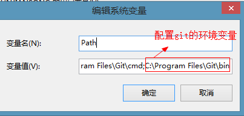
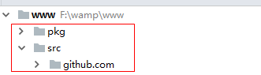

# 1Go操作mysql

1. 因为Go语言没有提供任何官方数据库驱动，所以需要安装第三方函数库。 
2. 由于在github上安装，所以需要安装git软件，安装过程一直点击下一步即可。安装完成后需要配置环境变量

## 1.1 安装git

git软件

 

安装完毕后，配置git的环境变量，这样可以使用`get`的指令

 

## 1.2 安装数据库驱动

设置GOPATH的环境变量，这样驱动才会下载到项目根目录中。


在cmd命令窗口中输入如下命令安装驱动

```go
go get github.com/go-sql-driver/mysql

这一命令会从代码中获取驱动的具体代码，并将这些代码放置到包库中，当需要用到驱动的时候，编译器会把驱动代码与用户编写的代码一同编译。
```

安装完毕后，会在GOPATH下看到下载的驱动

 

## 1.3 连接数据库

1、在src目录下创建demo.go文件，导入数据库驱动

```go
import (
	"database/sql"
	_ "github.com/go-sql-driver/mysql"
)

注意：程序在操作数据库的时候只需要用到database/sql，而不需要直接使用数据库驱动，所以程序在导入数据库驱动的时候将这个包的名字设置成下划线。
```

2、通过sql.open()连接数据库

```
sql.open(驱动名,数据源dsn)(*DB,err)

数据源语法："用户名:密码@[连接方式](主机名:端口号)/数据库名"

注意：open()在执行时不会真正的与数据库进行连接，只是设置连接数据库需要的参数
ping()方法才是连接数据库
```

3、执行SQL语句

​	创建测试表

```mysql
mysql> create table stu(
    -> id int primary key,
    -> name varchar(10)
    -> );
Query OK, 0 rows affected (0.02 sec)
```

操作数据

```mysql
package main

import (
	"database/sql"
	_ "github.com/go-sql-driver/mysql"
	"fmt"
)

func main(){
	//"用户名:密码@[连接方式](主机名:端口号)/数据库名"
	db,_:=sql.Open("mysql","root:root@(127.0.0.1:3306)/jettjia_dev") // 设置连接数据库的参数
	defer db.Close()	//关闭数据库
	err:=db.Ping()		//连接数据库
	if err!=nil{
		fmt.Println("数据库连接失败")
		return
	}

	//操作一：执行数据操作语句
	/*
	sql:="insert into stu values (2,'berry')"
	result,_:=db.Exec(sql)		//执行SQL语句
	n,_:=result.RowsAffected();	//获取受影响的记录数
	fmt.Println("受影响的记录数是",n)
	*/

	//操作二：执行预处理
	/*
	stu:=[2][2] string{{"3","ketty"},{"4","rose"}}
	stmt,_:=db.Prepare("insert into stu values (?,?)")		//获取预处理语句对象
	for _,s:=range stu{
		stmt.Exec(s[0],s[1])			//调用预处理语句
	}
	*/

	//操作三：单行查询
	/*
	var id,name string
	rows:=db.QueryRow("select * from stu where id=4")   //获取一行数据
	rows.Scan(&id,&name)		//将rows中的数据存到id,name中
	fmt.Println(id,"--",name)
	*/

	//操作四：多行查询
	rows,_:=db.Query("select * from stu")		//获取所有数据
	var id,name string
	for rows.Next(){		//循环显示所有的数据
		rows.Scan(&id,&name)
		fmt.Println(id,"--",name)
	}
}
```


